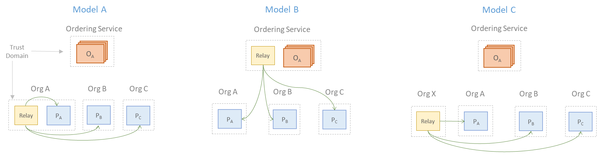
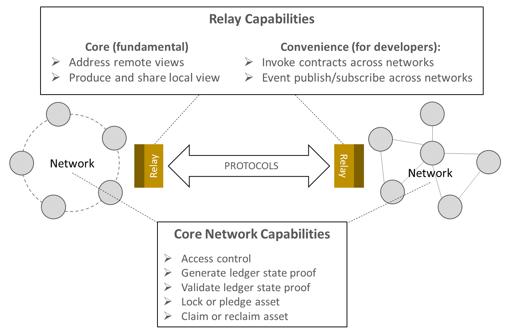

<!--
 Copyright IBM Corp. All Rights Reserved.

 SPDX-License-Identifier: CC-BY-4.0
 -->
# Weaver: Interoperability across DLT Networks

Weaver is an architectural framework with a family of protocols that enables scalable interconnectivity between independent distributed ledgers in a manner that preserves core tenets of decentralisation and security.

This framework addresses the problem of fragmentation that has emerged in the past few years, especially because of the proliferation of permissioned blockchain protocols and networks of limited process scope that nonetheless need to share assets and various ledger records to drive their workflows.

## Vision

The scope of DLT interoperability is illustrated in the figure below. We envision any form of trustworthy information communication across ledgers, whether they belong to a single network or to multiple networks running on very different DLTs, to require a standard set of capabilities. Communication between distributed ledgers and non-DLT systems are also covered in this vision. The common feature in all these scenarios is that the ledgers are governed and maintained independently and ought to have the ability to interoperate with other ledgers or systems on-demand.

The vertical layers in the above figure illustrate the typical DLT network stack, from smart contracts at the top to commitment and consensus protocols at the bottom. There are different aspects of concerns in each layer, as has been called out at the right of the figure. Operational concerns like identity management, governance, and policy, must be handled across all layers, treating networks as holistic units.

The figure below illustrates our layered view of what a general-purpose interoperability framework (like Weaver) ought to handle. Like the OSI model for networking protocols, low-level communication concerns in the bottom layers give way to orchestrational and policy concerns higher up. The _semantic layer_ is the most interesting from a blockchain practitioner's perspective as it presents research and engineering challenges unique to DLTs.

Toward the right of the figure, you can see functions in the semantic layer called out as distinct use cases involving some exchange of information across two networks, leading to ledger record updates in those networks. The three scenarios are:
- Data sharing
- Asset transfer
- Asset exchange

You can find details on these use cases (or _modes_ of interoperation) in [Interoperability Modes](https://hyperledger-cacti.github.io/cacti/weaver/interoperability-modes/).

_Relay_ modules owned and managed by networks enable cross-network communications or even communications between networks and enterprises systems of record. Cross-network identity management occurs on a separate plane from the information exchanges, and our vision for this is described in [Decentralized Identity](https://hyperledger-cacti.github.io/cacti/weaver/architecture-and-design/decentralized-identity/) and [Distributed Identity Management for Interoperation](./rfcs/models/identity/network-identity-management.md).

## System Design and Deployment

The Weaver system consists of standardized components as well as DLT-specific components, both of which must be incorporated into a given network to make it interoperable with others. Because DLTs can be highly divergent, some of these components may look very different in different DLTs, as is illustrated in the architecture diagram below which shows a typical Hyperledger Fabric network at the left and a typical Corda network at the right, both augmented for interoperability with each other. (The components that look different still follow a standardized template and offer a similar set of capabilities, as we will show further below.)

In the middle, for cross-network communications, lie DLT-agnostic relays, which can have one or more DLT-specific _drivers_ to interpret requests and orchestrate response collection from the network. _Interoperation modules_ lie within the network and operate the way smart contracts for that platform natively do. Hence, in a Fabric network, these are implemented and deployed as _chaincode_ on all peers, whereas in a Corda network, they are implemented and deployed within a special _Interop Cordapp_ that can trigger flows across the network. Lastly, for applications that are already deployed on these networks to exercise interoperation capabilities, Weaver provides SDK extensions and libraries.

### Example: Data Sharing Protocol Overview

For a data sharing use case, the following are the functions that are performed network-wide using the interoperation modules (i.e., through consensus):
- Access control of requests for data from another network
- Proof of response data authenticity generated in the form of peers' digital signatures
- Optionally, encryption of repsonse data and signatures to avoid confidentiality and integrity attacks mounted by relays
- Verification of proofs in the response by the requesting network

The basis for this protocol is a priori knowledge of counterparty networks' membership providers' certificate chains.

### Architecture

The Weaver components and tools are illustrated in the below architecture diagram, independent of the networks into which they are incorporated.

  

#### Relays

| Summary |
|:------|
| These are modules that acts as gateways to a network, both as an ingress and an egress point. A relay discovers other networks’ relays and routes messages for cross-network transactions. A relay offers an API to applications and to other relays that is not tied to a specific DLT or application implementation. |

These modules act as fulcra of inter-network (or inter-ledger) discovery and communication. A relay acts as a gateway for a network, serving as both an ingress and an egress point.

Relays connect clients, or applications, in one network, with the peers of another using a DLT-neutral, asynchronous, event-based, message passing protocol.
(Presently, the protocol is stateless but we will enhance the relay in the future to support stateful fault-tolerant communication with message queueing, prioritization, and load balancing. Discovery will also be a future addition, with relays currently channelling requests and responses using other networks’ relay addresses.)

A Weaver relay consists of a gRPC service and uses gRPC for communication. It offers 2 APIs:
- To a network app/client: trigger cross-network operations
- To other relays: cross-network requests/responses

For interoperability, a network must own or access at least one relay, though multiple would be useful for redundancy and failover. A relay is trustless, as it cannot impact integrity and confidentiality for end-to-end protocols. Therefore, a relay can be supplied and maintained by the network’s consortium as a whole or just any of the constituent organizations without impacting network security. It can also be an external service.

A Weaver relay can be used by any network built on any present or future DLT with the only extra effort required in customizing its configuration for communication with other network components.

Currently, Weaver relays support cross-network data queries (returning a ledger state view in response to a view request). Cross-network transaction invocations and event publish/subscribe will be supported in the future.

#### Drivers

| Summary |
|:------|
| These are modules that can be “plugged into” relays that can talk specific  DLT protocols and have access to specific portions of a distributed ledger. They translate relayed messages into instructions for collecting ledger state proofs and (in the future) issuing instructions to update ledger state. |

These are ledger-specific relay plug-ins, which can be activated by relays for the following purposes in a protocol:
Translation of a DLT-neutral relay request coming from outside the network to a DLT- and ledger-specific instruction or query that can be executed within the network
- Generating a ledger state view to return in a response.
- In the data sharing protocol, a driver orchestrates the generation of a response and the collection of authenticity proof to satisfy the verification policy within the external request. (Presently, Weaver drivers only serve a data query purpose, but in the future, we will add capabilities for transaction invocation (block creation) and event transmission.)

A driver is implemented as a typical Layer-2 app with a wallet identity for a given DLT platform (using its SDK). It must possess a network-issued client credential so it can invoke contracts, but like the relay it is coupled with, it is untrusted for integrity and confidentiality purposes. The credential can therefore be issued by the network’s consortium as a whole or by an individual constituent organization; this decision does not impact security.

Drivers are implemented in Weaver for Fabric and Corda, and a Besu implementation is underway. Once implemented for a given DLT, the driver module can be reused in any network built on that DLT with minimal network-specific customizations.

In our current model, a driver is deployed as a service loosely coupled with a relay, but other deployment models can be considered in the future where they are offered as extensions of relays. Depending on the nature of the wallet credential possessed by a driver, it can be used for a single ledger within the network or all the ledgers within the network or a private data collection (if the DLT platform supports these).

#### Interoperation Module

| Summary |
|:------|
| This is a set of procedures for ledger state exposure and validation and asset management in the context of cross-network operations. They are implemented and deployed as smart contracts and distributed application flows in DLT-specific ways. |

This module implements the core basic network functions that any cross-network transaction is comprised of: access control, proof generation and verification, asset locks, claims, pledges, and reclaims.

This module is deployed on, and its functions executed by, every network peer that is involved in a cross-network transaction. The implementation and deployment is DLT-specific and is based on the template outlined for the implementation and deployment of smart contracts and distributed applications on a particular DLT.
- For Hyperledger Fabric networks, this module is implemented as chaincode, which is the embodiment of a smart contract in that platform.
- For Corda networks, this module is implemented as a CorDapp, which is the embodiment of a distributed application (including contracts) on that platform.
- For Hyperledger Besu networks (and Ethereum-based networks in general), this module is implemented as a set of Solidity contracts.

The logic behind this is that the core functions for interoperation must be executed by the network as a collective (group) rather than by a trusted proxy module. And because the network’s trustworthiness is given by how it executes contracts and finalizes transactions, Weaver can guarantee that the proof and asset management functions are as trustworthy and as secure as the networks running them.

Weaver defines a template function API to be implemented by every interoperation module. For a given DLT, an interoperation module must be built from scratch using this template. But once built for a particular DLT, it can be reused for any network built on that DLT’s stack.

Access control and proof verification policies as well as foreign networks’ memberships and authority certificates are maintained on a networks’ ledger through consensus via these interoperation modules.

#### Application Helpers

| Summary |
|:------|
| This is a package of library functions and API for applications to use as an SDK. Offered functions can be called from suitable locations within applications’ workflows. |

This is an SDK consisting of a package of library functions and an API for applications to exercise, i.e., trigger operations involved in cross-network transactions.

These library functions enable distributed applications on DLT networks to be interoperation-ready with minimal adaptation. An application developer just needs to determine where in the business workflow a cross-network transaction (data sharing, asset exchange, or asset transfer) is required, and insert a suitable Weaver API function call to trigger it. The API hides the complexity of the underlying communication and commitment mechanisms.

Core functions currently offered by the Weaver SDK are standardized across DLTs, though implemented in both DLT- and language-specific ways:
Data sharing function that underneath runs a cross-network request-response protocol and commits to local ledger after proof validation.
Asset locks, claims, and unlocks for exchanges.
Asset pledges and redemptions for transfers.

Weaver currently offers SDKs for the following DLTs:
- In Fabric for JS/TS-based apps, built on Fabric Node SDK
- In Fabric for Go-based apps, built on Fabric Go SDK
- In Corda for Java/Kotlin-based apps, built on Corda SDK
- In Besu (partial support, only for asset exchanges) for JS-based apps, built on Web3.js

#### Identity Service

| Summary |
|:------|
| This is a module that consists of both a service and an agent. The service exposes the network’s identity providers’ or certification authorities’ certificate chains for external parties. The agent syncs such certificates from external networks. |

This is a service coupled with an agent that syncs membership and certificates with other networks to establish a trust basis for interoperation.

The service exposes the local network’s membership, i.e., the different stakeholders (corresponding to network subdivisions or even individual peer nodes) who collectively maintain shared ledgers through consensus, and the certificate chains of the respective stakeholders identity providers’ (root and intermediate certificates), to other networks’ identity agents.
- In a Fabric network, these consist of certificate chains of the organizations’ MSP CAs
- In a Corda network, these consist of network and doormen CA certificates as well as individual nodes’ CA certificates.

The agent syncs other networks’ memberships and certificates and records (or updates) them on its network’s ledgers (using consensus) via the deployed Weaver Interoperation Module.

An identity service is necessary for a permissioned network and an identity agent is necessary whenever the counterparty network is permissioned. Without this, access control and proof verification (two core Weaver functions) cannot be performed independently and in a foolproof manner.

Currently, Weaver offers reference code and instructions to launch an identity service. (Some of that code is specific  for Fabric and Corda networks.) Design specifications exist in Weaver for building a scalable solution using DIDs, public registries, and verifiable credentials, and an implementation is underway. (A PoC was built in the past for Fabric, using Indy as a candidate DID registry.)

### Relays and Drivers

The architecture of the relay, which we envision can be the basis of a universal DLT interoperability standard, is illustrated in the figure below. As mentioned above, there are both DLT-agnostic components as well as DLT-specific components called drivers. Relays can manage requests and responses for different interoperability modes as well as targets (other DLT networks or ERP systems).

Because relays are additional components introduced by Weaver into a DLT network, the nature of their deployment is a matter of concern (and debate). Below, you can see three ways in which a relay can be deployed within a typical Hyperledger Fabric network, each with different trust assumptions and governance requirements.

### Protocol Building Blocks

The capabilities that need to be supported within the network and in the cross-network communication modules for the three interoperability modes (data sharing, asset exchange, and asset transfer) are illustrated in the figure below.

  

To support any of the Weaver protocols, the *Core Network Capabilities* must be implemented in the interoperation module for a given network and the *Relay Capabilities* must be implemented in the relay/driver combination for that network.

### Design Specifications

For more details on the various architectural components, building blocks, and cross-network protocols, see the [Weaver RFCs](./rfcs).

## Articles

1. Venkatraman Ramakrishna and Vinayaka Pandit, DLT Interoperability: Why, How, and Weaver LinkedIn blog. [Part 1](https://www.linkedin.com/pulse/dlt-interoperability-why-how-weaver-part-1-vinayaka-pandit/), [Part 2](https://www.linkedin.com/pulse/dlt-interoperability-why-how-weaver-part-2-vinayaka-pandit/) _LinkedIn_
1. Venkatraman Ramakrishna and Vinayaka Pandit, [Making permissioned blockchains interoperable with Weaver](https://www.ibm.com/blogs/blockchain/2021/07/making-permissioned-blockchains-interoperable-with-weaver/), _Blockchain Pulse: IBM Blockchain Blog_
1. Venkatraman Ramakrishna, [Meet Weaver, one of the new Hyperledger Labs taking on cross-chain and off-chain operations](https://www.hyperledger.org/blog/2021/06/09/meet-weaver-one-the-new-hyperledger-labs-projects-taking-on-cross-chain-and-off-chain-operations), _Hyperledger Global Forum 2021 Blog_
1. Dileban Karunamoorthy and Ermyas Abebe, [On the Interoperability of Distributed Ledgers](https://medium.com/thinkdecentralized/on-the-interoperability-of-distributed-ledgers-15f584b79808), _Medium.com_

## Presentations

1. [Secure Asset Transfer Protocol](https://www.youtube.com/watch?v=st9tP1n0fg0), Thomas Hardjono, Venkatraman Ramakrishna, Martin Hargreaves, _Birds-of-a-Feather (BoF) Session, IETF 115 Meeting_, London, UK, November 10, 2022
1. [Panel Discussion on Blockchain Interoperability with Hyperledger Cactus, Weaver, and YUI](https://www.youtube.com/watch?v=FdYCrgO9g6A), Moderator: Tracy Kuhrt, Panelists: Takuma Takeuchi, Venkatraman Ramakrishna, Susumu Toriumi, _Hyperledger Global Forum 2022_, September 13, 2022
1. [Formalizing and Standardizing Blockchain Interoperability](https://www.youtube.com/watch?v=PMoEGHOr9-U),  Dhinakaran Vinayagamurthy and Rafael Belchior, _Hyperledger Global Forum 2022_, September 13, 2022
1. [Making Distributed Ledgers Interoperable Using Weaver (Hyperledger Labs)](https://www.youtube.com/watch?v=Tz4ttPFgsA0), Venkatraman Ramakrishna, _Hyperledger Global Forum 2022_, September 13, 2022
1. [Panel Discussion - All Things Cross-Chain](https://www.youtube.com/watch?v=_NmUiVsmss8), Moderator: Sophia Lopez, Panelists: Jim Zhang, Venkatraman Ramakrishna, Takeuchi Takuma, _Hyperledger Global Forum 2022_, September 12, 2022
1. [Secure Asset Transfer Protocol](https://www.youtube.com/watch?v=lgPvjhUsERo), Thomas Hardjono, Venkatraman Ramakrishna, Martin Hargreaves, Birds-of-a-Feather (BoF) Session, IETF 114 Meeting, Philadelphia, PA, USA, July 26, 2022
1. Working Draft: Views and View Addresses for Blockchain/DLT Interoperability, Venkatraman Ramakrishna, IETF 112 Side Meeting, November 12, 2021
1. [Blockchain Interoperability with Hyperledger Cactus & Weaver](https://www.youtube.com/watch?v=l-nZlLK8IMM), Peter Somogyvari and Venkatraman Ramakrishna, _Hyperledger NYC Meetup_, October 14, 2021
1. Panel discussion on Blockchain Interoperability: Moderator: Vinayaka Pandit; Panelists: Rafael Belchior, Hart Montgomery, and Venkatraman Ramakrishna, _IEEE Services 2021: Blockchain Interoperability_, September 8, 2021
1. Blockchain Interoperability: Challenges, Ongoing Efforts, and Potential Solutions: Vinayaka Pandit, _Hyperledger Global Forum 2021_, June 9, 2021
1. Hosted Discussion: The Future of Blockchain Interoperability: Hart Montgomery, Tracy Kuhrt, Susumu Toriumi, and Venkatraman Ramakrishna, _Hyperledger Global Forum 2021_, June 8, 2021

## Peer-Reviewed Research Publications

1. Bishakh Chandra Ghosh, Sikhar Patranabis, Dhinakaran Vinayagamurthy, Venkatraman Ramakrishna, Krishnasuri Narayanam, Sandip Chakraborty, [Private Certifier Intersection](https://eprint.iacr.org/2022/1302.pdf) _NDSS 2023_
1. Krishnasuri Narayanam, Venkatraman Ramakrishna, Dhinakaran Vinayagamurthy, Sandeep Nishad, [Generalized HTLC for Cross-Chain Swapping of Multiple Assets with Co-Ownerships](https://arxiv.org/pdf/2202.12855.pdf) _AFT 2022_ 
1. Bishakh Chandra Ghosh, Dhinakaran Vinayagamurthy, Venkatraman Ramakrishna, Krishnasuri Narayanam, Sandip Chakraborty, [Privacy-Preserving Negotiation of Common Trust Anchors Across Blockchain Networks](https://ieeexplore.ieee.org/document/9805532) _ICBC 2022_
1. Bishakh Chandra Ghosh, Venkatraman Ramakrishna, Chander Govindarajan, Dushyant Behl, Dileban Karunamoorthy, Ermyas Abebe, Sandip Chakraborty, [Decentralized Cross-Network Identity Management for Blockchain Interoperation](https://arxiv.org/abs/2104.03277), _ICBC 2021_
1. Ermyas Abebe, Yining Hu, Allison Irvin, Dileban Karunamoorthy, Vinayaka Pandit, Venkatraman Ramakrishna, Jiangshan Yu, [Verifiable Observation of Permissioned Ledgers](https://arxiv.org/abs/2012.07339), _ICBC 2021_
1. Ermyas Abebe, Dushyant Behl, Chander Govindarajan, Yining Hu, Dileban Karunamoorthy, Petr Novotny, Vinayaka Pandit, Venkatraman Ramakrishna, Christian Vecchiola, [Enabling Enterprise Blockchain Interoperability with Trusted Data Transfer](https://arxiv.org/abs/1911.01064), _Middleware 2019 - Industry Track_
