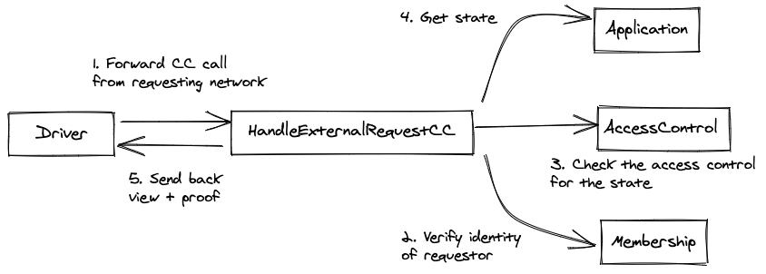
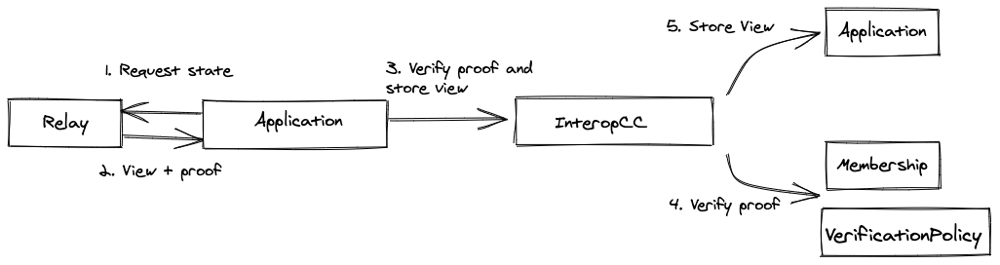

<!--
 Copyright IBM Corp. All Rights Reserved.

 SPDX-License-Identifier: CC-BY-4.0
 -->
# Fabric Interoperability Contracts

## Summary

-   The Fabric interoperability contracts handle the dual process of servicing requests for views from external networks, and verifing requested views for integrity.
-   These contracts allow networks to define policies that control which external entities can access what objects on the ledger, and policies that determine what constitutes a valid proof.
-   These contracts impose no impact on application contracts.

## Installation

-   `make protos-local` - Copy the latest protos directory from main folder and update local copy of fabric-protos directory
-   `make build` - Build the chaincode binary
-   `make` - `make protos-local` and `make build`
-   `make clean` - Deletes the binary

## Testing

Run all the tests with:

`go test`

(or `go test -v` for verbose logging)

## Usage

Once you have built the chaincode (by running `make`), the following command will run the chaincode:

`CORE_CHAINCODE_LOGGING_LEVEL=debug CORE_PEER_ADDRESS=localhost:7052 CORE_CHAINCODE_ID_NAME=mycc:v0 CORE_PEER_TLS_ENABLED=false ./bin/interop -peer.address localhost:7052`

With the chaincode process running, you can shell into a local fabric network (see below for sample network) to use the chaincode

```bash
docker exec -it cli bash
# Since we are not using the installed chaincode, this path can be to any valid chaincode
peer chaincode install -n mycc -v v0 -l golang -p /opt/gopath/src/chaincodedev/chaincode/asset-transfer-basic
peer chaincode list --installed
peer chaincode instantiate -n mycc -v v0 -l golang -c '{"Args":["initLedger","applicationCCID"]}' -C myc -o orderer:7050
```

The chaincode can then be invoked with the following examples:

```bash
peer chaincode invoke -n mycc -c '{"Args":["GetApplicationID"]}' -C myc
```

The chaincode can be used with any Fabric 2.0 network that has a peer running in development mode. However, we have provided a very simple [Fabric network](https://github.com/airvin/fabric-network/tree/fabric-2) for testing purposes. If you would like to use this network, start the Fabric network with the peer in development mode and without a chaincode container. This can be done with the `./start-no-cc.sh` script.

## Servicing a Remote View Request

Describe process of handling a remote view request.



## Verifying a Requested View

Describe process of requesting and verifying a remote view.


