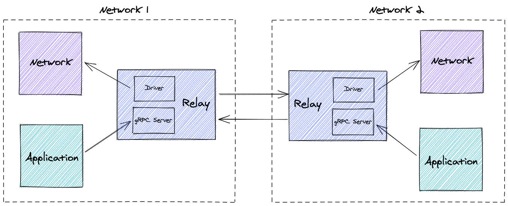
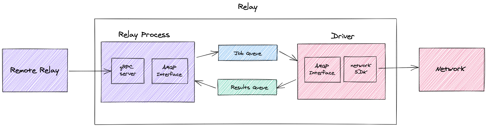

<!--
 Copyright IBM Corp. All Rights Reserved.

 SPDX-License-Identifier: CC-BY-4.0
 -->
# Relay Architecture

## High level architecture

This high level diagram shows how the relay fits into the overall system and how it communicates with the other components in the system

## Low level architecture

This low level diagram shows the various pieces of the relay and how they interact with each other

