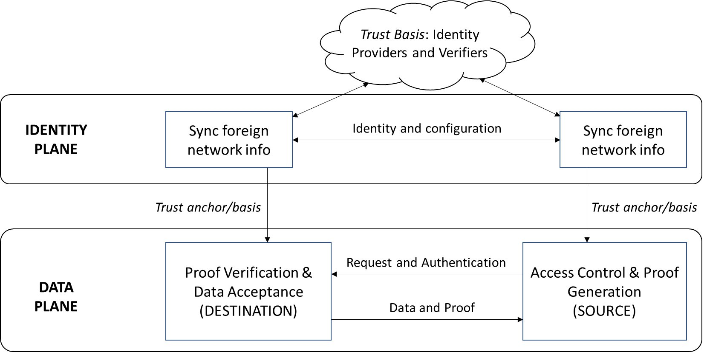
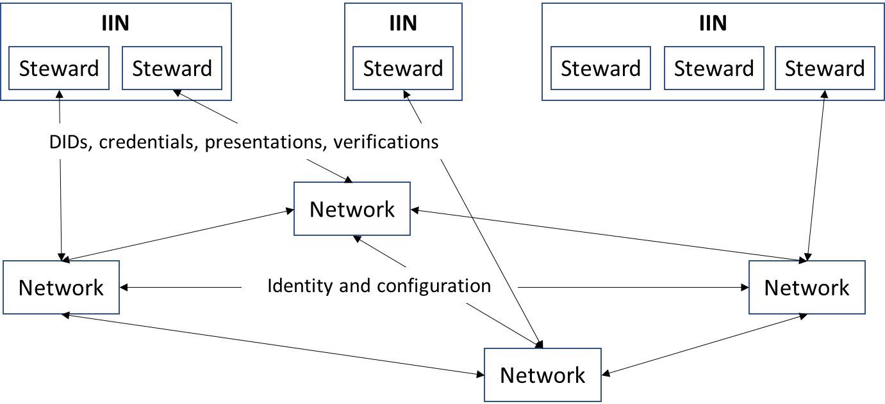
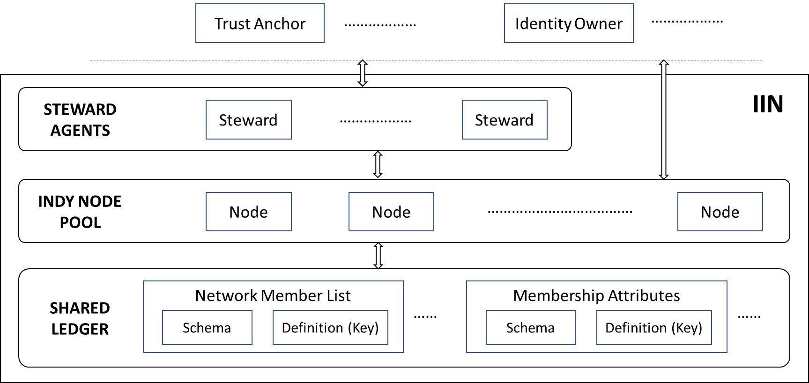
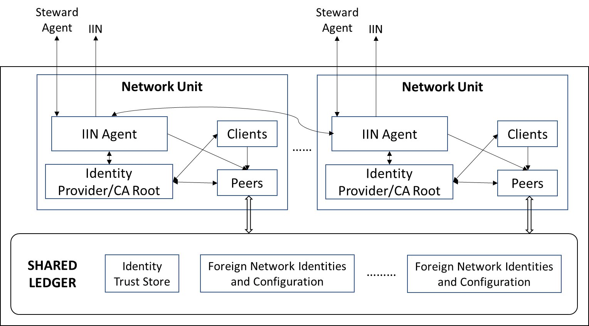
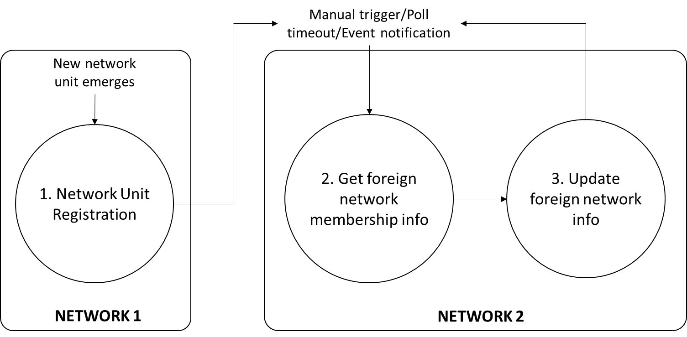
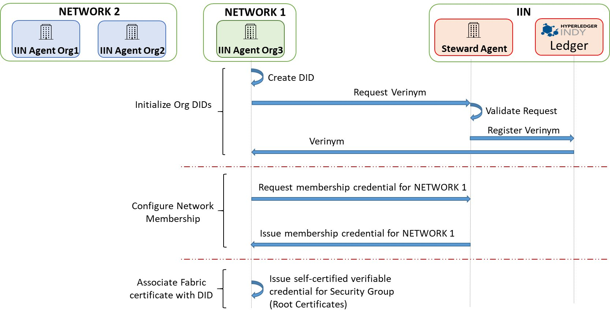
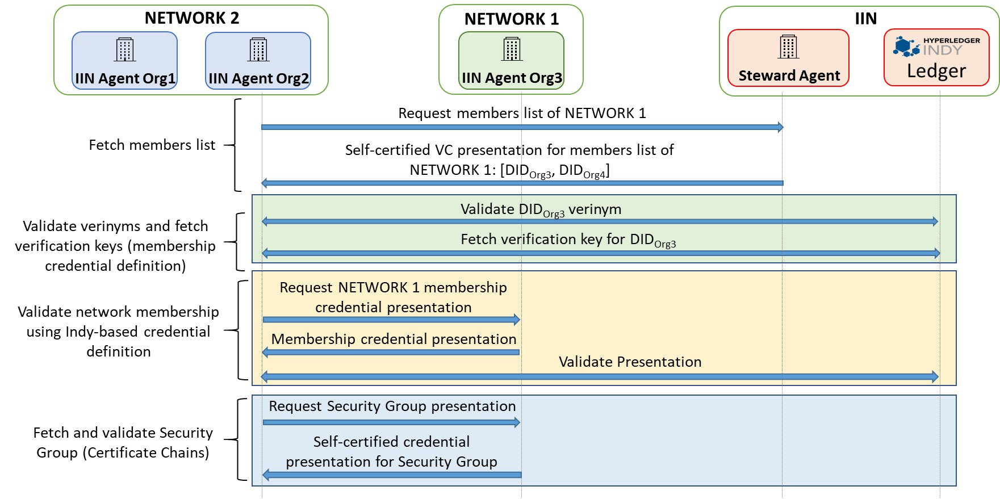
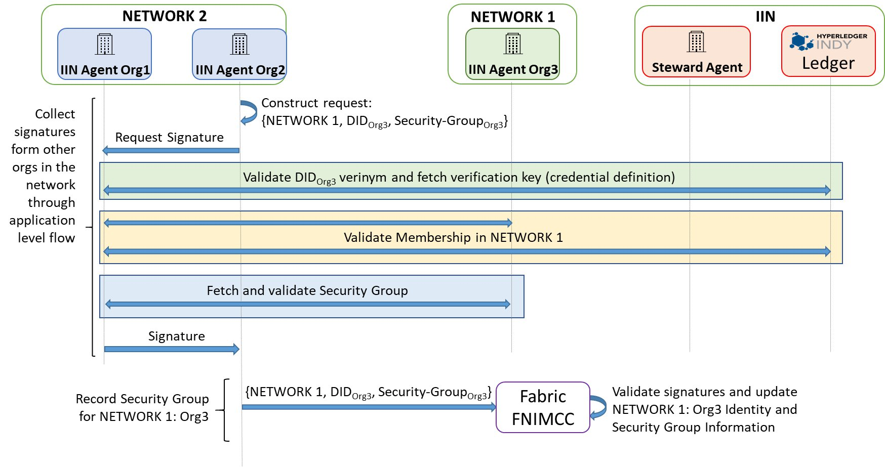

<!--
 Copyright IBM Corp. All Rights Reserved.

 SPDX-License-Identifier: CC-BY-4.0
 -->

Interoperation for asset or data transfers/exchanges relies on a message-passing infratructure and pan-network data processing modules, as we have seen in earlier pages. But there is yet another crucial basis these data processing modules need to satisfy our design principles of network independence and avoidance of trust parties. This is the ability of a network as a whole and of its individual members to accurately identify and authenticate another network's members.

Further, for the networks to remain independent and interact ad hoc with each other, we cannot impose a central authority that unifies their private identity management systems. So the identity basis of interoperation must be decentralized, leading inevitably to the requirement of exchanging identity information across networks as a pre-requisite for asset and data transfers/exchanges. This is illustrated in the figure below where interoperation protocols are classified in two planes (or tiers), data and identity, with the former depending on the latter.

- In the __data plane__ lies the protocols that effect the actual exchanges of data and assets. The figure above illustrates a typical data-sharing instance, where the network at the left requests a data record from the right. The latter receives the request via the two relays (not explicitly marked in this diagram) and runs an access control check through consensus in its _interop module_ before responding with the data record and supporting proof. The network at the left receives the data and proof, again via the two relays, and verifies the data using the supplied proof. __Note: since a core part of both request and proof are digital signatures of network members, the ability to identify and authenticate network members is necessary to perform these endpoint functions__.
- Here is where the __identity plane__ enters the picture, as a trust anchor for the data plane. The most general function of this plane is illustrated in the figure, where the networks get each others' identity and configuration (i.e., membership structure and network topology) information. This exchange has as its own trust basis (or dependency) a set of identity providers and verifiers. (_Note_: these identity providers and verifiers may belong to the two networks or they could be external entities.) The outcome of the exchange is a record of the other network's identity and configuration information on one's ledger, which can then be looked up in a data plane protocol instance.

### Identity Plane: Strawman Approach

The simplest identity plane protocol involves a direct exchange of identity information between representatives of the two networks: in other words, an API integration. But this approach suffers from the same drawbacks that API integration in the data plane would. It diminishes a blockchain network to a single trusted spokesperson, exposing that network to risk. Even if such a spokesperson could be designated, appropriately framing access control policies for potentially every other blockchain network in the world would be very challenging. This approach is therefore insecure and not scalable, and therefore ought to be treated purely as a strawman.

### Networks as Groups of Self-Sovereign Members

A secure and sustainable identity plane plaform can be built on the basis of _self-sovereign identity_ and _decentralized identifiers_. We recognize that:
- Each constituent member of a blockchain network may already possess an identity from a third-party provider
- Membership within a network can be treated as a property of a sovereign organization rather than subordination to a network's governing authority
- DIDs allow members to control who they wish to share their identities with and the levels of exposure
- Network membership lists and individual members' identities can respectively be validated by different providers, thereby maintaining decentralization of infrastructure

### Distributed Identity Management Infrastructure

The distributed identity management infrastructure for interoperation is illustrated in the figure below. We assume the existence of one or more _Interoperation Identity Networks (IINs)_ that act as registries and credential validators for the organizations that form the memberships of blockchain networks.

An IIN can be built from scratch to facilitate blockchain interoperation, but it can also be an augmentation of an existing decentralized identity provider or registry. Its purpose is to maintain identity records and credentials for organizations and validate these to third parties as per the desire of the identity or credential owner. In this model, an IIN can itself be reputed or it can bring together many reputed and trusted identity providers (called _stewards_) into a shared network. As long as the members of two blockchain networks have shared trust in one or more IINs, an identity plane exchange can be effected, thereby setting the foundation for data and asset transfers.

#### Interoperation Identity Network

The ideal IIN architecture is illustrated in the figure below, inspired by Hyperleder Indy, whose architecture is used in our canonical (or reference) implementation. Built on a DLT itself, an Indy-based IIN can provide the combination of assurance and decentralization that a centralized registry cannot. Further, such an IIN will support the entire SSI and DID standard, maintaining credential schemas and verification keys, and issuing _verifiable credentials_ that can be used for privacy-preserving authentications.

An IIN is modeled as a network with a distributed shared ledger, implemented using an Indy Node Pool and running BFT consensus. The ledger is also (ideally) meant to be publicly accessible, though there is nothing preventing our protocols from working with a private IIN.

A canonical IIN maintains the following:
- DID records corresponding to organizations that are members of one or more blockchain networks, whose salient attributes include:
  * Unique (within an IIN) identifier or _verinym_ for the identity owner
  * Service endpoint for the identity owner
  * Credential schemas
  * Credential definitions (public keys used to authenticate signed credentials)

Every IIN has a set of bootstrapped _trust anchors_ called _stewards_. A steward can create other trust anchors by issuing them suitable credentials. The trust anchors are the primary identity providers in our distributed identity management architecture. They can be existing reputed authorities or identity providers who are trusted to certify blockchain networks' memberships, or they can be created ad hoc by a consortium representing the members of a blockchain network.

For one blockchain network to discover and validate another in the identity plane, it must trust one or more IINs and trust anchors who can provide that validation. We envision a shared and mutually reinforcing trust among stewards and other anchors within an IIN. An anchor could gain trust by virtue of joining a well-established IIN. Similarly, an IIN bootstrapped with well-known stewards gains trust because of the collective reputations of those stewards.

Examples of entities that can act as stewards or trust anchors within IINs: the Sovrin Foundation (an organization dedicated to enabling open-source digital ID management, and which also maintains Indy), companies like Maersk or Walmart that have founded real-world blockchain networks, companies like IBM or R3 that maintain popular DLT platforms.

IINs don't have to be built on Indy. Alternatives like Sidetree exist, providing similar functionality. There are also various existing DID registries that are already issuing credentials to existing organizations. To the extent possible, we would like to leverage all of this existing infrastructure and not force any network menmber to find yet another identity provider. Therefore, these existing registries or networks can be used as IINs: the only requirement is that they follow the standards for SSI and DIDs and issuing VCs.

#### Network Membership Credentials

Two kinds of credentials (each with a schema and a definition) are maintained on an IIN ledger:
1. __Member list__: This contains a network name or ID and a set of DIDs of that network's members.
  * This is a per-network credential whose schema and verification key must be maintained on an IIN.
  * This is issued by a steward or trust anchor in an IIN and is associated with that steward's or anchor's DID.
2. __Membership__: This contains an oranization's attributes, including the set of IDs of networks to which it belongs.
  * This is designed to be an extensible credential, i.e., support more attributes in the future.
  * An existing membership credential (of the VC form) can be used as long as it matches the schema recorded on an IIN.
  * The issuer must be a steward or trust anchor (or equivalent, if it's a non-Indy registry) in an IIN.
  * This is associated with the member's DID.

#### Identity Info: Units of Exchange

The IIN is used to discover the membership list of a foreign network and establish the authenticity of its members. Memnbership credentials are independent of blockchain networks.

But data plane transfers and exchanges require knowledge of in-network identities and certificates, which are issued by a network's membership manager(s) to peers and clients. These are not shared through IINs for several reasons. First, the volume of this information can be quite high and further it is subject to change based on a network's internal needs. Also, a network or its members may not wish to expose all this information to an IIN, which is designed to be publicly accessible. Therefore, it is infeasible or undesirable to shared network-specific credentials via established IINs. Instead, we will enable the _peer-to-peer_ exchange of such credentials after the membership discovery and validation procedure is complete.

Specifically, the identity information for a network member consists of the set of certificate chains of the membership managers for that particular member (organization). These consist of one or more hierarchies of root and intermediate CA certificates. For example:
- In Fabric, each organization uses one or more MSPs (_membership service providers_), each running one or more root and intermediate Fabric-CA servers. Any network peer belonging to an organization is issued a certificate authorized by one of these certificate chains. To authenticate a network peer or client in a data plane protocol, knowledge of these certificate chains is essential.
- In Corda, the entire network typically consists of a hierarchy of CAs, from a root to multiple _doormen_, and from each doorman to multiple nodes. Finally, the certificates used to sign transactions are issued by the node CAs. Therefore, knowledge of the root, doormen, and node CA certificates is essential for authenticating signers.

More generally, each unit of exchange corresponding to a network member is a _Security Group_, so-called because each network member is an independent organization in its own right with a security domain.

#### IIN Agents as Member Representatives

Every network member needs a proxy (either an abstraction or a separate module) for communication with IINs and with the members of foreign networks in the identity plane. We use the term "IIN Agent" to refer to this proxy, and illustrate its functioning as a module within a Fabric network through the reference diagram below.

In the reference implementation, IIN Agents are built as Hyperledger Aries nodes and communicate with each other and with IIN stewards and trust anchors using the Aries protocol. (IIN stewards and trust anchors are also built as Aries nodes.)

The list of trusted IINs is recorded on the local network's shared ledger, as illustrated in the figure (and thereby agreed through network consensus). To be able to interoperate with another network, the latter's members must have identity records maintained by sume subset of these trusted IINs and their VCs must be issued by these IINs stewards and trust anchors.

#### Protocols

Let us consider a scenario where _NETWORK 1_ and _NETWORK 2_ wish to interoperate, and their respective member organizations are as follows:
- _NETWORK 1_: Org3, Org4, Org5
- _NETWORK 2_: Org1, Org2

Each network discovers the other's member list and obtains and records ech member's security group to the local shared ledger. We can enumerate these as follows:
- _NETWORK 1_ discovers and registers _NETWORK 2_:Org1
- _NETWORK 1_ discovers and registers _NETWORK 2_:Org2
- _NETWORK 2_ discovers and registers _NETWORK 1_:Org3
- _NETWORK 2_ discovers and registers _NETWORK 1_:Org4
- _NETWORK 2_ discovers and registers _NETWORK 1_:Org5

Each of these can be done in parallel and each discovery and registration operation is idempotent as long as the security group of a network member does not change.

The high-level workflow for discovery and registration is illustrated below (using _NETWORK 2_ as the seeker and _NETWORK 1_ as the provider).

(_Note_: "Network unit" is synonymous with "network member")

Prerequisites for this process are:
- The member list credential of _NETWORK 1_ is provided by a steward or trust anchor in a particular IIN which is also on the trust list recorded in the ledger of _NETWORK 2_.
- The membership credentials for both organizations in _NETWORK 1_ are supplied by one or more IINs that are on the trust list of _NETWORK 2_.
- Each of the 5 organizations (2 in _NETWORK 1_ and 3 in _NETWORK 2_) has an IIN Agent running on their behalf.

Let us take the example of _NETWORK 2_ having already obtained the security group info for Org4 and Org5 in _NETWORK 1_. It is now discovering and registering _NETWORK 1_:Org3. We assume that there is a single IIN with a single Steward for validating member list as well as membership credentials for all members of both the networks.

_Note_: we assume here for simplicity that a steward as a reputed identity provider has a mechanism to validate the bona fides of an orgganization and its membership in a given network. There are other techniques involving group signatures that could be applied to corroborate an organization's claim to network membership rather than requiring a steward to use an out-of-band security mechanism, but that is presently beyond the scope of this design.

The discovery and registration procedure steps are as follows:
- The IIN Agent for Org3 registers its membership to _NETWORK 1_ at the Steward in IIN:
  * _NETWORK 1_:Org3 gets a DID (verinym) issued
  * The Steward updates the member list credential for _NETWORK 1_ to include Org3
  * Org3 obtains a membership credential from Steward
- The IIN Agent for Org3 issues itself a self-signed VC containing its security group info
- The IIN Agent for _NETWORK 2_:Org2 (only one organization in the network needs to do this) obtains the new member list credential from Steward in IIN and validates it using the IIN ledger records
- The IIN Agent for _NETWORK 2_:Org2 discovers that Org3 is a member of _NETWORK 1_, fetches Org3's membership credential from Org3's IIN Agent, and validates it using the IIN ledger records
- The IIN agent for _NETWORK 2_:Org2 fetches the self-signed security group credential from the IIN agent of _NETWORK 1_:Org3 and validates it
- The IIN agent for _NETWORK 2_:Org2 triggers a flow among the IIN Agents of _NETWORK 2_ to collect signatures endorsing the security group info for _NETWORK 1_:Org3 fetched above
  * The IIN Agent for _NETWORK 2_:Org1 gets this endorsement request, and validates both the membership credential and the security group info for _NETWORK 1_:Org3 by communicating with the Steward, the IIN ledger, and the IIN Agent for _NETWORK 1_:Org3
  * The IIN Agent for _NETWORK 2_:Org1 signs the request from Org2 containing the security group info for _NETWORK 1_:Org3 after the above check succeeds
- When the IIN agent for _NETWORK 2_:Org2 gets signatures from the IIN Agents representing each member of _NETWORK 2_, it submits the security group info for _NETWORK 1_:Org3 alon with the signatures to the _interop module_ (typically smart contract) for recording on the ledger of _NETWORK 2_
  * Now the ledger of _NETWORK 2_ contains the identities and certificates of all three members of _NETWORK 1_: Org3,Org4,Org5, and data plane interoperation may ensue.

_Note_: the last step above (recording to the local ledger via the _interop module_) may be performed by IIN Agents of both Org1 and Org2 as they have no means of synchronizing their actions, but this recording will be idempotent and hence not cause any harm.

The process above is illustrated with a few more details in the sequence of protocol diagrams below.

### References
Bishakh Chandra Ghosh, Venkatraman Ramakrishna, Chander Govindarajan, Dushyant Behl, Dileban Karunamoorthy, Ermyas Abebe, Sandip Chakraborty, [Decentralized Cross-Network Identity Management for Blockchain Interoperation](https://arxiv.org/abs/2104.03277), _ICBC 2021_
