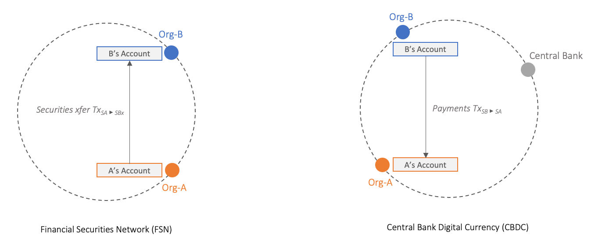
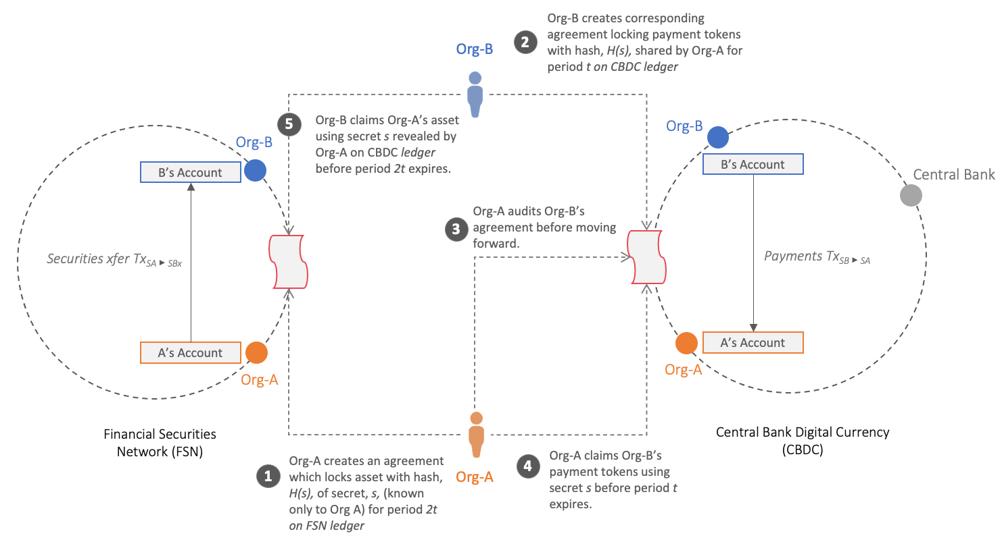

<!--
 Copyright IBM Corp. All Rights Reserved.

 SPDX-License-Identifier: CC-BY-4.0
 -->

In traditional financial markets parties trade assets such as securities and derivatives for cash or other assets. To reduce risk, various clearing and settlement processes and intermediaries are often involved. One form of settlement is a DvP (delivery versus payment) where the transfer of securities is performed only in the event of a corresponding payment. This arrangement reduces principal risk by ensuring that both parties receive their end of the exchange. However, settlement in financial markets are slow and time consuming. It also involves counterparty risks and requires intermediaries.

Over the past few years, we have been seeing significant efforts in digitising and tokenising both currencies and securities on Distributed Ledger Technology (DLT) infrastructures. On the one hand we have seen concerted efforts around Central Bank Digital Currencies (CBDC) being added to the landscape of other blockchain based payment networks. On the other hand, we have also seen efforts such as that from the Australian Stock Exchange (ASX) to replace its current settlement system--Clearing House Electronic Subregister System (CHESS) with a DLT based platform by 2021.

Against this backdrop, a number of central banks have been exploring the potential of performing DvP settlement across a currency ledger and a securities ledger. In this use case, we use this as a motivating use-case for our discussions. The scenario involves two decentralised ledgers, namely, a currency ledger and a securities ledger, based on different DLT protocols performing a coordinated transfer of assets in their respective ledgers.

The figure below depicts this scenario in the context of two organisations--*Org-A* and *Org-B*. *Org-B* wants to purchase some securities owned by *Org-A* and both organisations have accounts on both ledgers. This scenario is simplified and leaves out a number of additional real world processes. For instance, the buyer and seller for securities need to discover each other and agree on the price and terms of a sale. In addition, an offer to sell securities might be fulfilled by multiple buyers taking smaller portions of the amount for sale. Such capabilities are often offered by centralised exchanges that offer capabilities such as order books and matching engines to address these needs. In this scenario we instead focus on the settlement process that follows such steps, once the parties of an exchange and the price of the exchange for an asset are determined.

To effect the settlement of this exchange between *Org-A* and *Org-B*, the following two transactions will have to happen atomically across both networks: i) transfer of payment from *Org-B*'s currency account in the CBDC ledger to *Org-A* while at the same time ii) the entitlements of the designated securities are transferred from *Org-A* to *Org-B*. The scenario would need to guarantee that after the transaction execution, either both parties have their end of the exchange or neither does and that this exchange is performed in a timely manner.

The settlement of the exchange of securities from *Org-A* to *Org-B* in the Financial Securities Network for a simultaneous payment from *Org-B* to *Org-A* in the CBDC network is coordinated by Weaver using [Hashed Time Lock Contracts](https://en.bitcoin.it/wiki/Hash_Time_Locked_Contracts).
This protocol essentially has three phases:
- Fund locking: To initialise an asset exchange, it is common for one or both parties to first lock up funds with a fund-withholding party on his or her own blockchain. Temporary fund locking ensures the locked fund cannot be used for other purposes while the exchange is being executed. This scheme is often used with a specified timeout to provide flexibility for reclaiming locked funds if the exchange does not take place.
- Fund redeeming: In general, the execution requires a pair of transactions to occur on both blockchains, e.g., from Org-A to Org-B on the FSN ledger and from Org-B to Org-A in CBDC ledger. When certain conditions are met, the locked funds can be redeemed by, or paid to the respective users. The execution of the exchange can be carried out by users themselves, or through other trusted third parties. These trusted third parties can be stand-alone parties that are not otherwise involved in both blockchains, or part of either blockchain. 
- Refund: For protocols that are initialised with a temporary fund-locking, the locked funds can usually be reclaimed by the initial owner after a specified timeout, if a redemption has not occurred. 

The process proceeds as follows, and is further illustrated in the figure below:
1. **Org-A locks its securities in FSN ledger**: *Org-A* first creates some secret S, known only to it and locks its securities using the hash of S. The securities are configured to redeemable by *Org-B* if it presents S within some specified time threshold.
1. **Org-B locks payments tokens in CBDC ledger**: Org-B, observes that *Org-A* has locked its securities in the FSN network and does a corresponding lock of its payment tokens with the hash of S, used by *Org-A* in locking its securities. The payment tokens are redeemable only by Org-A, if it submits a transaction that reveals S within a specified time.
1. **Org-A checks Org-B's contract in CBDC ledger**: *Org-A* checks the CBDC network to ensure that the payments tokens are locked by Org-B.
1. **Org-A claims payments in CBDC ledger**: *Org-A* submits a transaction to claim the payments tokens, by revealing the secret S.
1. **Org-B claims securities in FSN ledger**: *Org-B* observes that the value of S has been revealed in the CBDC network by *Org-A* in step 4, and submits a transaction to claim the securities in the FSN network using the revealed secret.

