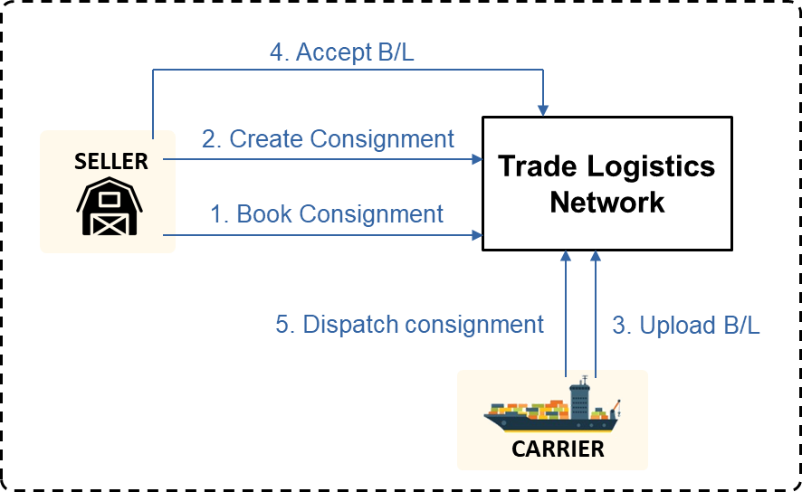
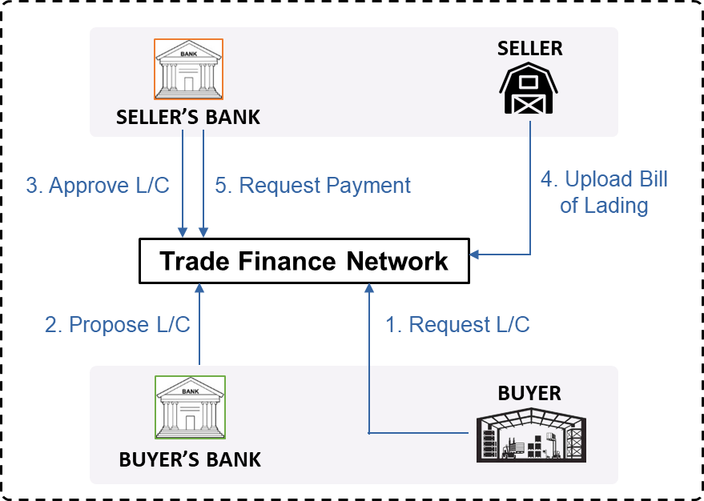
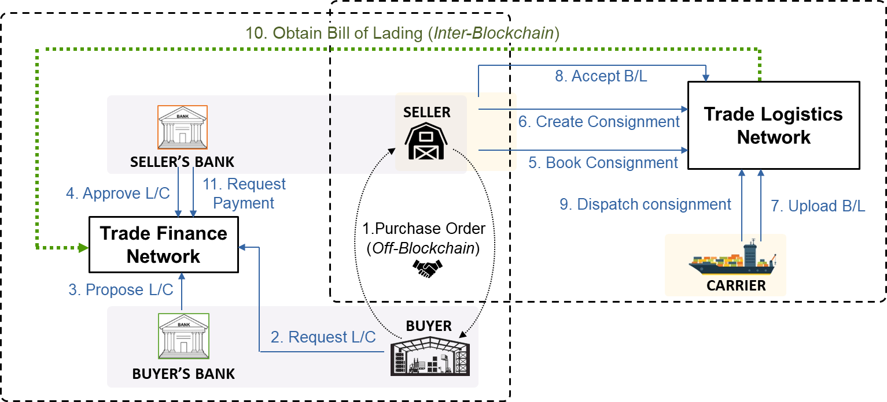
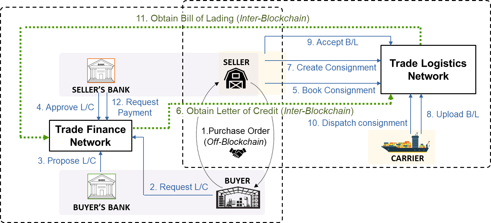
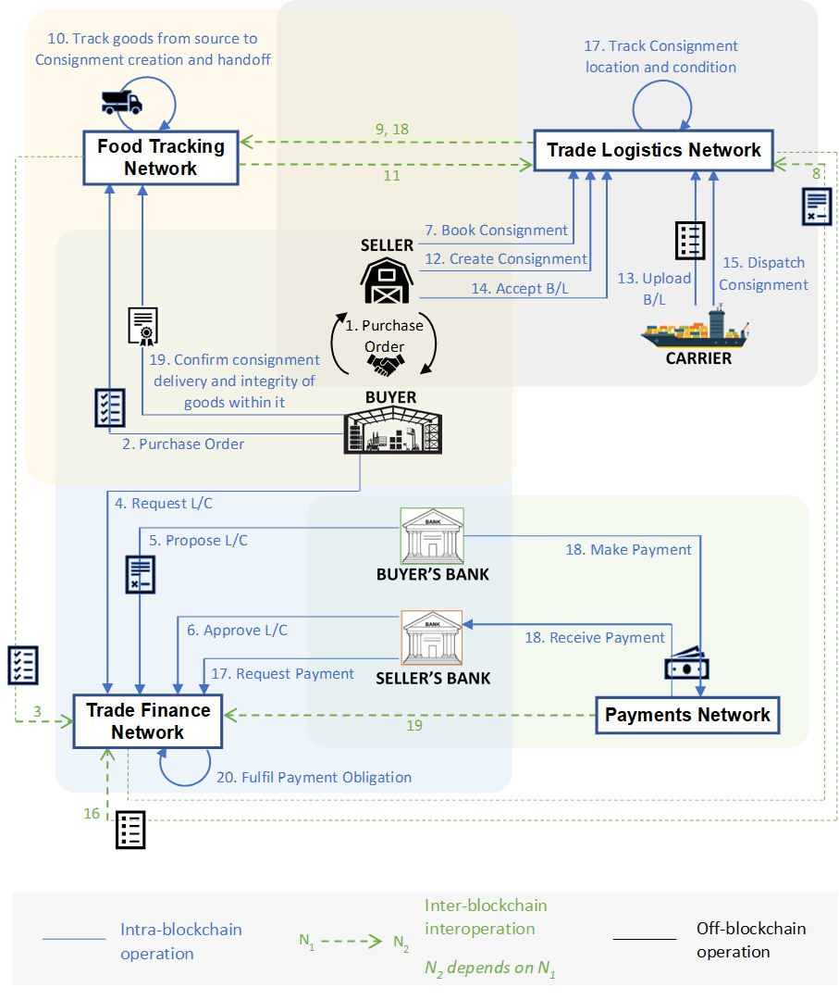

<!--
 Copyright IBM Corp. All Rights Reserved.

 SPDX-License-Identifier: CC-BY-4.0
 -->

The examples in this page cover the __global trade__ application domain and the __data sharing__ pattern.

## Process Overview
At its simplest, international trade is about a party in one country buying certain goods from a party in another country. Because the goods cross international boundaries, the buyer is called an _importer_ and the seller is called an _exporter_. For the same reason, this process is not as straightforward as, say, purchasing an item from a retailer.

The exporting of goods in most countries is governed by a host of regulatory provisions and authorities, making the very act of clearing the sale and getting the goods ready for shipment a complex one. Further, an exporter must rely on one or more _carriers_ to move the shipment from source to destination while managing all of the risks this entails.

But this only covers the shipping logistics. The trading parties, i.e., the exporter and importer, both face what is called _counterparty risk_, or the hazard of giving something up without a guarantee of receiving something in return. If the exporter ships the goods first, the importer may renege on the payment. And if the importer mmakes the payment first, the exporter may renege on the shipment. To hedge against this risk, sophisticated process of _trade finance_ have evolved over centuries, with banks or other financial institutions providing the sorts of guarantees (in exchange for fees) that enable exporters and importers to safely conduct trades.

Permissioned blockchains are a great fit to manage such trade scenarios, involving multiple independent entities and no governing authorities, using smart contracts. Let us now see two kinds of processes in action, each of which can be managed in its own restricted network:
1. __Trade logistics__: preparation, clearance, and export of goods
2. __Trade finance__: payment guarantees and fulfillment

## Networks in Isolation
There exist real business networks in production that manage trade logistics and finance, but they can be very complex. We will present highly simplified versions of these processes, and focus on the aspects that will motivate the need for data sharing across networks.

Also, we will henceforth use the terms _buyer_ and _seller_ instead of _importer_ and _exporter_ respectively.

### Initiating a Trade
Our trade process begins offline, with buyer and seller negotiating and agreeing on the sale of particular goods for given payment. We will assume that a _purchase order_ is created and contains a unique id we can use as reference in subsequent steps. This is illustrated in the figure below.

### Trade Logistics Network
The figure below represents a trade logistics network consisting of a seller and a carrier, loosely inspired by the TradeLens network built on Hyperledger Fabric. Think of the seller as a coffee plantation owner is Brazil, for example, and the carrier as a prominent shipping company like Maersk.

The seller begins by booking a shipping consignment (associated with the purchase order id) and then registering its creation. It then hands the consignment over to the carrier. In a real life export scenario, this process involves a lot of documentation and approval cycles, but we are going to ignore all of those here. The carrier supplies documents certifying its possession of the consignment and the contents within it. The _bill of lading_ (B/L for short) is one of these documents, and though there may be others, like a packing list and a shipping manifest, we only need one to motivate interoperability. So we will keep it simple and assume that the carrier simply uploads a B/L. The seller examines and accepts this document, following which the carrier dispatches the consignment.

__Note that, at this point, a valid B/L is recorded on the trade logistics network ledger, a fact we will make use of soon enough.__

### Trade Finance Network
The figure below represents a trade finance network consisting of a seller, a buyer, and their respective banks. This is loosely inspired by the We.Trade network built on Hyperledger Fabric and the Marco Polo network built on R3 Corda. Think of the seller as our coffee plantation owner in the logistics network, the buyer as Starbucks, and the banks as Bank of America and HSBC Bank, for example.

Traders and banks use a variety of mechanisms to mitigate counterparty risk, one of them being _open accounting_, used in networks like We.Trade. We pick the popular _letter of credit_ (L/C for short) instrument for our trade finance story as this exemplifies the inherent link between logistics and finance (we will see this later). The process begins with the buyer requesting an L/C from its bank for a given trade, referring to the id of the purchase order generated earlier. In simplest terms, an L/C is a promise made by a bank to pay a certain amount to the bearer of certain documents associated with a given export shipment. In our scenario, the buyer's bank issues an L/C promising to pay the seller (through its bank) the amount due to it upon production of a valid B/L. This L/C proposal is recorded on the ledger, and subsequently approved by the seller's bank. After the seller uploads a B/L, the seller's bank is allowed to register a request for payment. This leaves a payment obligation for the buyer's bank on the ledger, which is where we will conclude the scenario, as the actual payment is carried out through a separate process on a different network.

__Note that the seller is supposed to produce and record a valid B/L in Step 4.__

## Linking Finance with Logistics
It is obvious that the logistics and finance processes are linked. Both begin with references to a common purchase order id and both involve bills of lading. Let us focus on the B/L, as it exemplifies a common pattern in these kinds of business networks: _that of being generated in one network and being used in another_. Because thee are two separate networks, the trade finance network depends on the seller to upload a B/L. But here, we encounter another kind of hazard, one we discussed earlier in the [challenges](./overview#challenges-to-overcome) section. The seller has an incentive to produce a fake bill of lading in order to get paid for goods it may not have dispatched and may have no intention of dispatching. In the present setup, the trade finance network as a whole, nor the buyer or its bank, has visibility into the trade logistics network's ledger, and hence have to trust the seller's word.

This hazard can be avoided if the networks are interoperable, and can share data with each other. Specifically, if the trade logistics network can share a B/L recorded on its ledger _institutionally_ with the trade finance network. To see how this works, see the diagram below, which contains both the networks and merges their flows.

Step 4 in the [isolated trade finance network](./global-trade#trade-finance-network) is now replaced with an interoperation step (Step 10) whereby the trade finance network obtains a B/L from the trade logistics network via a data-sharing protocol. This avoids the hazard of having to depend on an unreliable seller to supply a valid B/L. But it is not enough for the trade logistics network to share B/L data. It must also share some _proof_ or evidence that the B/L is presently on record in its shared ledger.

__Note: in general, an interoperation mechanism for data sharing must communicate data as well as an associated proof that can be _independently verified_ by every memebr of the receiving network.__

## Extending the Scenario
The above example conforms to how the logistics and finance processes work today. Letters of credit typically specify bills of lading among the lists of documents that must be supplied to claim a payment. But state-of-the-art blockchain technology and permissioned networks can facilitate a lot more process innovation than earlier technology could.

The present trade logistics network allows a consignment to be created and dispatched without any knowledge of how the trade will be financed. But in real life, there is a need to track imports and exports carefully to ensure that no regulations are broken, and secondarily, to avoid wasted effort. Therefore, we can envision trade logistics networks requiring some evidence of the financial arrangements of a trade before it allows a seller and a carrier to carry out with the shipping process.

The process augmentation is illustrated in the figure below with the insertion of a new Step 6 between the booking and the creation of a shipping consignment.

Like Step 11 (Step 10 in the earlier figure), this is a data-sharing interoperation step where the L/C proposed and accepted on the trade finance network's ledger is copied to the trade logistics network's ledger. (As with the B/L sharing, proof of the L/C ledger record must accompany L/C data.) In this new process, the trade logistics network will not waste time processing shipments that do not have a backing L/C guarantee from the trade finance network.

__Note that in the interoperation steps, the artifact being shared by one network with another (B/L or L/C) does not have to be copied verbatim to the receiving network's ledger. The process incorporates transformations carried out through smart contract transactions occurring through their networks' native consensus mechanisms.__

## Vision: Network of Networks
The promise of blockchain was a more decentralized yet trustworthy internet, but as we saw earlier, networks like Bitcoin and Ethereum may not fulfill that promise, largely because they have technical limitations when it comes to performance and scaling, privacy preservation, and auditability. At the same time, private blockchain networks are here to stay, and they do overcome these technical limitations, albeit at smaller scale. In the longer term, a more sustainable and achievable vision will be to allow private networks to exist while possessing the means to interoperate with other private networks. The interlinking of a trade logistics network with a trade finance network was just a sample. There is more aspects to an international trade scenario: more networks and more cross-network dependencies. But as long as we can institute mechanisms to link two networks directly for data-sharing, we can extrapolate our two-network scenario into a network-of-networks scenario.

To show how this will work, we will add two more networks to the mix. Business networks exist to track the quality and health of perishable goods from the production source to the end retailer. These networks complement networks like Trade Lens, which manage the long-distance shipping that occurs in the middle but have no visibiity into the goods before consignment creation or after delivery at the destination by the carrier. To track goods at either ends is the function of networks like IBM Food Trust, which would be ideal for the coffee shipment example we used earlier. A separate aspect of our trade scenario is the actual payment a buyer makes to the seller. Our trade finance network ends by recording a payment obligation, but the transfer of money needs to occur on a separate payment network, like, for example, the Stellar Network.

The figure below presents our vision for how cross-network data sharing can help smoothen and simplify all aspects of global trade despite the fact that different sub-processes occur on independent private networks.

The _Food Tracking Network_ is loosely inspired by IBM Food Trust and the _Payments Network_ loosely inspired by Stellar.
- The seller and buyer, as the trading parties, belong to the food tracking network. The process in this network begins with a registration of a purchase order, following which perishable goods (think coffee seeds, for example) are tracked from farms to a warehouse where a shipping consignment is created. Whenever the carier delivers the shipment, the fact of delivery is recorded as is the condition of the goods within.
- The payment network has the buyer's and seller's bank as members. Action in this network is triggered by the buyer's bank making a payment, or a monetary transfer, to the seller's bank. Both banks have accounts in this network and the payment succeeds or fails depending on available account balance.

There are two parallel timelines starting at Step 17:
- One involves the trade finance network and the payments network (Steps 17-20). Step 18 contains both "Make Payment" and "Receive Payment" as these actions are supposed to occur atomically within the payments network. These pertain to the fulfilment of the payment promised to the seller by the buyer.
- Another involves the trade logistics network and the food tracking network (Steps 17-19). These pertain to the tracking of goods after dispatch and confirmation of their subsequent delivery and condition.

You may notice we have augmented the trade logistics and trade finance processes as follows:
- Step 17 in the trade logistics network illustrates a sequence of transactions, each recording the location and condition of the goods in transit at periodic intervals. We assume that this information can be procured using sensors deployed with the consignment.
- Step 20 in the trade finance network results in the cancelling of the payment obligation recorded by the seller's bank in Step 17 within that network ("Request Payment"), thereby concluding the trade instance associated with the purchase order id generated in Step 1.

The data-sharing interoperation steps are as follows:

- _Step 3_: The trade finance network fetches a purchase order from the food tracking network before permitting an L/C request to be made.
- _Step 8_: The trade logistics network fetches an L/C from the trade finance network before permitting a consignment to be created.
- _Step 9_: The food tracking network fetches a consignment booking record and an associated L/C from the trade logistics network before permitting tracking of goods from the source to the shipping warehouse.
- _Step 11_: The trade logistics network fetches tracking information indicating delivery of goods to the warehouse before permitting a consignment to be created.
- _Step 16_: The trade finance network fetches a B/L from the trade logistics network before permitting the seller's bank to register a payment request.
- _Step 18_: This is a recurring step, in each instance of which the food tracking network fetches location and condition information for a given consignment from the trade logistics network, and does not permit the confirmation of consignment delivery and the integrity of the goods within until the shipment reaches its destination and its condition meets the required standard.
- _Step 19_: The trade finance network gets confirmation of payment (from buyer's account to seller's account) from the payments network.

To summarize, internationally traded goods can be tracked from a farm in one country to a retailer in another, the goods can be exported and shipped with all regulations complied with, financial guarantees can be put in place to safeguard the trading parties, and cross-border payments can be processed seamlessly and in a trustworthy manner. But this requires a combination of private blockchain networks willing to share data with each other and also have the ability to verify the authenticity of received data. We hope this scenario makes the motivation for data-sharing interoperation mechanisms perfectly clear.
