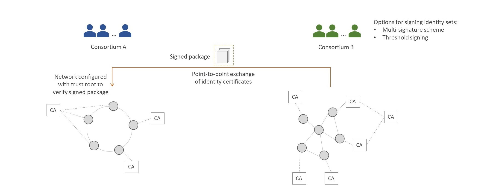
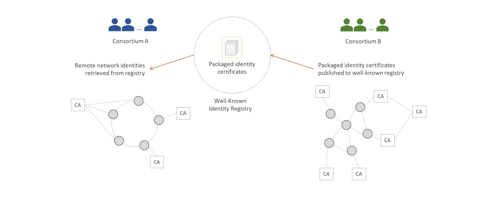
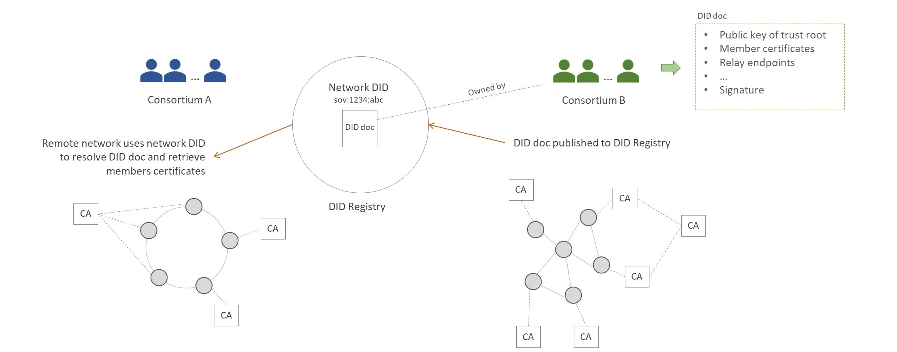
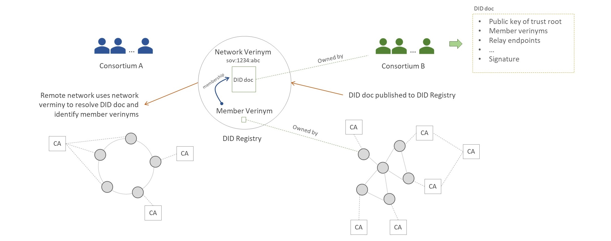

<!--
 Copyright IBM Corp. All Rights Reserved.

 SPDX-License-Identifier: CC-BY-4.0
 -->
# Design Choices for Identity Management

- RFC: 01-011-appendix
- Authors: Dileban Karunamoorthy, Ermyas Abebe, Venkatraman Ramakrishna
- Status: Proposed
- Since: 21-Jan-2021

## Summary

- Permissioned networks rely on the identity of its members for validating state.
- Membership credentials, in the form of digital certificates, are issued by trust authorities local to the network.
- Remote agents must be in possession of the necesary identity information in order to verify attestations from a network.
- There are multiple approaches to sharing network identity with external agents, each having differenet trade-offs.

## Point-to-Point Identity Exchange

The simplest approach to sharing identity information is via a bilateral exchange. This approach makes sense as initial step when enabling interoperability across two networks. No additional machinery is required beyond shairng a signed package of identities.

- An external agent requests a network for a signed packaged of identities.
- The signing parties form the trust root for providing valid identity sets.
  - The signing parties can be a small subset of the network, such as the set of consortium members.
- Remote agents use the known trust root to verify signed packages.
  - We assume here that this trust root is relatively static and known apriori.
- The distribution of signed packages can be done in different ways:
  - Made available upon request.
  - Made available via a REST endpoint or the consortium website.
  - Made available through the network's relay service via a configuration protocol.

### Additional Considerations

- Updating and notifying or distributing new packages when the network configuration changes.
- Remote networks may need to detect or be notified of potential identity revocations.
- Remote networks may retrieve recent member information when unknown identities are detected.

## Well-Known Registry for Identity Exchange

When multiple networks are involved, sharing identity information across each relationship is expensive. A well-known registry can be used to publish and share identity information. Networks query the registry for relevant identity information of those they intend to interoperate with.

- A well-known registry is used to publish and share network identity information.
 - The registry can be public or limit access to a group of networks, such as those part of an ecosystem.
 - The registry can be a centralized web service or database, or decentralized.
- Remote networks source identity information via the registry
- Root of trust can be:
  - The registry service
  - A signing trust root from the source network

### Additional Considerations

- Updating registry information when the network configuration changes.
- Remote networks may need to detect or be notified of potential identity revocations.
- Remote networks may retrieve recent member information when unknown identities are detected.

## DID Registry for Identity Exchange

An alternative to using a general-purpose registry of information is a DID registry. Networks in this instance are identified by a network DID, owned by the consortium. 

- A DID registry is used to register network DIDs.
- The network DID is owned by a trust root of the source network.
  - Trust root can be small subset of members (e.g. consortium members)
  - Ownership can be determined using different signature schemes, such as multisig and threshold signatures.
- The network DID is made publicly available.
  - For example, through the consortium website.
- Remote networks retrieve and verify the DID doc corressponding to the network DID.
- The DID doc contains member information.
  - The member certificates can be directly encoded in the DID doc.
  - Alternatively, DID doc contains location and hash of packaged certificates.

### Additional Considerations

- Updating member information in DID doc when the network configuration changes.
- Remote networks may need to detect or be notified of potential identity revocations.
- Remote networks may retrieve recent DID doc when unknown identities are detected.

## Verinyms for Identity Exchange

Network verinyms as a means to identify a legal entity and its participation in one or more networks is an improvement on using network DIDs alone. In addition to identifying a network and its members, this approach allows legal entities to prove membership in one or more networks.

- The trust anchors of a DID registry registers network verinyms.
- A network verinym is owned by the trust root of the source network
  - The trust root can be small subset of members (e.g. consortium members)
  - Ownership can be determined using different signature schemes, such as multisig and threshold signatures.
- The network verinym is made publicly available.
  - For example, through the consortium website.
- Remote networks retrieve and verify the DID doc corressponding to the network verinym.
- The DID doc contains member verinyms.
- Member verinyms are resolved and used to retrieve underlying network membership certificates.
- Members can also prove network membership by presenting membership credentials.

### Additional Considerations

- Updating the network verinym's member list when the network configuration changes.
- Remote networks may need to detect or be notified of potential identity revocations.
- Remote networks may retrieve recent DID doc when unknown identities are detected.
- Reducing the number of messages exchanged between networks when resolving the underlying identity certificates.

