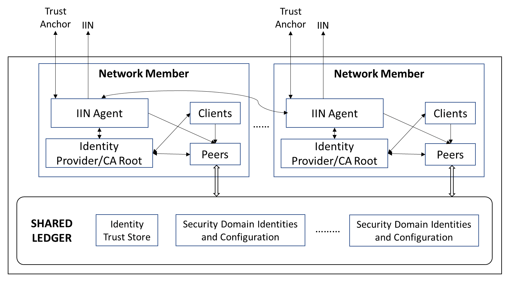
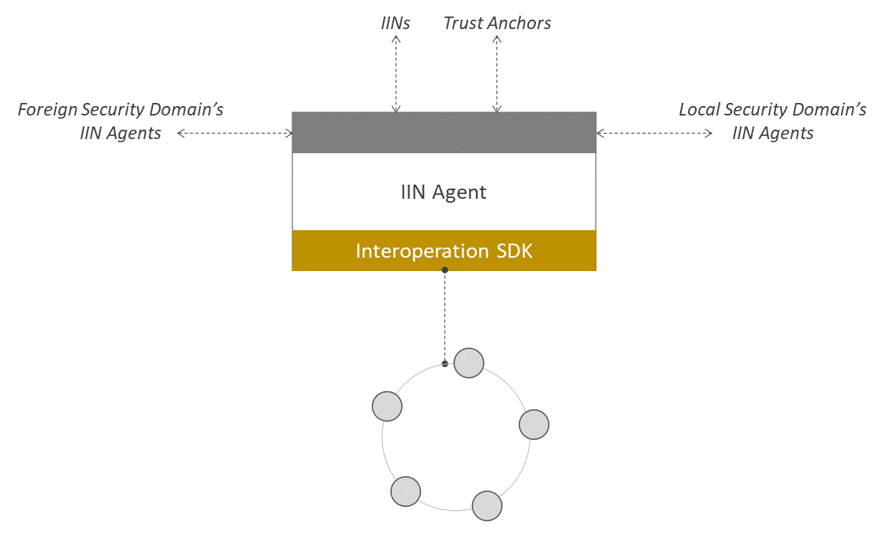
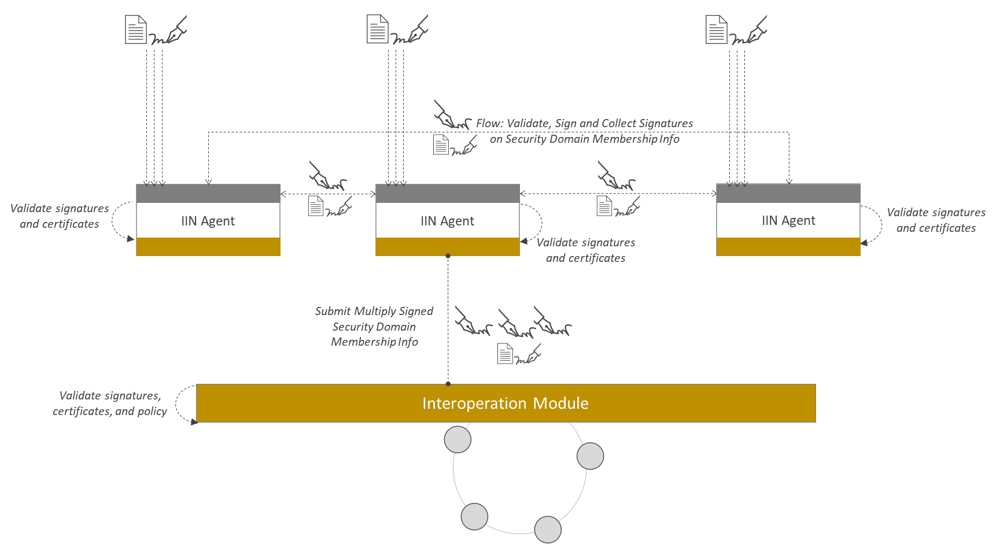

<!--
 Copyright IBM Corp. All Rights Reserved.

 SPDX-License-Identifier: CC-BY-4.0
 -->
# IIN Agents in a DLT Network

- RFC: 01-013
- Authors: Venkatraman Ramakrishna, Krishnasuri Narayanam, Bishakh Chandra Ghosh, Ermyas Abebe
- Status: Proposed
- Since: 25-Aug-2022

# Summary

This document specifies a component of a DLT network's participant unit that is responsible for exposing as well as consuming identity information with the help of IINs, and also act as a bridge between the data plane and the identity plane. The IIN Agent specifically interacts with the DID registry of the IINs, the trust anchors, and IIN agents of other networks' participant units to expose, discover and exchange identity information. The IIN agent also communicates with the data plane to read and configure data plane identity certificates and credentials.

# Network Architecture with IIN Agents

In our view, a DLT network seeking to interoperate with another using any of our protocols is composed of units that are consituent members of that network, and are assumed to have identities independent of the network in the identity plane. Representing each unit in an IIN is an IIN Agent, managing the participant unit's DID. Furthermore, these IIN agents are used to discover, resolve, and verify other participant units' identities as well as network identities. We also assume that each nework unit is a root identity provider within the data plane of its DLT network. In Fabric: an MSP root CA server (typically, but not mandatorially, having a 1-1 relationship with an organization). In Corda: network root CA.

This view is illustrated in the figure below (Fig.1), which maps quite naturally to Fabric networks where each organization is a member, but is general enough to fit other permissioned DLTs like Corda and Besu too.

 
<figcaption>Fig.1 - IIN Agents as Components of DLT Networks.</figcaption>

 

# Data Plane Identity Artifacts

The following artifacts in the data plane are relevant to identity plane protocols:
* _Identity trust store_: this is a set of IINs and Trust anchors `<IIN>,<Trust-Anchor-DID>`. It implies that the network trusts a given trust anchor or all trust anchors in a given IIN to certify the identity/membership credentials of foreign network units. 

* The IIN definition can additionally contain peer connectivity information (to access the IIN ledger). This data will be looked up in the identity sharing protocol, while fetching membership information for a foreign network. It can also be used in proof verification (or view validation) in data plane protocols.
* _Security Domain identities and configurations_: these are identities and certificates corresponding to foreign [security domains](../security/security-domains.md) and their members. See the [security domain identity](../../formats/network/identity.md#security-domain-identity) and [membership](../../formats/network/membership.md) for more details. (_Each security domain is also associated with an Organizational Unit Identity, or a DID record maintained in an IIN_). The IIN Agent of the network members collectively update these configurations using an [identity plane protocol](../../protocols/identity/id-config-sharing.md).

# IIN Agent Design and Interface

An IIN Agent has two distinct roles:
1. As a client of one or more IINs and a DID-and-VC holder for a member of a DLT network member that represents a real world Organization Unit.
2. As a client of a member of a DLT network or security domain with special permissions to update security domain identities and configurations on the ledger via the network's [interoperation module](../infrastructure/interoperation-modules.md).

This IIN Agent model and interface is represented in Fig. 2. An agent is built and deployed as a gRPC service that is reachable from other local or foreign security domains' agents. Simultaneously, it also offers gRPC client services to reach other agents, local or foreign. Each agent is capable of participating in DID and VC/VP protocols yb communicating with IINs and trust anchors too.

 
<figcaption>Fig.2 - IIN Agent Model and Interface.</figcaption>

 

## IIN Agent as Organizational Representative and DID holder

_This is work in progress_.

## IIN Agent as a Security Domain Representative

The agent is bootstrapped with a wallet identity with special permissions (in a Fabric network, we can represent this by embedding an `iin-agent` attribute in the identity certificate).

The agent can serve in two modes as a security domain representative. In one mode, it serves a source network or security domain by serving up that domain's [membership information](../../formats/network/membership.md) with authentication as illustrated in Fig. 3.

 
<figcaption>Fig.3 - IIN Agent in Security Domain Source Mode.</figcaption>

 

In another mode, it serves a destination (or identity syncing) network or security domain by requesting and validating another security domain's membership information from that domain's agents, collect attestations from all other local agents, and record this to the local ledger using the network's [interoperation module](../infrastructure/interoperation-modules.md). This is illustrated in Fig. 4.

 
<figcaption>Fig.4 - IIN Agent in Security Domain Destination Mode.</figcaption>

 

Collectively, IIN Agents in source and destination modes can sync and register a foreign security domain's identity and membership info for use in data plane protocols. See the [description](../../protocols/identity/id-config-sharing.md) of the identity plane protocol that performs this sync for more details. The protocol relies on the DID infrastructure (IINs and trust anchors) as a root of trust but is otherwise bilateral (network-to-network).

### IIN Agent Functional API

Here we specify API functions exposed to other foreign and local IIN agents. These all are RPC endpoints that can be implemented directly in a well-known protocol like gRPC. See the [membership](../../formats/network/membership.md) format specifications for more details.

#### API for Foreign Security Domains' IIN Agents

- **SyncExternalState(NetworkUnitIdentity): returns common.ack.Ack**
    Endpoint for user/client/agent to request a syncing of membership info from a foreign network's member described using the `NetworkUnitIdentity` structure.

- **RequestIdentityConfiguration(NetworkUnitIdentity): returns common.ack.Ack**
    Endpoint for foreign IIN Agent to request attested local security domain's membership information.

- **SendIdentityConfiguration(AttestedMembership): returns common.ack.Ack**
    Endpoint for foreign IIN Agent to supply attested foreign security domain's membership information.

#### API for Local Security Domain's IIN Agents

- **RequestAttestation(AttestedSecurityDomain): returns common.ack.Ack**
    Endpoint for local IIN Agent to request attestation over a foreign security domain's membership info as part of a signature collection flow.

- **SendAttestation(AttestedSecurityDomain): returns common.ack.Ack**
    Endpoint for local IIN Agent to supply attestation over a foreign security domain's membership info as part of a signature collection flow.
