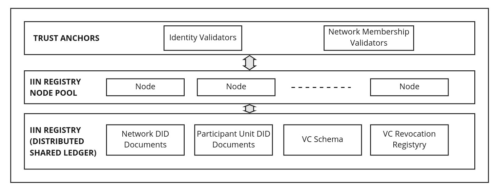

<!--
 Copyright IBM Corp. All Rights Reserved.

 SPDX-License-Identifier: CC-BY-4.0
 -->
# Interoperation Identity Network

- RFC: 01-012
- Authors: Venkatraman Ramakrishna, Bishakh Chandra Ghosh, Krishnasuri Narayanam, Ermyas Abebe
- Status: Proposed
- Since: 25-Aug-2022

# Summary

In abstract terms, an Interoperation Identity Network (henceforth IIN), is a system built on a distributed shared ledger that supports registration of DIDs to networks and their units, as well as resolution of network DID documents form their DID. The IIN also has reputed trust anchors, which play the important role of certifying (or validating) the identity of owners of those DIDs, as well as their memberships in their respective networks, in effect creating roots of trust for cross-network interoperations. An IIN further maintains credential schemas and verification keys ([vc-data-model](https://www.w3.org/TR/vc-data-model/#dfn-verifiable-data-registries)) that enables a DID owner to prove its identity and a recipient to validate that identity. Thus, the IIN provides the foundation for our architecture to enable blockchain network-identity discovery and validation.

An IIN for our family of interoperability protocols has some special requirements.

1. It has to be decentralized and preferably based on distributed ledger technology.

2. The IIN DID registry must support Network DIDs and implement the DID methods as specified in the [identity management protocol](../../protocols/identity/readme.md). Most importantly, the DID method of the IIN must support [Group Control](https://www.w3.org/TR/did-core/#group-control) for the DID controller.

3. The IIN must allow a DID resolver even from outside the IIN  to resolve a DID document from its registry, and verify the authenticity of the response. This property enables blockchain network discovery.

4. Support for Verifiable Credentials ([vc-data-model](https://www.w3.org/TR/vc-data-model/#dfn-verifiable-data-registries)) is required along with the verifiable sdata registry for VC schemas, verification key etc.

The IIN can be built on existing DLT based DID registry technologies such as  [Hyperledger Indy](https://hyperledger-indy.readthedocs.io/projects/sdk/en/latest/docs/getting-started/indy-walkthrough.html). It must also have a set of trust anchors for issuing VCs supporting claims such as identity of participant units  and their memberships in a permissioned network.

# IIN Ledger Artifacts

An IIN must have be able to record the following artifacts perferably in a distributed ledger:
* _DID Documents_ where each document is associated with a single unique DID. The DID Document can be for a blockchain network as a whole - [*Security Domain Identity*](../../formats/network/identity.md#security-domain-identity) or member participant units - [*Organizational Unit Identity*](../../formats/network/identity.md#organizational-unit-identity).

* _Verifiable Credential Schemas_: data structure describing a verifiable credential. ([vc-data-model](https://www.w3.org/TR/vc-data-model/#dfn-verifiable-data-registries))
  
* _Credential Definition_: verification key (issuer public key) and associated metadata to authenticate a credential.

* _Revocation Registry_: to allow VC issuers to revoke credentials.

## Organizational Unit Identity and Security Domain Identity

The IIN ledger holds the DID documents of individual network members as well as that of the network as a whole.
See [specifications of these DID formats](../../formats/network/identity.md) for details.

## Credential Schema, Verification Keys and Revocation Lists

A DID Document is not inherently mapped to any entity's physical identity [did-core](https://www.w3.org/TR/did-core/#binding-to-physical-identity) and the DID Documents are not supposed to contain any personal data. In order to bind a person's / organization's identity to the DID, or assert any other claims about the DID's subject, verifiable credentials are used.

The IIN must support two kinds of claims to be issued by trust anchors to the DIDs:

1. Identity VCs - for associating real world identity to individuals/organizations which are members of networks -  *Organizational Unit Identity VC*, or to a network as a whole - *security Domain Identity VC*. (See [Network Identity Validation protocol](../../protocols/identity/security-domain-identity-validation.md) for details.)

2. Membership VCs - to assert the membership of an individual/organization in a blockchain network.

For each verifiable credential, the IIN must store the corresponding [schema](https://www.w3.org/TR/vc-data-model/#data-schemas), as well as the issuer public keys and revocation list.

# IIN DID Method

An IIN can have any distributed DID registry based on any platform, provided it supports the DID method operations stated as follows: 

1. **DID creation** - For creating a new DID and a DID Document in the IIN, the DID method of the IIN must authenticate the DID controller who is creating a DID. For a Network DID, this authenticate must be based on a `verificationMethod` of type `BlockchainNetworkMultiSig`. For other DIDs for example participant unit DIDs, the authentication can be based on any `verificationMethod`.

2. **DID updation** - DID method of the IIN must support updating a Network DID Document by authenticating an updation request based on the `updatePolicy` of the `BlockchainNetworkMultiSig` type `verificationMethod` of the Network DID. For updation of other DIDs, the authentication can be based on any `verificationMethod`.

3. **DID resolution** - DID method of the IIN must allow a DID resolver even from outside the IIN  to resolve a DID document, and verify the authenticity of the response.

# IIN Architecture

The figure below illustrates the architecture of an IIN.

At the bottom layer lies a shared ledger forming the IIN Registry that is maintained collectively through consensus by a pool of nodes that lies in the layer above.

Above the node pool lie agents acting on behalf of trust anchors. These trust anchors can be reputable entity trusted to vouch for DLT network consortiums and their individual units. The trust anchors might be identity validators who assert the physical identity of a particular DID subject, or membership validator asserting the membership of a DID subject in a particular blockckchain network.

In this architecture, the identity validating trust anchors can issue VCs to the participants units such as organizations participating in blockchain networks. Moreover these trust anchors may also issue VCs directly for the Network DIDs, attesting the identity of the network itself.

## Trust Anchors

DID documents are implicitly not tied to any physical identity. Thus after obtaining a Network DID document or a participant DID document, it has to be validated based on some trust basis. For this validation the local network participants may rely on some trust anchors.

These trust anchors are entities that the participants trust and whose identity are already known to them. For example, trust anchors may be well known organizations that validate network identities, just like certificate authorities (CA) in the internet. Which trust anchor to use as trust basis entirely depends on the validator. Any entity with an IIN agent can itself become a trust anchor.

## IIN Agents

DLT networks interact with the IINs and with each other through components called IIN Agents. Each participant unit in a DLT network must have at least one IIN Agent using which it exposes its identity as well as discovers and verifies foreign network identities. The IIN Agents are detailed [here](./iin-agent.md).
