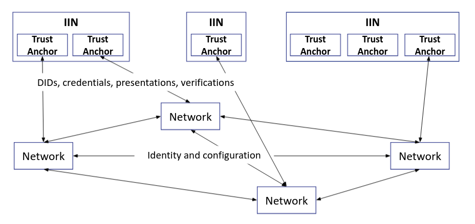

<!--
 Copyright IBM Corp. All Rights Reserved.

 SPDX-License-Identifier: CC-BY-4.0
 -->
# Decentralized Network-Identity Discovery and Management for Interoperation

- RFC: 01-011
- Authors: Venkatraman Ramakrishna, Krishnasuri Narayanam, Bishakh Chandra Ghosh, Ermyas Abebe
- Status: Proposed
- Since: 25-Aug-2022

# Overview

During interoperation through the [data sharing protocol](../../protocols/data-sharing/generic.md), the primary functions performed through consensus in the _endpoint_ peer networks, namely _request access control_ and _view proof validation_, depend on the availability of authentic information about the counterparty network's identity providers and their credentials. Snapshots of these _identity configurations_, changing at punctuated intervals, act as essential trust basis for access control checks and proof validations. As Fig.1 indicates, our protocol has two distinct planes of operation, an _identity plane_ that syncs identity information as necessary and a _data plane_ where requests and responses occur. (_Note_: data query is just one example of a protocol operating in the data plane, independent of the protocol operating in the identity plane yet dependent on the information obtained through the latter.)

 
<figcaption>Fig.1 - Data plane and identity plane in cross network data sharing protocol.</figcaption>

 

In the data sharing protocol, the protocol in the identity plane is implemented through the simplistic means of each network exposing a single public (i.e., without any access control) REST API function, from one of its active web servers, that reveals portions of the latest network configuration:
* In Fabric, this is the channel configuration containing root CA and intermediate CA certificates and other possibly relevant metadata for every organization participating in the channel.
* In Corda, this is a set of certificate chains, typically network root --> doorman --> node for each network node.

This solution, implemented as a stopgap measure, suffers from various drawbacks:
1.  First, it is insecure, relying on a single designated spokesperson to expose identity information in a participating network, and further not enforcing access controls on the information being exposed.
2. Second, it relies on apriori configuration of information about the REST API endpoints of the foreign networks, such as their addresses. There is no mechanism of discovering the interoperating networks.
3. Third, it assumes a priori trust between the two networks, while in the real world, parties rely on common trusted authorities for the introductory step.
4. Fourth, it again relies on a single designated member (participant unit) of a network to configure the identity information of foreign networks.

To enable data and asset exchange protocols between permissioned networks on-demand, we need a more secure and systematized process for exposing, discovering, verifying, and configuring network identity information. Further, this process should be decentralized in a way that allows participating networks and their units to own, control, and expose their identity information as they see fit and not have to rely on centralized parties as mediums of exchange. The process should also ensure extensibility, and scalability to the extent possible, by enabling a network with units owning decentralized identities (DIDs) which can be verified by well-known and trusted identity providers to exchange data or assets with permissioned networks already part of the ecosystem. Finally, trust in identity providers should be based on blockchain (or distributed ledger) principles, mitigating the possibility of collusion between networks and identity providers.

A slightly amended figure (Fig.2) illustrates our view of the solution below, where you can see that the identity plane protocol relies both on bilateral communication and a "cloud" of identity providers that provides the fundamental trust basis for interoperation. We will sketch out the details of this cloud and the identity information exchanges later.

 
<figcaption>Fig.2 - Identity plane using some identity providers and verifiers as a trust basis.</figcaption> 

 

Having established our mode of blockchain interoperation as a two-plane networking system, we can focus on the components and mechanisms in the identity plane. Other specifications in this repository cover the gamut of features implemented in the data plane.

# Design Approaches and Choices

There is a range, or spectrum, of architectural choices available to build identity plane infrastructure and protocols, which are described at length [here](./design-choices.md). In this document and in the rest of the specification, we will select one of those choices: "DID Registry for Identity Exchange", and describe a reference architecture and set of protocols in detail. Before doing that, we will describe the landscape as we see it, list our assumptions, and provide some reasoning for our design choices.

The concepts of _Decentralized Identity (DID)_ and _Verifiable Credential (VC)_ already exist and are in W3C draft status. There are several examples of DID registries where user identities can be stored and looked up from in controllable ways. Credential issuers have existed on the Web for many years, and we expect that most will soon provide VCs to DID holders as this is the most promising approach to ensuring decentralized, controllable, and privacy-preserving authentication. Entities that participate in blockchain networks may already possess DIDs in one or more of these registries, and if not, can easily get DIDs created. They can also obtain VCs from reputed certifiers if they do not already possess them for proving their identity and other claims. Therefore, our design relies on blockchain network participants possessing DIDs and VCs issued by entities outside those networks.

What we cannot know beforehand is what configuration of DID registries or VC issuers will exist at any given time nor should we make any assumptions that will limit our choices in the future. We can also not know the complete trust calculus beforehand that tells us how to connect two interoperating networks via common DID registries and VC issuers. We can only rely on the existence of DID and VC standards that everyone will eventually converges to. But for the purpose of our design, we can (and will) select a particular configuration that shows how the basis of interoperation can be built using DIDs and VCs. Our mechanisms can be easily adapted for different configurations of DID registries and VC issuers than the one we will describe in detail in this RFC.

# Distributed Identity Management Architecture

The below figure (Fig. 3) illustrates our identity plane architecture:
* A set of identity providers and verifiers to establish a trust basis for exchange of identity and any other network configuration information. We assume, without loss of generality, that such identity providers belong to networks which we term as _Interoperation Identity Networks (IINs)_.
* A set of agents, called *IIN Agents* that act on behalf of members (participant units) within a network that collectively supply and fetch membership, identity, and any other configuration information, of the counterparty network.

 
<figcaption>Fig.3 - Identity plane architecture overview</figcaption> 

 

_Some Notes on IINs (Pertaining to the Design Choices Described Earlier)_:

* _The term 'Interoperation Identity Network' is a placeholder to describe a unit of our proposed architecture, and is subject to change in the future. A term that may replace it is 'Distributed Identity Registry', which captures both the role and the nature of this entity, and which practitioners may already be familiar with_.
* _An IIN is not a new concept or system we are inventing for interoperation purposes but is rather an extrapolation of the concept of a DID registry, many varieties of which exist today, to a distributed system that may maintain DID records through consensus among a committee on a shared ledger rather than maintain them in a centralized repository_.
* _An IIN brings within its purview both a DID registry maintained as a shared ledger as well as well-known issuers of DIDs and verifiable credentials (VCs) who collectively maintain that ledger. In the real-world, registries as well as issuers already exist, though not necessarily part of a single network. The design and protocol we describe can accommodate existing DID registries and VC issuers, even though they be independent (and centralized) entities, but in our discussion we will assume, without loss of generality, that they belong to one or the other network (labeled as an IIN). Our mechanisms rely on the ability to negotiate with issuers and read/write to DID registries; neither function is constrained by the nature of the issuers or the registries_.

The following figure (Fig. 4) illustrates a representative instance of the generalized architecture. We envision an ecosystem consisting of multiple independent DLT networks, each of which chooses to interoperate for data or asset exchanges with another network bilaterally on a need basis. In this ecosystem, there also exist one or more IINs, each of which consist of one or more reputable trust anchors. These trust anchors issue VCs to support claims of the networks and their participants, thus forming the trust basis for identity verification.

 
<figcaption>Fig.4 - IINs in Identity plane architecture</figcaption> 

 

#### Condition for successful identity configuration:

Suppose there are two networks N1 and N2, and there are two IINs, IIN1 and IIN2. There are also two trust anchors, T1 in IIN1 and T2 in IIN2.

Prerequisites for interoperation between network N1 connected to trust anchor T1 on IIN1 and N2 connected to trust anchor T2 on IIN2:
* N1 must have access privileges to IIN2's ledger and N2 must have access privileges to IIN1's ledger. Here access means ability to read the ledger to resolve DID Documents from it.
* N1 must trust T2 as an identity provider and verifier, and N2 must trust T1 similarly

> (_Note_: this calculus becomes simpler if IIN1 and IIN2 are the same network, and even simpler if T1 and T2 are the same. In the latter case, the scenario devolves into N1 and N2 having a common root of trust.)

## Reference Architecture and Functional Requirements

From a functional perspective, the mechanism to exchange identity information and to keep it in sync across network boundaries is agnostic of the trust relationship between networks. The simplest way to implement our architecture would be using a single IIN with multiple trust anchors representing either individual network consortiums or authorities trusted by the networks' constituent members, as mentioned earlier in this document. Functionally, this will be identical to a multi-IIN setup and so we will use this as the canonical architecture to describe the exchange protocol. The specification for IINs and the network components will leave room for multiple IINs though.

## Interoperation Identity Network - IIN

Our canonical IIN is a distributed shared ledger based DID registry that supports [Group Control](https://www.w3.org/TR/did-core/#group-control) to allow the group of network members (participant units) to control a single DID for the network. Along with this DID registry the IIN also has trust anchors, that issue VCs to support claims by different units.

See specification for IINs [here](./iin.md).

## Forms of Identity

Our framework consists of both hierarchical and decentralized identities. Decentralized identities belong to constituent units of participating DLT networks, each of whom is assumed to be an independent actor with an identity that is may not owe its existence to the network in question. Yet, for interoperation purposes, that decentralized identity will be associated with the corresponding network's identity, as will the identities of all the other units of that network. Below are the different identities that will be maintained and used in identity plane protocols:
* _Organizational Unit Identity_: Each member (individual/organization) of a DLT network will have a real world identity independent of its affiliation with that network. This identity is also a decentralized identity (DID), registered in an IIN DID registry.
* _Security Domain Identity_: The identity of a network, which is also a [security domain](../security/security-domains.md), in the form of a DID, registered in an IIN. This identity is controlled collectively by the members of the network.
* _Trust Anchors_: Trust anchors are identities of well-known entities that issue VCs to attest the real world identities of both Organizational Units and Security Domains.
* _Security Domain Member Identity_: In the data plane, network members may use different identities scoped within their security domain as necessitated by the DLT platform on which the network is built. Such identities are not a requirement in the identity plane. But a member uses its _Organizational Unit Identity_ (in the identity plane) to self attest its _Security Domain Member Identity_.

See the [data format specifications](../../network/identity.md) for more details.

## Security Domain Identity Creation, Exchange and Validation

DLT networks and their members must create and configure their respective identities in the identity plane. See the protocols for [cross-network identity exchange and validation](../../protocols/identity/readme.md) for more details.

## Security Domain Identity Discovery

For two different DLT networks to interoperate seamlessly, a network must fetch, validate, and record its counterparty network's members' identities on its ledger. But discovering the counterparty network and obtaining its security domain identity is a prerequisite for any identity plane protocol in which members' identities can be synced. IIN infrastructure facilitates such discovery by allowing networks to register and record their security domain identities in the forms of Network DIDs. We will assume that each network will have a unique Network DID, analogous to a domain name in the Internet.

See the [network discovery protocols specifications](../../protocols/discovery/discovery.md) for more details.

