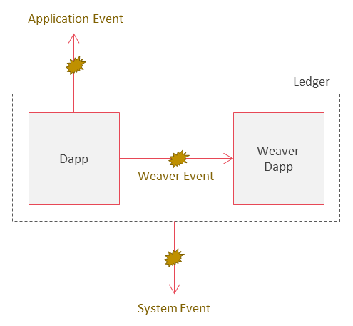
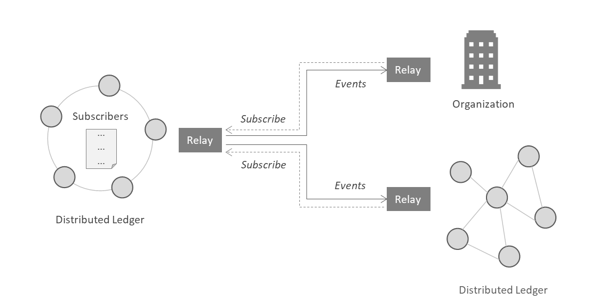

<!--
 Copyright IBM Corp. All Rights Reserved.

 SPDX-License-Identifier: CC-BY-4.0
 -->
# Events

- RFC: 01-004
- Authors: Ermyas Abebe, Dileban Karunamoorthy
- Status: Draft
- Since: 02-Nov-2020

## Summary

* Distributed ledgers generate a variety of events during operation.
* Some events are caused by custom application logic while others are caused by standard ledger operations such as committing a transaction or block.
* Events generated can be observed by zero or more external agents with appropriate permissions.
* External agents can take different forms, including a person, a device, an enterprise application or other distributed ledgers.

## Types of Events

The events generated by a distributed ledger can fall into one of three categories, application events, system events, or Weaver events.

### Application Events

Application events are generated by application code (Dapp), executed by the distributed ledger protocol, when specific conditions in the application logic are met. Examples of application events include: 
  * A *payment event* generated when a party receives funds from another.
  * A *settlement event* generated when a Letter of Credit is settled upon payment by the importer's bank.
  * A *redeemed event* generated when a commercial paper contract is redeemed after its maturity date.

### System Events

System events are generated by the distributed ledger protocol when performing standard ledger operations. Examples of system events include:
  * A *commit event* generated when a transaction or block is committed to the ledger.
  * An *upgrade event* generated when a smart contract is upgraded.
  * A *member revoked event* generated when a member's access to a ledger is revoked.

### Weaver Events

(Requires further discussion)

Weaver events are events registered by an application Dapp with the Weaver Dapp. Weaver events are captured in the ledger's world state. Examples of Weaver events include:
  * A *delivered event* generated by a logistics Dapp is registered with the Weaver Dapp. The event is pushed to a remote trade finance network to initiate payment settlement.
  
  
## Subscribing to Events

External agents can subscribe to events of a named *topic*. An authorized subscriber will receive events publish by the ledger. Topics can vary from system events to events related to the life-cycle of an object stored on the ledger.

