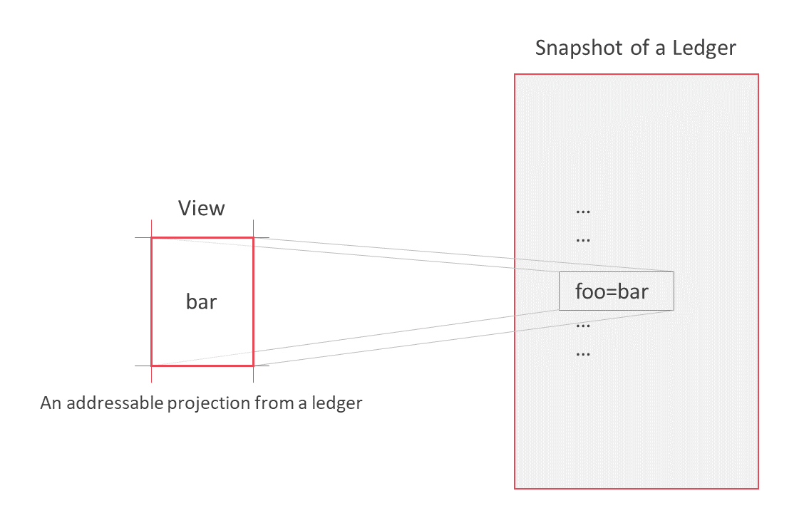
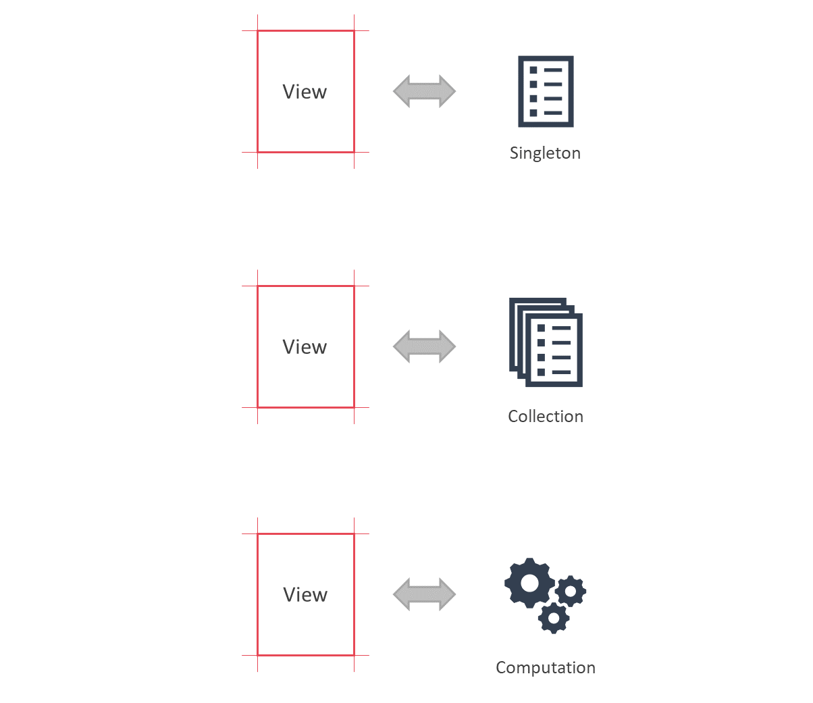
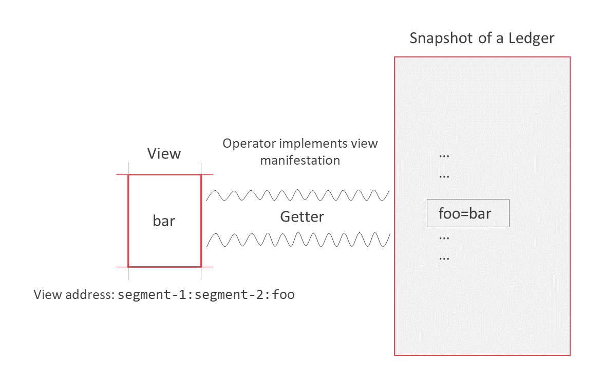
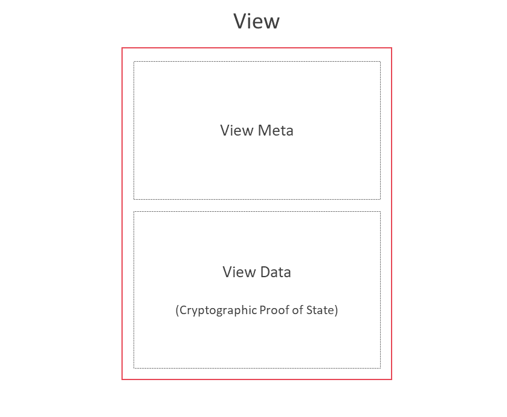

<!--
 Copyright IBM Corp. All Rights Reserved.

 SPDX-License-Identifier: CC-BY-4.0
 -->
# Views

- RFC: 01-001
- Authors: Allison Irvin, Antony Targett, Christian Vecchiola, Dileban Karunamoorthy, Ermyas Abebe, Nick Waywood, Venkatraman Ramakrishna
- Status: Proposed
- Since: 19-Aug-2020

## Summary

- A view is a uniquely addressable, externally consumable, projection of state from a ledger.
- Views can be thought of as values. That is, they represent the _what_ and not the _how_.
- A view's internal representation is dependent on the implementation of the distributed ledger protocol.
- The view abstraction however allows us to talk about state on ledgers without being concerned about their underlying implementation. For example, the Bill of Lading with address X on the logistics ledger or the payment transaction with address Y on the payments ledger.
- The view abstraction also allows the communicating infrastructure to ignore details of ledger implementations when managing state.

## View Abstraction

A view is an abstract representation of state projected from a ledger that is consumable by external clients. Views are uniquely addressable and can either be _static_ (based on a fixed snapshot of the ledger) or _dynamic_ (based on a "current" snaphot of the ledger).



The state represented by a view depends on the underlying ledger and the types of projections made available. Views can represent a single object on the ledger, a collection of objects or any arbitrary computation. The sematics of a view therefore depends on the specific instance of the ledger and the decisions made on what state is externally consumable and in what form.




## Projecting Views

Views are manifested using operators called _getters_. View operators are implemented using features provided by the underlying ledger protocol and every getter projects a unique view to the external world. Examples of the mechanisms used by well-known protocols in projecting views include:

- A Bitcoin view, manifested by generating a Simplified Payment Verification on a given transaction ID.
- A Corda view, manifested by querying the local vault or executing a query flow.
- An Ethereum view, manifested by sending a view transaction to a contract address with one or more input fields.
- A Fabric view, manifested by querying a chaincode function using one or more arguments.

The schematic representation of getters are dependent on the underlying distributed ledger protocol, but are conceptually abstrated away from clients consuming a view through the use of [_view addresses_](../formats/addressing.md). Although getters can be visible to external clients, their sematics and usage are transparent. This allows networks to use alternate representations for getters without requiring external clients to treat these in different ways. In other words, an external client is free from the understanding the implementation of an operator - the client is interested in the _what_ not the _how_.




### Examples of Getters

The following is an example of a getter representing a bill-of-lading with id 10012 in a Fabric network:

```
trade-channel:trade-chaincode:getbilloflading:10012
```

An alternate representation of the same view using base64 encoding:

```
base64(trade-channel:trade-chaincode:getbilloflading:10012)

=> dHJhZGUtY2hhbm5lbDp0cmFkZS1sb2dpc3RpY3MtY2hhaW5jb2RlOmdldGJpbGxvZmxhZGluZzoxMDAxMg==
```

The same view represented using a sha256 hash:

```
sha256(trade-channel:trade-chaincode:getbilloflading:10012)

=> 1650ada0686306b188ee70a45251827c8b56b5f2fab9f86f26370b59a8049e57
```

A one-time getter for the same view built using a sha256 hash after a nonce is appended:

```
sha256(trade-channel:trade-chaincode:getbilloflading:10012:noncexxx)

=> f52aac4d073437ee53a3f84b0f4cb91c3ec0d101127c497da502d6b7618de2b3
```

The two latter representations of view operators are opaque, hiding details of the operator implementation. Representations such as these are useful in keeping details of the getter construction private or in implementing one-time views. However, implementing opaque getters requires managing off-chain state for mapping them to corressponding getters that can be understood by the underlying ledger protocol.

See RFCs on specific ledger protocols for getter constructions.


## The Anatomy of a View

A view is composed of two segments. A segment that contains state from the underlying ledger, accompanied by a cryptographic proof, and a second segment that contains meta-data about the state. The structure of the data segment in a view depends on the underlying ledger protocol and the data schema of the ledger. The meta-data describes attributes of the state including type of proof, ledger protocol and serialization format. The meta-data enables consumers of views to recognize, parse and verify the integrity of views, including long after the view has been constructed.




## Related Art

- Verifiable Observation of State in Permissioned Ledgers (AFT)
- [DAML Ledger Model](https://docs.daml.com/concepts/ledger-model/index.html)
- [John Wiegley - Putting Lenses to Work](https://www.youtube.com/watch?v=QZy4Yml3LTY)
- [Profunctor Optics: The Categorical View](https://golem.ph.utexas.edu/category/2020/01/profunctor_optics_the_categori.html)

