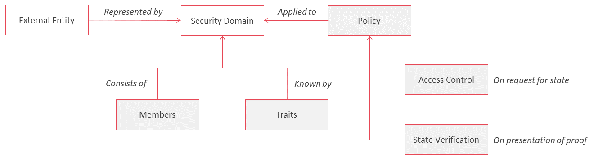

<!--
 Copyright IBM Corp. All Rights Reserved.

 SPDX-License-Identifier: CC-BY-4.0
 -->
# Security Domains and Guards

- RFC: 01-007
- Authors: Allison Irvin, Antony Targett, Christian Vecchiola, Dileban Karunamoorthy, Ermyas Abebe, Nick Waywood, Venkatraman Ramakrishna
- Status: Proposal
- Since: 13-Aug-2020

## Security Domains: Summary

Security domains are defined on external entities such as a thing, person, organization or on groups of entities such as networks. Security domains assemble a set of policies that are applied to a variety of interactions with a given external entity. These can include access control policies that are applied on requests to read state on the ledger or verification policies applied on presentation of a proof of state by the external entity.

A security domain is an abstract concept used to group a set of members to various policies. The relation between the various concepts is shown in the image below.

### Members and Traits of Security Domains

The members of a security domain are represented by a set of public keys, certificates or certificate authorities. This allows security domains to be defined over a domain of validators in a permissionless network, a domain of known entities in a club, an organization, or a group of organizations representing a permissioned network.

It is also possible for the members of a security domain to be empty, implying that any interaction with the external entity doesn't involve validation of membership. This is useful in situtations when the external entitiy is known by other non-identifiable traits, such as the _difficulty target_ in the Bitcoin network, zero-knowledge credentials (e.g. a bank in Australia), knowledge of some secret, or a commitment.

### Policies

The application of policies helps guard against unauthorized access to state or presentation of proofs that are either invalid or don't meet an expected integrity criteria.

## Securing the Relay
