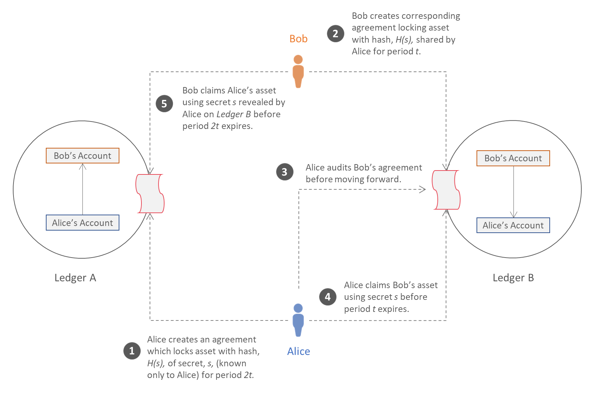
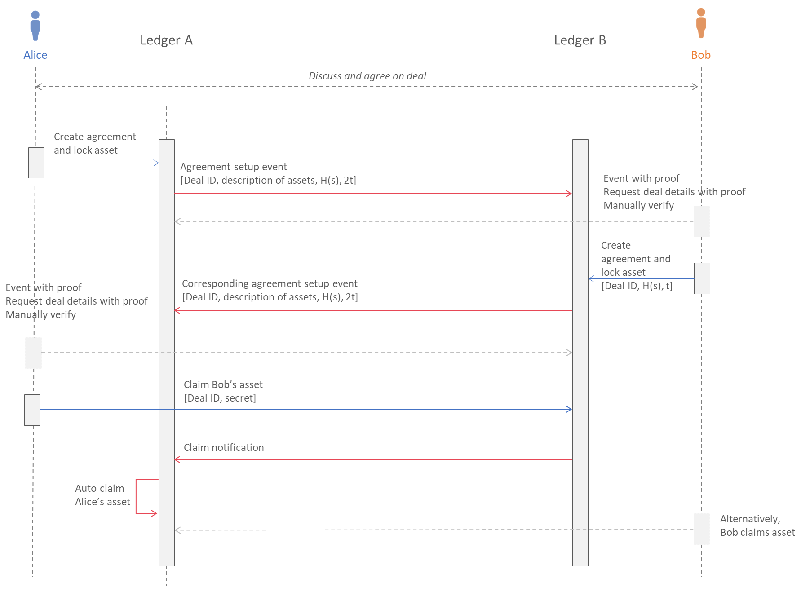

<!--
 Copyright IBM Corp. All Rights Reserved.

 SPDX-License-Identifier: CC-BY-4.0
 -->
# Asset Exchange - HTLC

- RFC: 02-004
- Authors: Dileban Karunamoorthy, Ermyas Abebe, Venkatraman Ramakrishna, Sandeep Nishad, Krishnasuri Narayanam, Dhinakaran Vinayagamurthy
- Status: Proposed
- Since: 25-Nov-2020

## Summary

* Asset exchange protocols allow parties to trade assets residing in different ledgers.
* Hash Time Locked Contract (HTLC) is a pattern for enabling asset exchanges without placing trust in a central party.
* HTLCs are atomic in nature, in that, either a deal executes and parties receive the assets they wanted, or parties retain their original assets.

## Atomic Swaps with Hash Time Locked Contracts

Hash Time Locked Contracts (HTLCs) is a non-custodial approach to exchanging assets between two or more parties. Although HTLCs do have some drawbacks in their construction, they are simple enough to address a number of real-world exchange scenarios. 

The following figure describes the flow of a two-party exchange.

Alice and Bob agree on a deal off-chain to exchange assets A for B. In practice assets A and B could be fungible or non-fungile and the deal is based on their fair value. Alice and Bob also agree on the refund period for the deal and decide who will go first. The process for exchanging the assets then proceeds as follows.

1. Alice creates an agreement on *Ledger A*, locking her asset using the hash *H(s)* of a secret *s* for the period *2t*. The secret is only known to Alice at this stage.
2. Upon inspection, Bob creates a corresponding agreement on *Ledger B* locking his asset using the same hash shared by Alice. The refund period is set to *t*.
3. Alice inspects Bob's agreement before proceeding. She verifies the hash *H(s)* and period *t*.
4. Alice attempts to claims Bob's asset using secret *s*. If the hash of *s* matches *H(s)* in the agreement and the current time is less than *t*, the asset is unlocked and transferred to Alice.
5. Bob, observing the secret shared by Alice on *Ledger B*, now attempts to claim Alice's asset using secret *s*. If hash of secret *s* matches *H(s)* and the current time is less than *2t* the asset is unlocked and transferred to Bob.

In the event Alice fails to claim Bob's asset before the refund period *t* elapses, Bob can reclaim his asset any time after. Similarly, Alice can reclaim her asset any time after *2t*.

## Overview of Protocol Flow

## Protocol Messages

## Open Questions 

* Can the coordination and agreement on the deal, which currently happens off-chain, be coordinated by the protocol?
* Do we assume that the application, acting on behalf of Alice and Bob, is always available and that a deal never partially fail?
  * Given this is a permissioned network, on the rare chance that an application is down after counter party has claimed asset, the failure to claim can be resolved through manual procedures involving the management committees and proving of counter party claims.
* The relay and driver plays no special role besides communicating flow of messages.
* Alternatively, the application layer can coordiante the whole swap instead of involving the relay / drivers.

## Additional Notes

* Alice sets up deal on-chain by locking asset
  * Asset owned by Alice
  * Image of secret (hash-lock)
  * Duration till asset can be redeemed
  * Bob as counter-party
  * Address of counter party's asset
  * Deal ID
* Creation of deal generates event that is propagated to destination network
* Bob creats corresponding deal using event data on destination network
  * Asset owned by Bob
  * Image of secret 
  * Duration till asset can be redeemed
  * Alice as counter-party
  * Address of counter party's asset
  * Deal ID (matches with deal ID in origin network)
* Scenario 1: Alice claims Bob's asset on destination network
  * Submits secret
  * Secret is propagated to origin network
  * Automatic claim executed.
    * Possible failure if message is lost.
      * Bob claims Alice's asset using secret.
* Scenario 2: Time lock expires
  * Bob reclaims asset in destination network
  * Alice reclaims asset in source network
  * Alternatively, automatic reclaiming by driver or application

