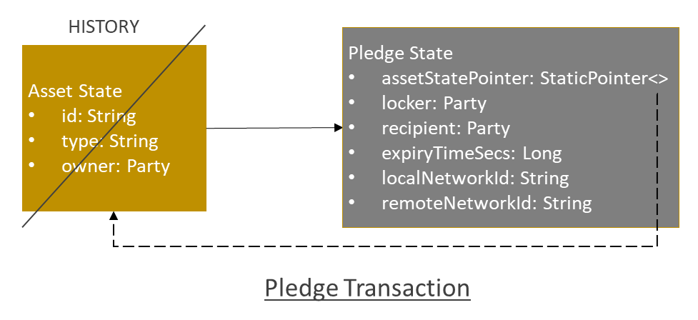
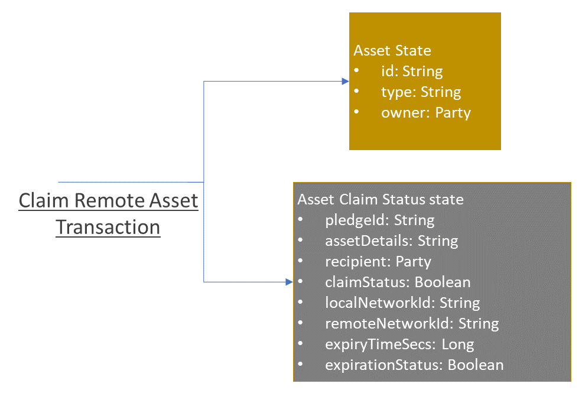
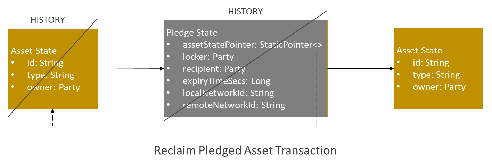

<!--
 Copyright IBM Corp. All Rights Reserved.

 SPDX-License-Identifier: CC-BY-4.0
 -->
# Asset Transfer Protocol Units in Corda Networks

- RFC: 02-010
- Authors: Krishnasuri Narayanam, Sandeep Nishad, Venkatraman Ramakrishna, Dhinakaran Vinayagamurthy
- Status: Proposed
- Since: 21-Oct-2022

## Implementation of Protocol Units in Weaver
Below we describe the approach for the implementation of asset transfer from one ledger to another that requires only non-validating notary.
- Pledge transaction: Consumes an input *Asset State* (object representing an asset on the ledger) and produces *Pledge State* as the output. A reference to the consumed *Asset State* is maintained as a Corda [*StaticPointer*](https://docs.r3.com/en/api-ref/corda/4.3/enterprise/kotlin/corda/net.corda.core.contracts/-static-pointer/index.html) (instead of copying the entire *Asset State* object), which will be used during the reclaim of pledged asset later in the same ledger.
  - only the party performing the pledge is required to be the signer of the trasaction (however, both the party performing the pledge and the recipient are considered to be the owner of _Pledge State_).

- ClaimRemoteAsset transaction: The Corda _flow_ that implements this transaction triggers a _subFlow_ to fetch an object that represents the pledge status in the remote network (export network). This object already must have been written to the local ledger (import network) as part of a trusted data-sharing invocation between these networks. This object data is validated such that: (i) expiry time has not elapsed (ii) the party performing the claim is same as the recipient in the _Pledge State_ (iii) local network is same as the remote network specified in _Pledge State_. Moreover, the transaction _flow_ ensures that the Claim is not already done in the local network by checking for the non-existance of claim status state in local ledger. The Corda contract _command_ checks that there are two output states (one representing the claimed asset state and other representing the claim status state object in local ledger). The _contract_ also checks that the owner of the claimed asset is same as the recipient in the claim status state; and the party performing the Cliam is the required signer of the transaction. The Corda _flow_ that implements this transaction triggers a _subFlow_ to create asset object that is claimed as part of this transaction.
  - The _subFlow_ will be part of the client CorDapp, but not part of the interoperation CorDapp of the Corda network.

- ReclaimPledgedAsset transaction: Consumes an input *Pledge State* and produces *Asset State* as the output. The Corda _flow_ that implements this transaction first queries the _Pledge State_ from local ledger (export network) then triggers a _subFlow_ to fetch an object that represents the claim status in the remote network (import network). This object already must have been written to the local ledger as part of a trusted data-sharing invocation between these networks. This object data is validated such that: (i) expiry time is as specified in the _Pledge State_ (ii) asset was not claimed in import network (iii) pledge was expired already. The Corda contract _command_ checks that the _locker_ in the _Pledge State_ is the owner of the asset that is reclaimed in addition to being the signer of the transaction.

A non-validating notary used in this approach doesn't check the validity of the transaction, but only prevents _double spending_ by the parties. This ensures the privacy of the transaction data.
