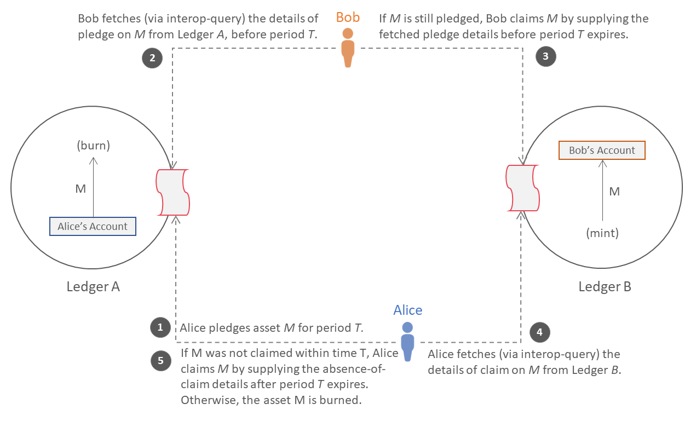
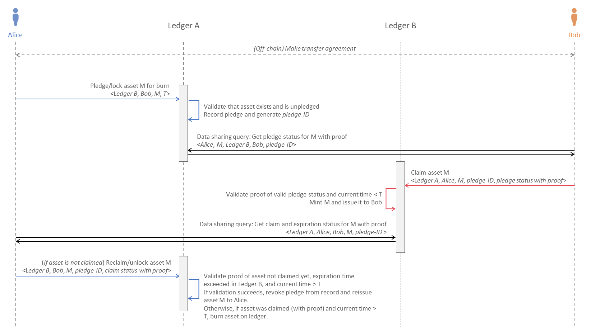

<!--
 Copyright IBM Corp. All Rights Reserved.

 SPDX-License-Identifier: CC-BY-4.0
 -->
# Asset Transfer Protocol

- RFC: 02-008
- Authors: Venkatraman Ramakrishna, Krishnasuri Narayanam, Sandeep Nishad, Dhinakaran Vinayagamurthy
- Status: Proposed
- Since: 26-Dec-2022

## Summary

Asset transfer protocol in Weaver allows transferring an asset from one shared ledger to another by burning it in the source ledger and creating it in the destination ledger in an atomic manner.
- Creating of the asset in the destination ledger should happen within an agreed-upon period. Otherwise, the asset is created in the source ledger after the time period elapses.

## Protocol Overview

The asset transfer protocol specified in this document realizes the model described in the [atomic cross-ledger transactions spec](../../models/ledger/atomic-cross-ledger-transactions.md).

This protocol uses as its building blocks:
- Smart contracts (for network-local operations)
- Cross-network [data sharing protocol](../data-sharing/generic.md)

The ledgers, participants, and sequence of states they go through to either effect an asset transfer or revert to the original state (upon failure of any kind) are illustrated in the figure below. (_Note_: Alice and Bob may represent the same real-world entity. Asset _M_ in both ledgers are assumed to be equivalent in a global sense, though their internal representations may vary from Ledger _A_ to Ledger _B_, especially if the two ledgers are built on different DLT platforms.

In a nutshell, the protocol can be described intuitively as follows:
- **Pledge Phase**: Alice pledges (or locks) M in Bob's favor in Ledger A
- **Claim Phase**: Bob mounts a claim to mint and own M in Ledger B using proof (acquired from Ledger A) of M being pledged by Alice in his favor
- **Claim Phase**: If Bob was able to claim within the expiration time T, the asset is successfully transferred across ledgers from Alice to Bob
- **Reclaim Phase**: If the claim did not occur (for whatever reason) and the pledge has expired, Alice can freely reclaim M in Ledger A using proof (acquired from Ledger B) of M being unclaimed by Bob
- **Reclaim Phase**: If Alice mounts her reclaim after the expiration period T and provides valid proof of the unclaimed status of M in Ledger B, the asset transfer fails and M reverts to her ownership.
Integrity of the asset is guaranteed through the cross-ledger atomicity ensured by this protocol: either the Claim Phase suceeds or the Reclaim Phase does, thereby resulting in only one of the two following outcomes:
- Bob owns M in Ledger B
- Alice owns M in Ledger A

## Generic Asset Transfer Flow

The asset transfer flow is illustrated in more detail in the following figure, and in the description further below. It shows the protocol followed by Alice and Bob, using transaction within the ledgers and cross-network data sharing queries across the ledgers:

1. Alice pledges or locks asset *M*, which she owns, in Ledger *A*, in a commitment to burn it upon successful minting and assigning to Bob's ownership in Ledger *B* within time period *T*.
2. Bob fetches the pledge status for *M* in Ledger *A* using a cross-ledger [data sharing query](../data-sharing/generic.md).
    - If Ledger *A* reports the existence of no such pledge by Alice on asset *M*, the protocol terminates.
    - Otherwise, if Ledger *A* reports the expiration of the pledge (i.e., Bob send the query after time period *T*), the protocol terminates.
3. Bob mints and acquires ownership of asset *M* in Ledger *B* by providing the fetched pledged details along with proof from Ledger *A*.
    - If the proof is invalid or indicates the absence of a pledge or indicates that the pledge has expired, minting of asset *M* fails.
    - Otherwise, if the current time exceeds *T*, minting of asset *M* fails.
    - Otherwise, asset *M* is minted and issued to Bob on Ledger *B*.
4. Alice fetches the claim status of asset *M* in Ledger *B* using a cross-ledger [data sharing query](../data-sharing/generic.md).
    - If Ledger *B* reports a successful minting of asset *M* and issuance to Bob, the protocol terminates.
    - Otherwise, if ledger *B* doesn’t report a successful mint of asset *M* by Bob but the current time has not exceeded *T*, then Alice retries this step after some time.
    - If ledger *B* doesn’t report a successful mint of asset *M* by Bob and the current time has exceeded *T*, then Alice proceeds to the next step.
5. Alice mints asset *M* in ledger *A* by providing the last queried mint status from ledger *B* as the proof.
    - If the asset was already claimed in ledger _B_ then minting again the same asset in ledger _A_ is not carried out.

*Note*: though Alice may fetch the claim status of asset *M* (Step 4) at any point in time, Ledger A will not permit the reclamation or unlock of the asset until the time period *T* has elapsed. As a practical matter, because Alice does not know exactly when to fetch the claim status proof for successful reclamation, she may attempt Step 4 multiple times by programming her client/agent suitably. Though this will add communication overhead, it will not impact the correctness of the protocol.

## Protocol Units or Building Blocks

Weaver will support the following functions, which can be either exercised using the [interoperation module](../../models/infrastructure/interoperation-modules.md), which offers them as transactions, or as a library package:
- `PledgeAsset(<asset-type>, <asset-id-or-quantity>, <recipient-network-id>, <recipient-user-id>, <pledge-expiration-time>)`: This records the fact that a generic asset is pledged by the caller in favor of a generic recipient for a particular time period as an [AssetPledge structure](../../formats/assets/transfer.md#representing-an-asset-transfer-pledge). Before recording, it checks whether the asset has already been pledged by querying the ledger. If not, the asset is locked and its state of ownership may not be modified until the expiration of that time period. The specifications of the asset are opaque to this function and is provided in the form of a blob. The recipient must be identified both by a network ID (i.e., the network/ledger to which the asset is to be transferred) and a cryptographically verifiable identity (typically a certificate). The function MUST produce and return (to the caller) a `<pledge-id>` that uniquely identifies this asset transfer instance (or session).
- `ClaimRemoteAsset(<pledge-id>, <recipient-network-id>, <pledge-status>)`: This first parses the pledge status, which is an [AssetPledge structure](../../formats/assets/transfer.md#representing-an-asset-transfer-pledge) or a serialized form of it. (*Note*: this pledge status is supposed to be sourced from the network where the given asset is pledged, and the associated proof is validated by the [interoperation module](../../models/infrastructure/interoperation-modules.md)). The pledge status is then validated to ensure that the caller is the intended recipient of the asset, that the recipient network and user as specified in it match the ones supplied as parameters, and that the pledge has not expired already (by comparing the current time with the pledge expiration time). Upon success, a claim by the recipient on the given asset associated with the `<pledge-id>` is recorded on the ledger as an [AssetClaimStatus structure](../../formats/assets/transfer.md#representing-claims-on-pledged-assets). The specifications of the asset are opaque to this function and is provided in the form of a blob. The recipient's network ID (i.e., the network/ledger to which the asset is to be transferred) must be explicitly passed to this function whereas the recipient's identity is an attribute within the `AssetPledge` structure.
- `ReclaimAsset(<pledge-id>, <recipient-network-id>, <recipient-user-id>, <claim-status>)`: This first looks up the pledge corresponding to `<pledge-id>` from the ledger and validates it to ensure that it has expired. Then the claim status is parsed, which is an [AssetClaimStatus structure](../../formats/assets/transfer.md#representing-claims-on-pledged-assets) or a serialized form of it. (*Note*: this claim status is supposed to be sourced from the network where the given asset is to be transferred/claimed, and the associated proof is validated by the [interoperation module](../../models/infrastructure/interoperation-modules.md)). The claim status is then validated to ensure that the asset claimer matches the pledge recipient, that the pledger matches the original owner associated with the claim, that the claim time has expired, and that the claim was not made within the expiration time. The recipient must be identified both by a network ID (i.e., the network/ledger to which the asset is to be transferred) and a cryptographically verifiable identity (typically a certificate).
- `GetAssetPledgeStatus(<pledge-id>, <recipient-network-id>, <recipient-user-id>)`: This returns the [AssetPledge structure](../../formats/assets/transfer.md#representing-an-asset-transfer-pledge) on the ledger (or a serialized form of it) corresponding to the `<pledge-id>`. It must validate the recipient network and user identities within the stored pledge against the passed parameter values before returning the information to the caller. It is meant to be used as a lookup function in a cross-network data sharing query (and hence will be accompanied by proof). The recipient's identity must be cryptographically verifiable (typically a certificate).
- `GetAssetClaimStatus(<pledge-id>, <recipient-user-id>, <pledging-user-id>, <pledging-network-id>, <pledge-expiration-time>)`: This returns the [AssetClaimStatus structure](../../formats/assets/transfer.md#representing-claims-on-pledged-assets) on the ledger (or a serialized form of it) corresponding to a given `<pledge-id>`. It must validate the claimant and pledger (both network and user) information in the claim structure against the passed parameter values, and mark the claim's expiration status (i.e., whether the claim can still be made) by comparing the pledge expiration time with the current time. It is meant to be used as a lookup function in a cross-network data sharing query (and hence will be accompanied by proof). The recipient's identity must be cryptographically verifiable (typically a certificate).

## Prerequisites: Smart Contract Developer Responsibilities

The triggers for each step in the asset transfer flow must come from the distributed applications pledging and acquiring the asset in question. Because the transfer involves ledger updates, the smart contract portion of the application (e.g., chaincode in Hyperledger Fabric, CorDapp contract in Corda) that processes ledger data through consensus must implement and expose (through its transaction API) several functions. See the [Fabric](./fabric.md) and [Corda](./corda.md) specifications for detailed guidelines when developing applications on those platforms. (*Note*: the function names specified in these pages are suggestive; the developer may pick any suitable names.)

The application smart contract or distributed application offering these functions must already have mechanisms to:
- Uniquely identify assets and fetch their specifications
- Unambiguously identify the owner(s) of an asset
- Time lock (or freeze) an asset; i.e., prevent any operations (state or ownership changes) on an asset for a fixed time period
- Determine whether an asset is currently in the locked state

How the smart contract implements these functions is beyond the purview of Weaver. The functions listed for pledging, claiming, reclaiming, and status queries, will depend on these mechanisms, and it is up the smart contract's developer to implement the asset transfer functions correctly according to the specifications.

## Client API

The Weaver SDK will provide the following API, corresponding to the operations performed by user agents during an asset transfer instance:
- `PledgeAsset(<contract-id>, <function-name>, <asset-type>, <asset-id-or-quantity>, <recipient-network-id>, <recipient-user-id>, <pledge-expiration-time>)`: This is a convenience function to invoke the operation to pledge an asset in a given application contract. The `<function-name>` may be `PledgeAsset` or `PledgeFungibleAsset` (as suggested in the previous section) or something else.
- `ClaimRemoteAsset(<pledging-network-id>, <pledging-contract-id>, <pledge-status-function-name>, <pledge-id>, <recipient-user-id>, <contract-id>, <function-name>)`: This is a convenience function to claim an asset based on a known `<pledge-id>`. It involves a cross-network data sharing query (`GetAssetPledgeStatus` or equivalent function) followed by a proof validation and claiming of the asset in the local network (using a `ClaimRemoteAsset` or equivalent function). This functional will internally infer and supply its network ID when making the data sharing query.
- `ReclaimAsset(<contract-id>, <function-name>, <recipient-network-id>, <recipient-contract-id>, <claim-status-function-name>, <pledge-id>, <pledging-user-id>)`: This is a convenience function to reclaim an asset based on a known `<pledge-id>`. It involves a cross-network data sharing query (`GetAssetClaimStatus` or `GetFungibleAssetClaimStatus` or equivalent function) followed by a proof validation and reclaiming of the asset in the local network (using a `ReclaimAsset` or equivalent function). This functional will internally infer and supply its network ID when making the data sharing query.

In the future, we will also engineer the protocol using [event pub/sub](../events/event-bus.md) rather than manually triggered data sharing queries. In this protocol, the user will only need to exercise the `PledgeAsset` API function; the others will be triggered automatically by events.

## Safety and Liveness

At no point in time is asset *M* available in both the ledgers *A* and *B*. This is ensured by allowing minting of asset by Alice in ledger *A* only if the asset was not already minted by Bob in ledger *B*. Also note that Alice could mint the asset *M* in ledger *A* anytime after the period *t*.
