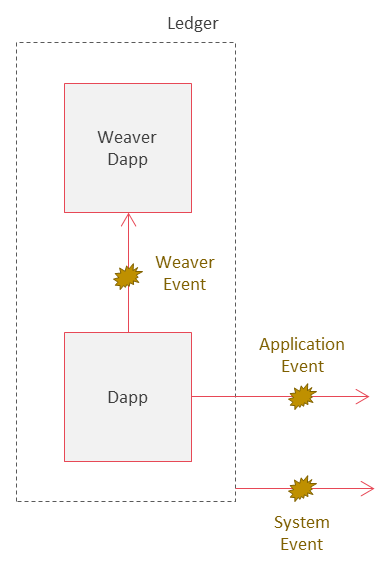
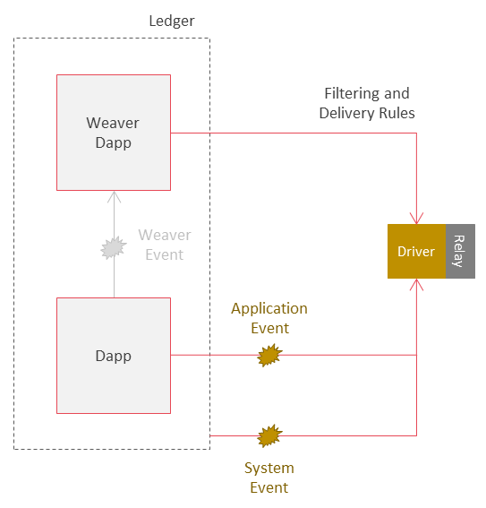

<!--
 Copyright IBM Corp. All Rights Reserved.

 SPDX-License-Identifier: CC-BY-4.0
 -->
# Event Bus

- RFC: 02-016
- Authors: Ermyas Abebe, Dileban Karunamoorthy
- Status: Draft
- Since: 01-Dec-2020

## Summary

* The event bus is a protocol for end-to-end event delivery between distributed ledgers.
* The protocol enables external agents to subscribe to events of interest from remote ledgers.
* The protocol delivers events to all authorized agents using a choice of security and delivery guarantees.
* Events can be observed by zero or more agents.

## Types of Events

See specification on [events](../models/events.md) for event types.

## Event Capture and Delivery

### Application and System Events

* Relay drivers subscribe to all events generated by a network. These include system and application events.
* The events are filtered based filtering rules defined in the Weaver Dapp.
* When matches are found, the event is forwarded to all event subscribers registered in the Weaver Dapp.
* Defining matching rules for application events might be challenging.
  * E.g. filtering events generated by Dapps based on object ID or topic name is hard if there is no standard for publishing events. 
* Drivers must be granted appropriate permissions to listen to events from the network.
  * Fine grained control of which application events are visible to drivers might be hard to achieve.
* Drivers must maintain additional state locally in order to provide delivery guarantees (e.g at least once, sequencing, etc).

### Weaver Events

* The driver only monitors the Weaver Dapp for new events.
* Weaver events are events registered by applications directly with the Weaver Dapp.
* Weaver events can be part of the world state or simply emited during commit time.
  * If events are managed by the ledger, drivers can be stateless.
  * State for ensuring delivery guarantees, sequencing etc can be tracked on the ledger.
* The data model for Weaver events are easier to enforce, which applications must comply with.

## Event Proofs

The role of events can be thought of in two complementary ways with different trade-offs.

* Events are non-critical side-effects of execution that are useful for trigering external actions.
* Events are a way to communicate critical information to continue a larger work flow.

The trade-offs come in the form of the cost to generate proofs.

* An event can be delivered as is, signed by the driver/relay.
  * Least cost, has little impact on the network.
* An event can be accompanied by a proof derived from the block that produced the proof.
  * Example: a merkle proof based on a signed block header.
  * Might not be applicable to all DLTs (e.g. a Fabric transaction's validity requires further proof).
  * Lower cost, little impact on the network*.
* An event can be signed by mulitple organizations.
  * Signatures requested explicitly from a set of orgs.
  * Stateful (Weaver) events where signatures are acquired through standard queries.
    * Cost is no different to generating standard data proofs

## Delivery Gurantees

Delivery guarantees can differ depending on whether events are critical or non-critical.

* At most once
  * Fire and forget
  * Suitable for non-critical events
* At least once
  * Critical events
* Exactly once
  * Critical events
  * Can be costlier to implement

## Event Subscription Protocol

Discuss protocol for registering and receiving events.

* Permissioned networks restrict visibility of a ledger's state to its members.
* This includes visibility on application, system and Weaver events.
* Access to a ledger's events by an external agent must be explicitly granted (similar to rules when sharing state).
* How do external agents learn about events to subscrible to.
* Format of event subscription messages.
* Authorization by network after subscribing to events.
* Registering topics and subscribers.
  * Events belong to topics which remote ledgers can subscribe to. Allow one or more subscribers per topic.
    * E.g. Multiple subsribers: remote ledgers interested in a sanctions list.
	* E.g. Single subscriber: a one-to-one relationship exists between business objects on the origin and destination ledger.
* Push vs pull models
  * Push model.

### Policies to Prevent Flooding or Spam

* Receiving relays might need to define policies in order to prevent potential spam after registering with a remote ledger.
* Policies can rate limit events, restrict events up to a certain size, etc.

## Anatomy of an Event

* Message structure for subscribing to events
* Message structure encapsulating and communicating events
* Event representation
  * A DLT-neutral standard helps here
  * Encapsulate DLT event in network neutral standard with useful metadata

