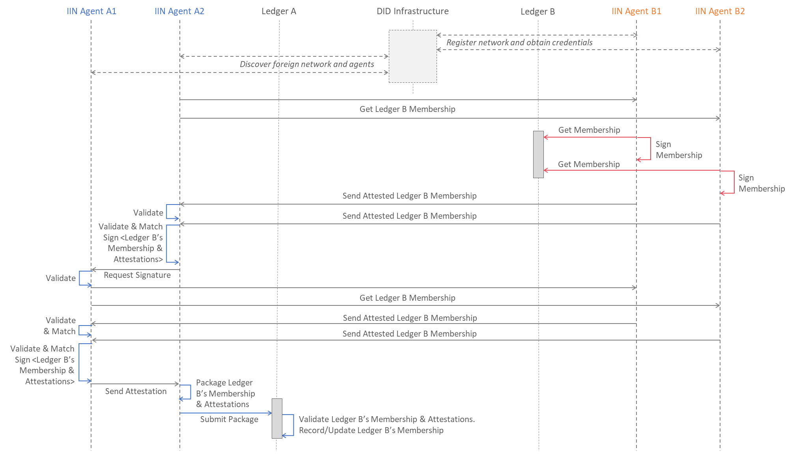

<!--
 Copyright IBM Corp. All Rights Reserved.

 SPDX-License-Identifier: CC-BY-4.0
 -->
# Security Domain Membership Syncing

- RFC: 02-018
- Authors: Venkatraman Ramakrishna, Krishnasuri Narayanam, Bishakh Chandra Ghosh, Ermyas Abebe
- Status: Proposed
- Since: 27-Aug-2022

## Overview

Data plane interoperation requires the syncing and configuration of a foreign security domain's [membership information](../../formats/network/membership.md) as well as the relay endpoints for that security domain (or network).

The Security Domain DID of a foreign security domain contains `relayEndpoints` and `DataplaneCredentials` verification methods, used to configure relay endpoints and certificates (part of membership info) respectively.

## Sync Protocol

Consider two security domains governing ledgers `Ledger A` and `Ledger B` respectively. The first has two IIN Agents `A1` and `A2` representing two organizational units that are members of its security domain. The second has agents `B1` and `B2`. The security domain governing `Ledger A` is trying to sync the latest identity and membership info of the security domain governing `Ledger B`. Without loss of generality, we can pick `A2` as the initiator of the cross-network identity plane protocol that results in `Ledger B`'s security domain membership and relay endpoints info getting recorded in `Ledger A`. The protocol is illustrated in the figure below. (_Note_: this represents the "happy path". We will add more diagrams subsequently illustrating failures and race conditions.)

The first phase in the above diagram, involving [registration](./identity-syncing.md), [discovery](../discovery/discovery.md), and [validation](./security-domain-identity-validation.md) are covered in other specifications. In this draft, we only specify the bilateral protocol occurring between sets of IIN Agents representing two independent security domains' members.

The communication among IIN Agents of the security domain governing `Ledger A` to collect attestations can occur in one of two ways:
  * It can be orchestrated completely by the triggering agent (in this case `A2`), which sends requests and receives responses from every other local IIN Agent.
  * Alternatively, it could be a flow, where the trigger agent is simply the first node to produce an attestation after which the request is passed to another agent. This proces concludes when enough attestations are collected.

(We recommend the first approach in Weaver for simplicity of implementation.)

The validation procedures marked in the figure above may include an agent confirming the presence and validity of its security domain's DID record in an IIN. But in case two networks are attempting to interoperate without relying on DID infrastructure (IINs and trust anchors), these checks can be skipped. Even if DID infrastructure is present and relied upon, these checks need not be done as part of the protocol; the result of a past check can be cached and retrieved as needed (assuming freshness of cached records is ascertained).

Finally, a foreign security domain's membership info is recorded via the [interoperation module](../../models/infrastructure/interoperation-modules.md) deployed in the network (a chaincode in Fabric, a CorDapp in Corda, etc.). The logic in this module must validate and authenticate the various signatures in the transaction payload before committing to the ledger via the network's native consensus protocol.
