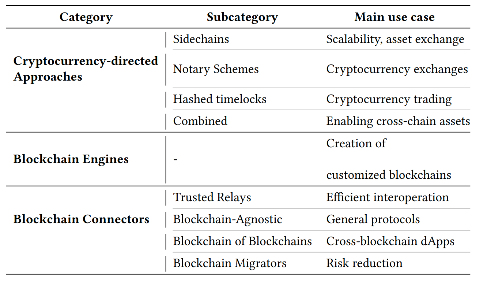

# 8. Related Work

Blockchain interoperability is emerging as one of the crucial features of blockchain technology
A recent survey classifies blockchain interoperability studies in three categories: Cryptocurrency-directed interoperability approaches, Blockchain Engines, and Blockchain Connectors [[5](#9-references)]. Each category is further divided into sub-categories based on defined criteria.
Each category serves particular use cases.

Cryptocurrency-directed interoperability approaches identify and define different strategies for chain interoperability across public blockchains, most of them implementing cryptocurrencies.

Blockchain engines are frameworks that provide reusable data, network, consensus, incentive, and contract layers for the creation of customized blockchains, serving general use-cases. Emerging blockchains are, for example, the Cosmos Network and Polkadot.

The Blockchain Connector category is composed of interoperability solutions that are not cryptocurrency-directed or blockchain engines. Several sub-categories exist: Trusted Relays, Blockchain Agnostic Protocols, Blockchain of Blockchains, and Blockchain Migrators”.

While Hyperledger Cactus has caracteristics from the the three categories, it can be considered a Blockchain Connector (namely a Trusted Relay). In particular, Cactus focuses on providing multiple use case scenarios via a trusted consortium.
Trusted relays allow the discovery of the target blockchains, appearing often in a permissioned blockchain environment, where cross-blockchain transactions are routed by trusted escrow parties. Thus, Cactus supports developers at building cross-chain dApps.

Depending on the validator plugin, the trust on the relay can be decentralized, making Cactus a decentralized, general-purpose, trustless relay.
The blockchain migrator feature paves the way for building a solution that performs data migration across blockchains.
