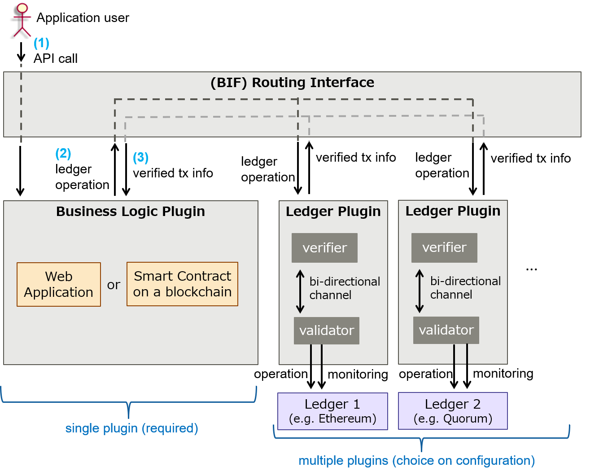

# Hyperledger Cactus<br>白皮书 <!-- omit in toc -->

本译文基于 https://github.com/hyperledger/cactus CommitID：d0b47d2e5afa65638c6bbd1e0737d4116f073654

## Version 0.1 (Early Draft) <!-- omit in toc -->


Photo by Pontus Wellgraf on Unsplash

<div style="page-break-after: always; visibility: hidden"><!-- \pagebreak --></div>

# 贡献者 <!-- omit in toc -->

| Contributors/Reviewers         | Email                                     |
|--------------------------------|-------------------------------------------|
| Hart Montgomery                | hmontgomery@us.fujitsu.com                |
| Hugo Borne-Pons                | hugo.borne-pons@accenture.com             |
| Jonathan Hamilton              | jonathan.m.hamilton@accenture.com         |
| Mic Bowman                     | mic.bowman@intel.com                      |
| Peter Somogyvari               | peter.somogyvari@accenture.com            |
| Shingo Fujimoto                | shingo_fujimoto@fujitsu.com               |
| Takuma Takeuchi                | takeuchi.takuma@fujitsu.com               |
| Tracy Kuhrt                    | tracy.a.kuhrt@accenture.com               |
| Rafael Belchior                | rafael.belchior@tecnico.ulisboa.pt        |

# 翻译者 <!-- omit in toc -->

| Translators/Reviewers | Email                   |
| --------------------- | ----------------------- |
| Yang Cheng            | chengyang418@163.com    |
| Yuxiang Liu           | david-khala@hotmail.com |

# 历史版本 <!-- omit in toc -->

| Date of Revision      | Description of Changes Made                            |
|-----------------------|--------------------------------------------------------|
| February 2020         | Initial draft                                          |

<div style="page-break-after: always; visibility: hidden"><!-- \pagebreak --></div>

- [1. 概述](#1-概述)
- [2. 使用案例](#2-使用案例)
  - [2.1 Ethereum 到 Quorum 的资产转移](#21-ethereum-到-quorum-的资产转移)
  - [2.2 数据托管出售](#22-数据托管出售)
  - [2.3 货币兑换](#23-货币兑换)
  - [2.4 稳定币和其他货币的铆定](#24-稳定币和其他货币的铆定)
    - [2.4.1 和非授权区块链（BTC）](#241-和非授权区块链btc)
    - [2.4.2 和法定货币](#242-和法定货币)
  - [2.5 带有访问控制列表的医疗保健数据共享](#25-带有访问控制列表的医疗保健数据共享)
  - [2.6 集成现有的食品溯源解决方案](#26-集成现有的食品溯源解决方案)
  - [2.7 终端用户钱包身份验证/授权](#27-终端用户钱包身份验证授权)
  - [2.8 区块链迁移](#28-区块链迁移)
    - [2.8.1 区块链数据迁移](#281-区块链数据迁移)
    - [2.8.2 区块链智能合约迁移](#282-区块链智能合约迁移)
    - [2.8.3 半自动区块链迁移](#283-半自动区块链迁移)
- [3. 软件设计](#3-软件设计)
  - [3.1. 原则](#31-原则)
    - [3.1.1. 广泛的支持](#311-广泛的支持)
    - [3.1.2. 尽可能的插件化架构](#312-尽可能的插件化架构)
    - [3.1.3. 尽可能避免双花](#313-尽可能避免双花)
    - [3.1.4 特性的包容性](#314-特性的包容性)
    - [3.1.5 低影响](#315-低影响)
    - [3.1.6 透明性](#316-透明性)
    - [3.1.7 自动化的工作流](#317-自动化的工作流)
    - [3.1.8 默认最高的安全性](#318-默认最高的安全性)
    - [3.1.9 交易协议协商](#319-交易协议协商)
    - [3.1.10 避免任何区块链网络上数字资产总量的变动的可能](#3110-避免任何区块链网络上数字资产总量的变动的可能)
    - [3.1.11 提供通用操作的抽象](#3111-提供通用操作的抽象)
    - [3.1.12 集成身份框架（Moonshot）](#3112-集成身份框架moonshot)
  - [3.2 特性需求](#32-特性需求)
    - [3.2.1 新协议的集成](#321-新协议的集成)
    - [3.2.2 代理/防火墙/NAT 能力](#322-代理防火墙nat-能力)
    - [3.2.3 双向通信层](#323-双向通信层)
    - [3.2.4 联盟管理](#324-联盟管理)
  - [3.3 工作策略](#33-工作策略)
- [4. 架构](#4-架构)
  - [4.1 集成模式](#41-集成模式)
  - [4.2 系统架构和基本流程](#42-系统架构和基本流程)
  - [4.3 技术架构](#43-技术架构)
    - [4.3.1 Monorepo包](#431-monorepo包)
      - [4.3.1.1 cmd-api-server](#4311-cmd-api-server)
        - [4.3.1.1.1  运行时配置解析和验证](#43111-运行时配置解析和验证)
        - [4.3.1.1.2 配置模式 - API 服务器](#43112-配置模式---api-服务器)
        - [4.3.1.1.4 插件加载/验证](#43114-插件加载验证)
      - [4.3.1.2 core-api](#4312-core-api)
      - [4.3.1.4 sdk](#4314-sdk)
      - [4.3.1.5 密钥串（keychain）](#4315-密钥串keychain)
      - [4.3.1.7 追溯](#4317-追溯)
      - [4.3.1.8 审核](#4318-审核)
      - [4.3.1.9 文档存储](#4319-文档存储)
      - [4.3.1.10 相关存储](#43110-相关存储)
      - [4.3.1.11 不可篡改存储](#43111-不可篡改存储)
    - [4.3.2 部署图](#432-部署图)
    - [4.3.3 组件图](#433-组件图)
    - [4.3.4 类图](#434-类图)
    - [4.3.5 时序图——交易](#435-时序图交易)
  - [4.4 交易协议说明](#44-交易协议说明)
    - [4.4.1 握手机制](#441-握手机制)
    - [4.4.2 交易协议协商](#442-交易协议协商)
  - [4.5 插件架构](#45-插件架构)
    - [4.5.1 账本连接器插件](#451-账本连接器插件)
    - [4.5.2 身份联盟插件](#452-身份联盟插件)
      - [4.5.1.1 X.509证书插件](#4511-x509证书插件)
    - [4.5.3 Key/Value 存储插件](#453-keyvalue-存储插件)
    - [4.5.4 服务端密钥串插件](#454-服务端密钥串插件)
- [5. 身份、认证、授权](#5-身份认证授权)
  - [5.1 交易签名模式、键所有权](#51-交易签名模式键所有权)
    - [5.1.1 客户端交易签名](#511-客户端交易签名)
    - [5.1.2 服务端交易签名](#512-服务端交易签名)
  - [5.2 Open ID 链接提供者、身份提供者](#52-open-id-链接提供者身份提供者)
  - [5.3 Web应用的服务端密钥串](#53-web应用的服务端密钥串)
- [6. 术语](#6-术语)
- [7. References 参考文献](#7-references-参考文献)

<div style="page-break-after: always; visibility: hidden"><!-- \pagebreak --></div>

# 1. 概述

区块链技术的应用正在快速增长，但是碎片化可能是未来阻碍区块链应用的一个大问题。

我们提出了一个协议，并根据一个异构系统架构<sup>[1](#7-references)</sup>进行了实现以便连接尽可能多的区块链系统，以此来解决碎片化的问题。

# 2. 使用案例

我们的目的是支持特定使用场景。核心思想是通过多种账本的互操作性支持尽可能多的使用场景，特别是一些主流或者其他的用例。

## 2.1 Ethereum 到 Quorum 的资产转移

| 用例属性名称 | 用例属性值                                                   |
| ------------ | ------------------------------------------------------------ |
| 用例标题     | Ethereum 到 Quorum 的托管资产转移                            |
| 用例         | 1. `用户 A` 在 Ethereum 账本上拥有一些资产</br>2. `用户 A` 让`交易员`交易 Ethereum 账本上的指定数量的资产，Quorum 账本接收资产。 |
| 互通模式     | 数值转移                                                     |
| 社交类型     | 托管资产转移                                                 |
| 描述         | 一个人（`用户 A`）在不同的账本（Ethereum，Quorum）上有多个账户，他希望按照一定汇率将 Ethereum 账本上的资产发送到 Quorum 账本上。只有当它成功的在 Quorum 账本上接收到转换的资产后交易员才可以接收到 Ethereum 上发送的资产。 |
| 参与者       | 1. `用户 A`：一个人或者实体在拥有账本上与之相关账户的资产。  |
| 参与者目标   | `用户 A` 失去 Ethereum 上发送的资产的所有权，但是得到 Quorum 上交换的资产数量的所有权。 |
| 成功情景     | 转移成功没有问题。资产在 Ethereum 和 Quorum 账本上都可用。   |
| 成功标准     | 成功转移资产到 Quorum。                                      |
| 失败标准     | 转移资产到 Quorum 失败。                                     |
| 前提条件     | 1. 已提供账本。</br>2.`用户 A` 和`交易员`都在账本上建立了身份。</br>3.`交易员`有权使用业务逻辑插件操作 Quorum 账本上的账户。</br>4.`用户 A` 可以访问部署的 Hyperledger Cactus。 |
| 备注         |                                                              |


<div style="page-break-after: always; visibility: hidden"><!-- \pagebreak --></div>


<div style="page-break-after: always; visibility: hidden"><!-- \pagebreak --></div>

## 2.2 数据托管出售


| W3C 用例属性名称           | W3C 用例属性值                                               |
|-----------------------------|------------------------------------------------|
| 用例标题      | 数据托管出售 |
| 用例                  | 1. `用户 A` 初始化（提案）一个和`用户 B`的托管交易。<br>2. `用户 A` 拿出资金，`用户 B` 拿出用于数字托管服务的数据。<br>3. 他们都观察到对方向托管服务的输入然后决定继续进行。<br>4. 托管服务释放资金和数据到交换的参与者。 |
| 社交类型  | 点对点交换 |
| 描述                 | 在此场景中的数据是电脑中以比特形式存储的内容：<br> * 机器学习模型<br> * 广告技术数据库<br> * 数字或数字化的艺术<br> * 专有的软件源码或二进制<br> * 其他。<br><br>`用户 A` 和 B 使用 Hyperledger Cactus 交易数据和资金，交易以原子交换的托管方式进行，可以有效避免参会双方的欺诈或者交易失败。<br>通过交易协议的握手机制，A 和 B 可以（事先）同意：<br><br>* 交付地址（哪个账本，哪个钱包） <br>* 他们都信任的托管商<br>* 价格和货币类型<br><br>可以通过参与 DLT，如果他们支持的话，来促进信任的建立。注意，`用户 A` 没办法知道数据集的质量，他们完全依赖于`用户 B` 的描述（这个问题有一些解决方案，但那不在我们讨论的范围之内）。 |
| 参与者                   | 1. `用户 A`：一个想要购买数据的人或者商业组织。  <br>2. `用户 B`：一个想要出售数据的人或者商业实体。 |
| 参与者目标        | `用户 A` 想要获得数据的访问权，可能因为这些数据可以帮他增强业务过程。<br> `用户 B` 想要通过他们的拥有的数据产生利润。 |
| 成功情景        | 参与者都独立进行托管操作并且按预期完成交换。 |
| 成功标准        | `用户 A` 成功访问数据，`用户 B` 获得了资金。 |
| 失败标准        | 任何一个参与者没有完成他们最终的交易。 |
| 前提条件           | `用户 A` 有用于交易的资金。<br>`用户 B` 有 `用户 A` 想要的数据。<br>`用户 A` 和 B 同意以合适的货币进行交易并且和托管商达成共识。 |
| 备注                  | Hyperledger 私有数据： https://hyperledger-fabric.readthedocs.io/en/release-1.4/private_data_tutorial.html <br> Besu 私有群组： https://besu.hyperledger.org/en/stable/Concepts/Privacy/Privacy-Groups/ |

<br>


<div style="page-break-after: always; visibility: hidden"><!-- \pagebreak --></div>

## 2.3 货币兑换

使法定货币和虚拟货币能够以任何可能的组合进行交易。

> 在技术层面，该用例和上边的用例是一样的，但是我们省略了一些细节。

## 2.4 稳定币和其他货币的铆定


| W3C 用例属性名称 | W3C 用例属性值                                               |
|-----------------------------|------------------------------------------------|
| 用例标题          | 稳定币和其他货币的铆定 |
| 用例                  | 1. `用户 A` 创建他们自己的账本。<br>2. `用户 A` 在自己的环境中部署 Hyperledger Cactus。<br>3. `用户 A` 实现了 Hyperledger Cactus 必要的插件来对接他们账本的交易，代币产生和燃烧。 |
| 社交类型 | 软件实现项目 |
| 描述                 | 有人启动了一个带有称为 ExampleCoin 代币的高可扩展账本，可以稳定保证每秒百万级别的交易吞吐，但是他们生存艰难，因为大家担心它的价值所以没有人愿意买他们的代币。他们选择与比特币建立一种双向锚定机制，向其持有者保证，他们的代币可以兑换成固定数量的比特币或美元。 |
| 参与者                   | `用户 A`：账本和货币的所有者或者操作者，他们希望和其他货币保持稳定（锚定）。 |
| 参与者目标             | 1. 通过支持资金来获得他们货币的信誉。<br>2. 用最少的样板代码实现必要的软件（大部分应该由 Hyperldger Cactus 提供）。 |
| 成功情景        | `用户 A` 使用他们自己编写的插件来支持 Hyperledger Cactus 部署，终端用户应用程序开发可以从使用 Hyperledger Cactus REST API 开始，Hyperledger Cactus REST API 现在暴露了由`用户 A` 编写的插件所提供的功能。 |
| 成功标准        | 除了创建 Hyperledger Cactus 插件外，成功情景没有显著的额外开发工作。 |
| 失败标准        | 实现的复杂性很高，如果没有框架，从头开始写东西会更容易。 |
| 前提条件           | * 可操作性的账本和货币。<br>* 实现插件的技术知识（软件工程）。 |
| 备注                  | |

> 我们省略了时序图，因为该使用场景不适用于 Hyperledger Cactus 的终端用户。

### 2.4.1 和非授权区块链兑换

BTC 的持有者可以购买 ExampleCoin，购买方式是将他们的 BTC 发送到`保存 ExampleCoin 的钱包`，然后其他网络上就会挖出相应数量的代币发送到他们的 ExampleCoin 钱包。

ExampleCoin 的持有者可以将他们的资产兑换为 BTC，兑换方式是接收 ExampleCoin 账本上的燃烧证明（Proof of Burn），然后从`保存 ExampleCoin 的钱包`发送对应数量的 BTC 到他们的 BTC 钱包。


### 2.4.2 和法定货币兑换

和锚定 BTC 的想法非常相似，但是用来存储 BTC 的钱包换成了保存 USD 的传统银行账户。

<div style="page-break-after: always; visibility: hidden"><!-- \pagebreak --></div>

## 2.5 带有访问控制列表的医疗保健数据共享

| W3C 用例属性名称 | W3C 用例属性值 |
|-----------------------------|------------------------------------------------|
| 用例标题         | 带有访问控制列表的医疗保健数据共享 |
| 用例             | 1. `用户 A` （病人）和`用户 B`（医疗保健提供者） 建立业务关系。<br>2. `用户 B` 请求`用户 A` 的电子病历的读取和写入权限。<br>3. `用户 A` 接收到访问请求并通过。<br>4. `用户 B` 通过账本特定的访问控制或隐私特性得到获取 `用户 A` 数据的授权。 |
| 社交类型         | 点对点数据共享 |
| 描述                 | 假设两个医疗保健提供商都实现了自己的基于区块链的患者数据管理系统，并希望彼此集成，以便为患者从一个到另一个医疗保健提供商进行某些治疗时提供无缝连接的体验。用户可以在两个平台上分别控制自己的数据，并且通过 Hyperledger Cactus 支持的集成，他们还可以定义细粒度的访问控制列表，同意两个医疗保健提供商访问彼此收集的有关患者的数据。 |
| 参与者                   | * `用户 A`：和医疗保健提供者建立业务关系。<br>* `用户 B`：医疗保健提供者为`用户 A` 提供服务。其中一些服务依赖于`用户 A`之前病历的访问权限。 |
| 参与者目标             | * `用户 A`：想以更好地方式授权分享数据的数据，以免数据落入黑客之手或者流转到黑市中。<br>`用户 B` |
| 成功情景         | `用户 B`（医疗保健提供者）可以访问尽可能多的他们需要的数据，但是不能访问其他数据。 |
| 成功标准         | 有数据完整性的加密证明。数据在共享过程中没有受到损害，例如，其他参与者没有通过意外或恶意行为获得对数据的未经授权的访问。 |
| 失败标准         | `用户 B`（医疗保健提供者）没有访问所需数据的权限，或者有了不应访问的数据的权限。 |
| 前提条件           | `用户 A` 和`用户 B` 注册在同一个或两个单独的账本上，账本支持个人数据所有权、访问控制和共享的概念。 |
| 备注                  | 如果`用户 A` 和`用户 B` 都在同一个授权的、支持隐私的账本上而不是在两个单独的账本上，那么最好的隐私更有意义。这为`用户 A` 提供了额外的安全层，因为他们可以知道他们的数据仍然只存储在一个账本上，而不是两个（尽管这两个账本都启用了隐私保护） |


<div style="page-break-after: always; visibility: hidden"><!-- \pagebreak --></div>

## 2.6 集成现有的食品溯源解决方案 

| W3C 用例属性名称 | W3C 用例属性值                                               |
| ---------------- | ------------------------------------------------------------ |
| 用例标题         | 食品溯源集成                                                 |
| 用例             | 1. `消费者` 正在对实体零售店的食品进行评估。<br/>2. `消费者`询问指定的提供食品轨迹的终端用户应用程序。<br/>3. `消费者` 根据食物轨迹做出购买决定。 |
| 社交类型         | 软件实现项目                                                 |
| 描述             | 零售商已从`组织 A` 购买食品溯源解决方案，而食品制造商（零售商是其客户）购买了`组织 B` 的食品溯源解决方案。<br/>零售商希望向其客户提供端到端的食品溯源，但这是不可能的，因为溯源的链路在使用不同服务或解决方案的制造商处断开了。`Cactus` 被用作为零售商构建一个集成的架构组件，以确保消费者能够访问食品溯源数据，而不管其来源系统是`组织 A` 还是 `组织 B` 的产品或服务。 |
| 参与者           | `组织 A` ，`组织 B`，他们的业务涉及从种植或制造到消费者零售货架的食品全球供应链中的某些部分。<br/>`消费者`：在消费品零售商店购买食品，并希望在最终确定购买决定之前对食品进行全程溯源的公民。 |
| 参与者目标       | `组织 A`，`组织 B`：为`消费者`提供食品来源的方法。<br/>`消费者`：消费经过正当途径采购、处理和运输的食品。 |
| 成功情景         | 因为可以核实食物来源，`消费者`的满意度得到了提高。           |
| 成功标准         | `消费者`在做出购买决定之前可以核实食品的来源。               |
| 失败标准         | `消费者`无法部分或完全核实食品来源。                         |
| 前提条件         | 1. `组织 A` 和`组织 B`都自己注册了提供端到端的食品溯源解决方案的区块链软件服务，但要求链中的所有参与者使用单一解决方案才能工作。<br/>2. `组织 A` 和`组织 B` 的两种解决方案都有条款和条件，以便在技术和法律上能够在软件互相集成以及集成`Cactus`。 |
| 备注             |                                                              |


---


<div style="page-break-after: always; visibility: hidden"><!-- \pagebreak --></div>

## 2.7 终端用户钱包身份验证/授权

| W3C 用例属性名称 | W3C 用例属性值                                               |
|-----------------------------|------------------------------|
| 用例标题         | 钱包验证/授权 |
| 用例             | 1. `用户 A` 分别在不同的授权和非授权账本上拥有公私钥形式（PKI）的身份。<br>2. `用户 A` 希望通过单独的 API 或者用户接口将这些身份上传到 `Cactus`中来管理这些身份。<br>3. `用户 A`  更倾向于上传身份，并且现在能够通过或使用 `Cactus` 的终端用户应用程序（例如，通过直接发出 API 请求或使用这样做的应用程序）与保存上述身份的钱包进行交互。 |
| 社交类型         | 身份管理 |
| 描述                 | 面向终端用户的应用程序可以为终端用户提供多个许可（或无许可）网络无缝连接的体验，终端用户拥有一组用于不同账本上的钱包的不同身份证明。 |
| 参与者                   | `用户 A`：其身份通过单个 `Cactus` 部署进行加强的人或实体。 |
| 参与者目标             | `用户 A`：以一种方便的方式来管理一系列不同的身份，同时权衡一个`Cactus`部署必须与所涉及身份的私钥相信任（这是用户有经验的决定）。 |
| 成功情景         | `用户 A` 可以与他们的钱包进行交互，而不必单独访问每个私钥。 |
| 成功标准         | `用户A` 的凭证被安全地存储在 `Cactus` 的密钥串组件中，在那里它们被破坏的可能性最小（注意，当然，被破坏从来都不是不可能的，但以最小的不可能性） |
| 失败标准         | `用户 A` 不能向 `Cactus` 导入身份，原因有很多比如密钥格式不兼容。 |
| 前提条件           | 1. `用户 A` 必须在导入之前在各种分类账上设置身份，并且必须有权访问私钥。 |
| 备注                  |  |


---


<div style="page-break-after: always; visibility: hidden"><!-- \pagebreak --></div>

## 2.8 区块链迁移

| W3C 用例属性名称 | W3C 用例属性值                                               |
| ---------------- | ------------------------------------------------------------ |
| 用例标题         | 区块链迁移                                                   |
| 用例             | 1. `联盟 A` 在源区块链上操作一组服务或用例。<br/>2. `联盟 A` 决定使用另外一个区块链基础设施支持他的用例<br/>3. `联盟 A` 将现有资产迁移到另外一个区块链。 |
| 社交类型         | 资产转移                                                     |
| 描述             | 运营源区块链（例如，Hyperledger Fabric 实例）的一组成员（`联盟 A`）希望将功能迁移到目标区块链（例如，Hyperledger Besu），以扩大其覆盖范围。然而，这种迁移需要大量的资源和技术努力。来自 Hyperledger Cactus的“区块链迁移功能”可以通过连接源区块链和目标区块链并执行迁移任务来提供支持。 |
| 参与者           | 1. 联盟成员组成的`联盟 A`：操作源区块链的一组实体，他们的共同目标是实现向目标区块链的迁移。 |
| 参与者目标       | `联盟 A` 想要在目标区块链上操作他们的用例。服务在迁移后可用。 |
| 成功情景         | 联盟一致同意以去中心化方式迁移。区块链成功迁移并且没有出现问题。 |
| 成功标准         | 资产完成迁移。那些资产的身份历史在目标区块链中完成重构。     |
| 失败标准         | 1. 资产没有迁移。<br/>2. 不能在目标区块链中重构资产历史。    |
| 前提条件         | 1. 所有`联盟 A` 中的成员都想迁移区块链。 <br/>2. `联盟 A` 控制着源区块链。<br/>3. `联盟 A` 拥有目标区块链的写权限。<br/> |
| 备注             | 资产的定义是，源区块链产生的数据或者智能合约。<br/>该用例和资产可移植的用例相关（例如，2.1）。<br/>该用例提供了区块链的可移植性，从而降低了成本并促进了区块链的采用。 |

---
动机：区块链解决方案对于用例的适用性取决于底层区块链属性。随着区块链技术的快速成熟，特别是私有区块链，其属性可能会发生变化。因此，这就造成了用户期望和解决方案适用性之间的不平衡。因此，一个组织希望能够取代为某项服务提供基础设施的区块链。

目前，当一个联盟想要迁移他们的区块链时（例如，源区块链已经过时，加密算法不再安全等），解决方案是使用不同的平台重新实现业务逻辑，需要付出巨大的努力。数据迁移在公链中实现过 [[2](#7-references),[3](#7-references)]，他们最近都在努力为基于区块链的解决方案提供灵活性。在这些工作中，作者提出了公共的、无许可的区块链的简单数据迁移功能，用户可以在他们的服务支持的区块链基础设施上指定需求。


### 2.8.1 区块链数据迁移
数据迁移相当于捕获源区块链上数据资产（信息，以字节形式）的集合或子集，并构建目标区块链中这些资产的表示。请注意，两个区块链的基础模型不必相同（例如，Hyperledger Fabric 的世界状态模型与以太坊中的帐户模型）。要迁移数据，就要能够从源区块链捕获必要的信息并将其写入目标区块链。还要迁移信息的历史记录（例如，元素的更新就可以认为是信息）。


### 2.8.2 区块链智能合约迁移
迁移智能合约的任务包括迁移数据的任务。具体来说，信息应该可以在另一个区块链上访问和写入。此外，目标区块链的虚拟机应支持源区块链的计算复杂性（例如，不能将所有以太坊智能合约迁移到比特币，但反过来是可行的）。

自动智能合约迁移为企业区块链系统带来风险，因此解决方案非常重要。

### 2.8.3 半自动区块链迁移

通过我对功能性和非功能性需求的偏好，Hyperledger Cactus 可以推荐一组合适的区块链作为迁移的目标。首先，我可以实时了解目标区块链的特征，这将影响我的决策。例如，平台可以分析向以太坊写入信息的成本、美元-以太币的汇率、出块的平均时间、事务吞吐量和网络哈希率[[3](#7-references)</sup>]。在此基础上，该框架提出了一个迁移方案，其中包括预测成本、完成迁移的预计时间和成功的可能性等指标。由于以太坊没有显示出理想的吞吐量，所以我选择了 Polkadot 的平台。当它产生更高的吞吐量时，我就安全地将我的解决方案从 Fabric 迁移到 Polkadot，而不影响生产中的解决方案。对于公共区块链，此功能更有用。


<div style="page-break-after: always; visibility: hidden"><!-- \pagebreak --></div>


# 3. 软件设计

## 3.1. 原则

### 3.1.1. 广泛的支持

连接尽可能多的经济系统，而没有技术限制

### 3.1.2. 尽可能的插件化架构

身份、DLT、服务发现。最小固化，我们拥抱互操作性而不是孤立和锁定。密切关注社区反馈和 PR 以确定 Hyperledger Cactus 核心代码可以提取为插件的功能。限制限定以便添加未来的使用用例和协议。

### 3.1.3. 尽可能避免双花

同一时间内相同资产不能存在的两种形式，除非有明确的标识，比如【截止10月30号限定在特定 DLT 组合中；例如：不适用于 Fabric + Bitcoin】。

### 3.1.4 特性的包容性

每个 DLT 都包含一些和其他 DLT 部分或完全不同过的特性。Hyperledger Cactus 应该设计一种通过 Hyperledger Cactus 和 DLT 交互时使用这些特性的方式。该原则的一个最佳实践示例是 Kubernetes CRD 以及操作员允许社区以可重用方式扩展 Kubernetes 核心 API。

### 3.1.5 低影响

互操作性不是重定义生态系统而是适应它们。治理、信任模型和工作流依旧保留在每个生态系统中。信任模型和一致性必须是协议握手的强制性部分，这样任何可能的不兼容性都会以透明的方式预先显示出来，并且双方都可以“各走各的”，而不会意外地丢失资产或数据。该灵感来自于传统在线交易支付流程 API，它允许商人在交易结束前指定可接受的保障级别（例如，需要锁定、签名的收据等）。按照相同的逻辑，我们应该允许交易参与者指定他们需要的共识、交易最终性的顺序。共识需求必须支持谓词，例如“我在 Fabric 上，但是会接受 Bitcoin 确认 X 个区块后的交易。”还可以添加要求 KYC（了解您的客户）合规性的内容，以帮助尽可能多地促进采用。

### 3.1.6 透明性

跨生态交易参与者会意识到该转移带来的本地和全局的影响。所有参与者会在有限拒绝和错误是及时沟通。这种透明性应该像可信的证据一样可见。

### 3.1.7 自动化的工作流

每个生态系统中的逻辑构成了具有复杂的互操作性的用例。跨生态系统的转移可以在响应前一个转移时自动触发。自动化程序，无论错误恢复或者异常处理，都应该无中断地执行。

### 3.1.8 默认最高的安全性

支持最少的安全选项，并且严格的限制进入，不允许退出。

### 3.1.9 交易协议协商 

交易的参与者必须有一个握手机制，这样他们可以一致同意执行交易使用的支持的协议。该算法在参与者支持的算法列表中找到交叉点。

### 3.1.10 避免任何区块链网络上数字资产总量的变动的可能

我们相信增加或减少苏子资产的总量将会减弱区块链的安全性，因为增加和减少资产是复杂的。相反，中间的实体（例如，交换者）可以公用和/或发送传输。

### 3.1.11 提供通用操作的抽象

我们的公共模块化应该扩展到在区块链上操作和/或发现交易的通用机制。

### 3.1.12 集成身份框架（Moonshot）

不限制身份框架，要允许`Cactus`的用户使用最常用的身份框架并且支持未来通过插件化的架构对扩展身份框架的支持列表。支持`Cactus`的用户实现身份验证、授权和读写证书。

原生支持或考虑的身份框架：

* [Hyperledger Indy (Sovrin)](https://www.hyperledger.org/projects/hyperledger-indy)
* [DIF](https://identity.foundation/)
* [DID](https://www.w3.org/TR/did-core/)

## 3.2 特性需求

### 3.2.1 新协议的集成

增加新的协议必须成为插件架构的一部分，以便社区可以提议、开发、测试和发布他们实现的协议。

### 3.2.2 代理/防火墙/NAT 能力

意思是尽可能通过代理/防火墙/NAT 建立双向通信通道。

### 3.2.3 双向通信层

尽可能通过代理/防火墙/NAT使用一个区块链不可知的双向通信通道来控制和监控区块链上的交易。

   * 区块链的 P2P 通信协议不同。最好构建一个模块的方法来发送、接收区块链中值得信任的实体之间的通用交易。

### 3.2.4 联盟管理

联盟可以由合作和实体组成（人，组织等），他们都希望贡献硬件或者网络资源来操作一个`Cactus`集群（验证者集合，API服务器等）。

在最初的成员（一个或多个）集合构建哇按成一个联盟之后，它也要能够增加或移除新的或退出的成员。

`Cactus`不规定任何增加或者移除联盟成员的共识算法，而是专注于技术层面使它可以在独立实体的所有权下操作节点集群，而不用增加或移除成员的时候停机。

一个新加入联盟的成员不需要参与`Cactus`的所有组件：运行一个验证者节点就可以了，etcd、API 服务器可以保持新成员加入之前的状态。

## 3.3 工作策略

1. 参与者可以假装只支持他们所提出的协议，从而坚持特定的协议。
2. 随着规范的成熟，可以对协议进行版本控制。
3. 最初支持的两个协议应分别满足富士通和埃森哲实现的要求。

<div style="page-break-after: always; visibility: hidden"><!-- \pagebreak --></div>

# 4. 架构

## 4.1 集成模式

Hyperledger Cactus 有如下多种集成模式。

- 注意：在下边的描述中，**Value(V)**的意思是数字资产（例如，钱）。**Data(D)**的意思是非数字资产（例如，所有权证明）。账本1是原账本，账本2是目标账本。

| No.  | Name          | Pattern | Consistency                                                  |
| ---- | ------------- | ------- | ------------------------------------------------------------ |
| 1.   | 数值转移      | V -> V  | 检查是否 V1 = V2 <br> （V1 是账本 1 上的数值，V2 是账本 2 上的数值） |
| 2.   | 数值-数据转移 | V -> D  | 检查是否数值转移完成后数据也成功转移了                       |
| 3.   | 数据-数值转移 | D -> V  | 检查是否数据转移完成后数值也成功转移了                       |
| 4.   | 数据转移      | D -> D  | 检查是否所有 D1 都复制到了账本2 <br>（D1 是账本 1 上的数据，D2 是账本 2 上的数据） |
| 5.   | 数据合并      | D <-> D | 最终是否 D1 = D2 <br>（D1 是账本 1 上的数据，D2 是账本 2 上的数据） |

## 4.2 系统架构和基本流程

Hyperledger Cactus 将通过跨多区块链账本执行账本的操作提供集成服务。操作的执行由 Hyperledger Cactus 的模块控制，该模块将以单个 Hyperledger Cactus 业务逻辑插件的方式提供。Hyperledger Cactus 支持的区块链平台可以通过实现新的 Hyperledger Cactus 账本插件来加入。当用户通过 API 调用 Hyperledger Cactus 框架的时候，业务逻辑插件决定由哪个账本执行操作，它确保发布的集成服务的可靠性符合预期。下边的图片展示了在 Hyperledger Cactus 项目会议上讨论的 Hyperledger Cactus 架构。整体架构如下图。



每个实体如下：
- **Application user（应用程序用户）**: 提交 API 调用到 “Cactus 路由接口”的实体。
- **Business Logic Plugin（业务逻辑插件）**: 该实体执行业务逻辑并提供多个区块链连接的集成服务。该实体有 Web 应用程序或区块链上的智能合约组成。该实体是运行 Hyperledger Cactus 应用程序时所必须的一个独立的插件。 
- **Ledger Plugin（账本插件）**: 该实体是每个账本进行通信的业务逻辑插件。该实体由下边的验证器和验证者组成。该实体可通过配置从不同的插件中选择。
- **Validator（验证器）**: 该实体监控账本操作的交易记录，并且决定就交易记录的结果（成功、失败、超时）。验证器确保带有“验证器密钥”数字签名的结果可以被“验证者”验证。
- **Verifier（验证者）**: 该实体只接收验证器签名验证通过了的操作结果。注意，“验证器”是“验证者”双向通道的一部分。
- **Cactus Routing Interface（Cactus 路由接口）**: 该实体是“业务逻辑插件”和“账本插件”的路由服务。该实体也是业务逻辑插件和“应用程序用户”调用 API 的路由服务。
- **Ledger-n（账本-n）**: DLT 平台（例如：Ethereum，Quorum，Hyperledger Fabric ...）

执行步骤如下：
- **步骤 1**: “应用程序用户”提交 API 调用到 “Cactus 路由接口”。  
- **步骤 2**: API 调用由 “Cactus 路由接口”在内部将“业务逻辑插件”和业务逻辑初始关联起来。然后，“业务逻辑插件”决定需要的账本操作来完成或者终止业务逻辑。
- **步骤 3**: “业务逻辑插件”提交 API 调用“账本”上需要的操作，“账本”由“账本插件”包装。每个 API 调用都将由“路由接口”路由到设计好的“账本插件”上。
- **步骤 4**: “账本插件”通过“Cactus 路由接口”向“业务逻辑插件”发送事件提醒，当它的子组件“验证者”检测到有“账本”的账本操作请求事件时。
- **步骤 5**: “业务逻辑插件”从“账本插件”接收消息并决定业务逻辑的完成或者继续。当业务逻辑需要继续执行时跳到“步骤 3”，否则终止程序。

<div style="page-break-after: always; visibility: hidden"><!-- \pagebreak --></div>

## 4.3 技术架构

### 4.3.1 Monorepo包

Hyperledger Cactus 拆分成了一组 npm 包，这些包可以单独或一次全部编译。

所有的包都有一个 `cactus-*` 前缀来避免和其他 Hyperledger 项目发布的 npm 命名冲突。例如，如果 Cactus 和 Aries 都在 `@hyperledger` npm 范围下发布了一个名为 `common` 的包，该包的全限定报名就会是（没有前缀时） `@hyperledger/common` ，如果加上前缀就可以解决冲突问题，包名就成了 `@hyperledger/cactus-common` 和 `@hyperledger/aries-common`。在这里 Aries 只是一个示例，我们并不知道他们是否计划发布这样命名的包，但是这并不影响我们的示范。

包的命名习惯：
* cmd-* 存放包的可执行文件。
* sdk-* 存放应用开发者可以直接使用的包， Javascript SDK 除外，它的名字直接是 `sdk`。
* 所有其他包的命名，比如表明包的主要特性/职责的单个英文单词也是可取的。

#### 4.3.1.1 cmd-api-server

启动 API 服务器的命令行应用程序，它为调用代码提供了统一的基于 REST 的 HTTP API。包含了 Hyperledger Cactus 的核心。此处的代码是固定的，其余的被推送到实现了插件或者定义了它们的接口的其他包。使用 Swagger API 定义，插件在内部加载。

> 这个地方的设计是无状态且可以水平扩展。

**该包的主要职责：**

##### 4.3.1.1.1  运行时配置解析和验证

核心包的职责是从通用源中解析运行时配置（按优先级排序）：
* 代码中明确指定 (`config.setHttpPort(3000);`) 
* 命令行参数 (`--http-port=3000`)
* 操作系统环境变量 (`HTTP_PORT=3000`)
* 静态配置文件 (config.json: `{ "httpPort": 3000 }`)

使用 Apache 2.0 许可下的 node-convict 库来做配置的解析和验证：https://github.com/mozilla/node-convict

##### 4.3.1.1.2 配置模式 - API 服务器

要想获取最新的配置选项，你可以切换到 Cactus 最新的源码并在装有 NodeJS 10 或更新版本的机器上进入项目根目录来运行：

```sh
$ date
Mon 18 May 2020 05:09:58 PM PDT

$ npx ts-node -e "import {ConfigService} from './packages/cactus-cmd-api-server/src/main/typescript/config/config-service'; console.log(ConfigService.getHelpText());"

按降序的参数的优先顺序：CLI，环境变量，配置文件。输入“help”作为第一个参数打印这些信息同时显示有效的配置。

配置参数
========================

  plugins:
                Description: A collection of plugins to load at runtime.
                Default:
                Env: PLUGINS
                CLI: --plugins
  configFile:
                Description: The path to a config file that holds the configuration itself which will be parsed and validated.
                Default: Mandatory parameter without a default value.
                Env: CONFIG_FILE
                CLI: --config-file
  cactusNodeId:
                Description: Identifier of this particular Cactus node. Must be unique among the total set of Cactus nodes running in any given Cactus deployment. Can be any string of characters such as a UUID or an Int64
                Default: Mandatory parameter without a default value.
                Env: CACTUS_NODE_ID
                CLI: --cactus-node-id
  logLevel:
                Description: The level at which loggers should be configured. Supported values include the following: error, warn, info, debug, trace
                Default: warn
                Env: LOG_LEVEL
                CLI: --log-level
  cockpitHost:
                Description: The host to bind the Cockpit webserver to. Secure default is: 127.0.0.1. Use 0.0.0.0 to bind for any host.
                Default: 127.0.0.1
                Env: COCKPIT_HOST
                CLI: --cockpit-host
  cockpitPort:
                Description: The HTTP port to bind the Cockpit webserver to.
                Default: 3000
                Env: COCKPIT_PORT
                CLI: --cockpit-port
  cockpitWwwRoot:
                Description: The file-system path pointing to the static files of web application served as the cockpit by the API server.
                Default: packages/cactus-cmd-api-server/node_modules/@hyperledger/cactus-cockpit/www/
                Env: COCKPIT_WWW_ROOT
                CLI: --cockpit-www-root
  apiHost:
                Description: The host to bind the API to. Secure default is: 127.0.0.1. Use 0.0.0.0 to bind for any host.
                Default: 127.0.0.1
                Env: API_HOST
                CLI: --api-host
  apiPort:
                Description: The HTTP port to bind the API server endpoints to.
                Default: 4000
                Env: API_PORT
                CLI: --api-port
  apiCorsDomainCsv:
                Description: The Comma seperated list of domains to allow Cross Origin Resource Sharing from when serving API requests. The wildcard (*) character is supported to allow CORS for any and all domains, however using it is not recommended unless you are developing or demonstrating something with Cactus.
                Default: Mandatory parameter without a default value.
                Env: API_CORS_DOMAIN_CSV
                CLI: --api-cors-domain-csv
  publicKey:
                Description: Public key of this Cactus node (the API server)
                Default: Mandatory parameter without a default value.
                Env: PUBLIC_KEY
                CLI: --public-key
  privateKey:
                Description: Private key of this Cactus node (the API server)
                Default: Mandatory parameter without a default value.
                Env: PRIVATE_KEY
                CLI: --private-key
  keychainSuffixPrivateKey:
                Description: The key under which to store/retrieve the private key from the keychain of this Cactus node (API server)The complete lookup key is constructed from the ${CACTUS_NODE_ID}${KEYCHAIN_SUFFIX_PRIVATE_KEY} template.
                Default: CACTUS_NODE_PRIVATE_KEY
                Env: KEYCHAIN_SUFFIX_PRIVATE_KEY
                CLI: --keychain-suffix-private-key
  keychainSuffixPublicKey:
                Description: The key under which to store/retrieve the public key from the keychain of this Cactus node (API server)The complete lookup key is constructed from the ${CACTUS_NODE_ID}${KEYCHAIN_SUFFIX_PRIVATE_KEY} template.
                Default: CACTUS_NODE_PUBLIC_KEY
                Env: KEYCHAIN_SUFFIX_PUBLIC_KEY
                CLI: --keychain-suffix-public-key


```

##### 4.3.1.1.4 插件加载/验证

NodeJS 的内置木块加载器加载插件，Node 包管理工具（npm）在验证插件，验证时按照字节级别完整的验证所有安装的模块。

#### 4.3.1.2 core-api

包含插件架构和其他很多包共享的系统级组件的接口定义。`core-api` 的目的是成为一个叶子包，意思是说它不依赖其他包，所以所有依赖 `core-api` 的包会更加安全，不必解决循环依赖问题。

#### 4.3.1.4 sdk

`cmd-api-server` 提供的 RESTful HTTP API 的 Javascript SDK（绑定的）。兼容 NodeJS 和 Web 浏览器（HTML 5 DOM + ES6）环境。

#### 4.3.1.5 密钥串（keychain）

负责以加密格式持久存储敏感数据（例如，私钥）。

API 层面的更多细节，请查看`插件架构`下的相关章节。

#### 4.3.1.7 追溯

包含用于追溯、记录和其他 Hyperledger Cactus 包的代码的应用性能管理（APM）的组件。

#### 4.3.1.8 审核

用于写和读取审核记录的组件必须可以持久保存且不可篡改。后一个属性是审计日志与跟踪/日志消息的区别，跟踪/日志消息的设计是短暂的，用于支持技术问题，而不是与法规/合规/治理相关的问题。

#### 4.3.1.9 文档存储

为其他包，如`审核`和`追溯`，提供结构化或非结构化的文档存储和分析能力。使用它自己的 API 层通过插件实现不同后端存储服务的适配。默认使用 `Open Distro for ElasticSearch` 作为后台存储： https://aws.amazon.com/blogs/aws/new-open-distro-for-elasticsearch/


> 该包提供的 API 层保持了简洁和功能的精简，因此通过 `Cactus` 架构不同的底层后端存储可以作为一个选项长久保持。

#### 4.3.1.10 相关存储

包含负责提供访问兼容标准 SQL 的持久存储的组件。

> 该包提供的 API 层保持了简洁和功能的精简，因此通过 `Cactus` 架构不同的底层后端存储可以作为一个选项长久保持。

#### 4.3.1.11 不可篡改存储

包含的负责提供访问不可篡改存储组件，比如带有只能追加语义的分布式账本，就像区块链网络（如，Hyperledger Fabric）。

> 该包提供的 API 层保持了简洁和功能的精简，因此通过 `Cactus` 架构不同的底层后端存储可以作为一个选项长久保持。

### 4.3.2 部署图

Source file: `./docs/architecture/deployment-diagram.puml`


### 4.3.3 组件图


### 4.3.4 类图

### 4.3.5 时序图——交易

TBD

<div style="page-break-after: always; visibility: hidden"><!-- \pagebreak --></div>

## 4.4 交易协议说明

### 4.4.1 握手机制

TBD

### 4.4.2 交易协议协商

交易参与者必须有一个握手机制，一次来来同意执行一个大家都支持的用于执行交易的协议。该算法查找参与者支持的算法列表的交叉点。

参与者可以通过假装只支持自己所说的协议的方式坚持使用特定协议。随着规范的成熟，可以对协议进行版本控制。作为插件架构，必须添加新协议，允许社区提议、开发、测试和发布他们自己的实现。最初支持的两个协议应分别满足 Fujitsu（富士通）和 Accenture（埃森哲）的要求。尽可能通过代理/防火墙/NAT建立双向通信信道。

<div style="page-break-after: always; visibility: hidden"><!-- \pagebreak --></div>

## 4.5 插件架构

因为我们目的是集成，所以 `Cactus` 要能够灵活地支持多种的账本，尽管目前还没有实现。

> 插件是一个自包容的代码片段，实现了 `Cactus` 中为特定功能预定义的接口，比如交易执行。

插件是核心组件顶层的抽象，支持 `Cactus` 操作者根据意愿切换不同的实现。

> 向后兼容性很重要，但插件的版本控制仍然遵循语义版本控制约定，这意味着主要升级可能会有破坏性的更改。

插件使用 ES6 模组（源码）实现，可以在运行环境中从持久化数据存储中加载。核心包负责验证代码签名来保证源码的完整性。

插件架构涵盖的所有方面的一个总体主题是，每个方面都应该有一个傻瓜式实现，以允许在单个消费级机器上部署，而不是昂贵的硬件和专业知识。

> 理想情况下，一个完全可测试/可操作（但是还没有成为产品）的 `Cactus` 部署应该可以通过一个简单的命令（比如一个 npm 脚本）在开发者的笔记本上运行。

---


---

### 4.5.1 账本连接器插件

成功的定义是：
1.在 `Cactus` 中添加对未来发明的账本的支持不需要修改`核心`代码，而是可以通过简单地添加相应的连接器插件处理新账本来实现。
2. 使用 REST API 和利用特性检查的客户端应用程序可以保持 100% 的功能，而不管 `Cactus` 中部署的连接器插件的数量和性质如何。例如：一个通用的汇款应用程序不必对其支持的账本进行硬编码，因为统一的 REST API 接口（由账本连接器插件提供）保证了支持的功能可以运行。

由于不同账本的功能可能非常不同，插件接口内置了功能检查，以支持调用方/客户端应用程序**在运行时以编程方式确定**给定账本上是否支持某个功能。

```typescript
export interface LedgerConnector {
  // method to verify a signature coming from a given ledger that this connector is responsible for connecting to.
  verifySignature(message, signature): Promise<boolean>;

  // used to call methods on smart contracts or to move assets between wallets
  transact(transactions: Transaction[]);

  getPermissionScheme(): Promise<PermissionScheme>;

  getTransactionFinality(): Promise<TransactionFinality>;

  addForeignValidator(): Promise<void>;
}

export enum TransactionFinality {
  GUARANTEED = "GUARANTEED",
  NOT_GUARANTEED = "NOT_GUARANTEED
}

export enum PermissionScheme {
  PERMISSIONED = "PERMISSIONED",
  PERMISSIONLESS = "PERMISSIONLESS"
}

```

### 4.5.2 身份联盟插件

身份联盟插件在 API 服务器内部运行并且需要实现通用 PassportJS 策略的接口：https://github.com/jaredhanson/passport-strategy#implement-authentication

```typescript
abstract class IdentityFederationPlugin {
  constructor(options: any): IdentityFederationPlugin;
  abstract authenticate(req: ExpressRequest, options: any);
  abstract success(user, info);
  abstract fail(challenge, status);
  abstract redirect(url, status);
  abstract pass();
  abstract error(err);
}
```

#### 4.5.1.1 X.509证书插件

X.509证书插件允许客户端提供证书，而不是使用身份验证令牌操作，从而简化了客户端身份验证。这在技术上允许调用客户端通过 REST API 获取验证器节点的身份，而不必访问验证器节点的签名私钥。

PassportJS 已经有为客户端证书验证而写的插件了，但是我们在此插件上更进了一步，提供了在运行时从验证器节点自己获取 CA 证书的选项。

### 4.5.3 Key/Value 存储插件

Key/Value 存储插件支持更高级别的包来存储和检索 `Cactus` 集群的配置元数据，比如
* 谁是活跃验证器和网络中可访问验证器的主机名？
* 哪个公钥属于哪个验证器节点？
* 哪些交易已经预定了、哪些已经开始了，哪些结束了？

```typescript
interface KeyValueStoragePlugin {
  async get<T>(key: string): Promise<T>;
  async set<T>(key: string, value: T): Promise<void>;
  async delete<T>(key: string): Promise<void>;
}
```

### 4.5.4 服务端密钥串插件

密钥串插件在 API 层面上和 Key/Value *存储*插件插件差不多，但是在幕后，它们当然可以通过利用专门为存储和管理机密数据而构建的存储后端来加密静态存储的数据。

可能的存储后端还包括自己管理的软件 [1] 和云原生服务 [2][3][4]。密钥串插件（从大方面说还有插件架构）的目的是使 `Cactus` 可部署在有不同后端服务的环境中，比如在部署的数据中心或者出售机密管理服务/API的云服务商。这应该是傻瓜式的，同样还有将机密数据保存在内存和解密也一样（严格来说只是部署方面）。后者将减少新用户进入的障碍，并可能成为像贡献者一样的人。

直接支持 HSM（Hardware Security Modules，硬件安全模块）也是密钥串插件需要支持的，但是这个优先级比较低，因为考虑到所有严谨的带有机密数据管理的存储后端都将内置对处理 HSM 透明的支持。

根据设计，密钥串插件只能由具有活动 `Cactus` 会话的经过身份验证的用户使用。用户的机密信息通过密钥串插件内部实现的命名空间在密钥串上相互隔离（例如，用户不能查询其他用户的命名空间）。

```typescript
interface KeychainPlugin extends KeyValueStoragePlugin {
}
```

[1] https://www.vaultproject.io/
[2] https://aws.amazon.com/secrets-manager/
[3] https://aws.amazon.com/kms/
[4] https://azure.microsoft.com/en-us/services/key-vault/

<div style="page-break-after: always; visibility: hidden"><!-- \pagebreak --></div>

# 5. 身份、认证、授权

`Cactus` 的目标是提供管理身份拥有者身份的统一 API。开发者在他们的应用程序中使用 `Cactus` REST API 可以支持以下其中一个或者两个需求：
1. 关注访问控制和高效业务处理（通常在企业中）的应用程序。
2. 关注个人隐私（通常是基于客户的应用）的应用程序。

下边的章节概括了 `Cactus` 中实现上述情况的高级特性。

终端用户（通过用户接口）可以发出 API 请求来：
* **在** `Cactus` 中注册一个用户名+密码的账户。
* 将他们的 `Cactus` 账户关联到他们的钱包并且使用注册过的钱包执行交易（就像前边说的可以通过本地或者远程进行交易签名）。

## 5.1 交易签名模式、键所有权

使用 `Cactus` 的应用开发者可以选择支持用户在他们本地的代理设备上本地签名他们的交易而不向 `Cactus` 暴露他们的私钥，或者远程使用 `Cactus` 服务端存储的私钥静态加密，通过授权他们的 `Cactus` 账户进行解密。每种方式都有他们的利弊，设计时需要仔细考虑。

### 5.1.1 客户端交易签名

通常更适用于用户有更高的个人隐私需求的基于消费者的应用程序。

**优势**
* 当 `Cactus` 部署被破坏时，密钥不被破坏
* `Cactus` 部署的操作员不对密钥的安全负责（和上面一样）
* 降低了服务端的复杂度（不用中心化管理密钥）

**劣势**
* 与服务器端交易签名相比，用户体验是次优的
* 用户会永远失去访问权如果他们丢失了密钥（在多数企业级/专业的用例中是不可接受的）

---


---

### 5.1.2 服务端交易签名

通常适用于企业级应用，由于服从、治理、内部或外部政策约束终端用户更愿意降低对隐私的期望。

**优势**
* 免去了用户管理密钥的负担（用户体验更好）
  * 改进了法规遵从性和治理

**劣势**
* 服务端被破坏会泄露存储在密钥串上的被加密的密钥。

---


---

## 5.2 Open ID 链接提供者、身份提供者

`Cactus` 可以通过*第三方身份提供者*或自己作为*身份提供者*验证用户。一切都遵循公认的 Open ID Connect 行业标准，以最大限度地提高信息安全性并降低数据泄露的可能性。

## 5.3 Web应用的服务端密钥串

传统的 web 或移动端应用程序和区块链应用程序（web 2.0 和 3.0，如果你愿意的话）认证协议之间存在着差距，因为区块链网络依赖于属于公钥基础设施（PKI）的私钥来认证用户，而传统的 Web 或移动端应用程序主要依赖于中央集权存储的散列后的密码，以及在成功验证身份（例如，使用密码成功登录）后颁发的临时令牌。传统（Web 2.0）应用程序（遵循安全最佳实践）使用服务器端会话（Web）或操作系统（iOS、Android等）提供的安全密钥串。目前企业应用开发行业的行业标准和最先进的认证协议是 Open ID Connect（OIDC）。

为了成功缩小这两个世界之间的差距，`Cactus` 配备了一个 OIDC 身份提供者和一个服务器端密钥串，终端用户应用程序可以利用该密钥串对 Hyperledger Cactus 进行一次身份验证，并通过该 Hyperledger Cactus 身份管理其他区块链上的身份。此功能对于没有安全脱机存储 API（HTML localStorage不安全）的 Web 应用程序非常重要。

示例：用户可以注册一个 Hyperledger Cactus 帐户，从其 Fabric 或 Ethereum 钱包中导入私钥，然后通过仅对 `Cactus` 进行一次身份验证来访问所有这些身份，这将产生一个包含 JSON Web Token（JWT）的服务器端会话（HTTP cookie） 。

> 原生移动应用程序可能不需要使用服务器端密钥串，因为它们通常配备操作系统提供的密钥串（Android、iOS就是这样）。


在 Web 2.0 应用程序中，流行的身份验证/授权解决方案是 Open ID Connect，它基于从密码派生的密码和令牌进行身份验证。与区块链网络交互的 Web 3.0 应用程序（分散应用程序或 *DApps*）依赖私钥而不是密码。

<div style="page-break-after: always; visibility: hidden"><!-- \pagebreak --></div>

# 6. 术语 

**应用用户**：向 Hyperledger Cactus 应用或智能合约请求 API 调用的用户。API 调用触发向远程账本发送交易。 

**Hyperledger Cactus Web 应用或区块链上的智能合约**：执行商业逻辑并提供多个区块链集成服务的实体。

**Tx 验证者**： 验证从安全双向通道发送来的交易数据的签名的实体。已验证的交易会被 Hyperledger Cactus Web 应用处理或者由智能合约执行相应的业务逻辑。

**Tx 提交者**：提交远程交易到其中一个账本的 API 服务器的实体。

**API 服务器**：Hyperledger Cactus 的一个模块，提供了统一处理/控制在它后面的区块链账本的接口。

**验证者**：Hyperledger Cactus 的一个模块，验证发送到区块链应用的交易的有效性。

**锁定资产**：对区块链账本管理的资产的操作，即禁止对目标资产的操作。目标根据资产类型可以是全部或者部分。

**终止**：Hyperledger Cactus 的一个状态，表明账本操作失败，Hyperleder Cactus 将执行恢复操作。

**集成账本操作**：一系列区块链账本的操作，这些操作由 Hyperledger Cactus 触发。当 "终止" 发生时 Hyperledger Cactus 有责任执行 "恢复操作"。

**恢复操作**：单个或者多个账本操作，由 Hyperledger Cactus 执行在集成操作前来恢复集成服务的状态。

**终端用户**：与 Hyperledger Cactus 或者其他账本相关系统交互的人（个人或者公司职员），他们可以完成某些目标，或者完成发送、接收、交换钱或者数据这样的任务。

**商业组织**：有一个或多个人组成的盈利或非盈利组织，来实现经济收益或者特定（非盈利组织）目标。简单来说，本文中*商业组织*可以简写为*组织*。

**身份所有者**：对一个或多个身份拥有控制权的个人或组织。例如，一个拥有两个独立邮箱账户的人意味着这个人是两个独立身份（邮箱账本）的身份所有者。拥有加密货币钱包（钱包私钥）也是一个身份所有者。

**身份密码**：一个只有身份拥有者知道的私钥或者密码（除非被窃取）。

**证书**：可以是 IT 应用中`用户身份认证`证书或身份的证明，也可以是交易场景中的其他证书，比如证明一个人拥有学士或者博士学位。 

**账本/网络/链**：同义词，本文中使用他们表示相同的内容。

**OIDC**：Open ID 链接身份验证协议。

**PKI**：Public Key Infrastructure，公钥基础设施

**MFA**: Multi Factor Authentication，多因子验证。

<div style="page-break-after: always; visibility: hidden"><!-- \pagebreak --></div>

# 7. References 参考文献

1: [Heterogeneous System Architecture](https://en.wikipedia.org/wiki/Heterogeneous_System_Architecture) - Wikipedia, Retrieved at: 11th of December 2019

2: E Scheid and Burkhard Rodrigues, B Stiller. 2019. Toward a policy-based blockchain agnostic framework. 16th IFIP/IEEE International Symposium on Integrated Network Management (IM 2019) (2019)

3: Philipp Frauenthaler, Michael Borkowski, and Stefan Schulte. 2019. A Framework for Blockchain Interoperability and Runtime Selection.
